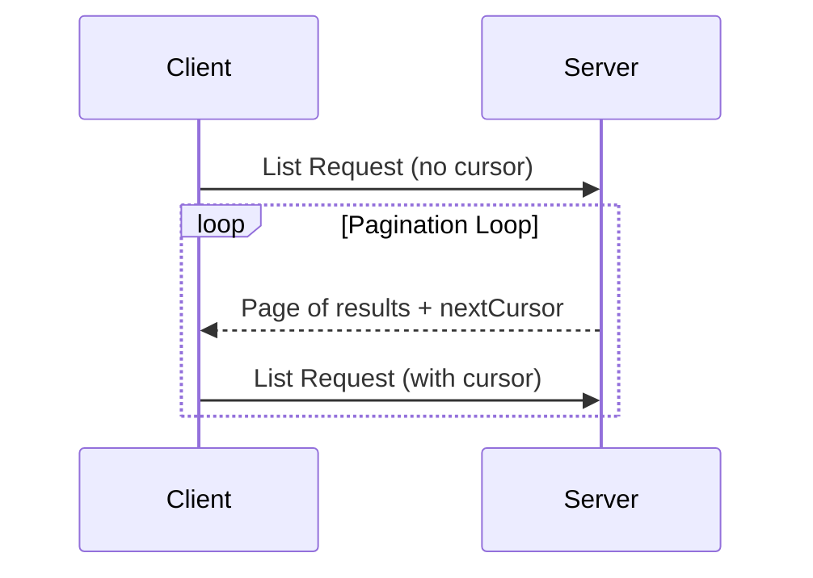

## Summary

Pagination

## Compressed

> ## Documentation Index
> Fetch the complete documentation index at: https://modelcontextprotocol.io/llms.txt
> Use this file to discover all available pages before exploring further.

# Pagination

<div id="enable-section-numbers" />

The Model Context Protocol (MCP) supports paginating list operations that may return large result sets.

Pagination is especially important when connecting to external services over the internet, but also useful for local integrations to avoid performance issues with large data sets.

<Note>
  For brevity, the request examples on this page omit the `_meta` request
  metadata (`io.modelcontextprotocol/protocolVersion`,
  `io.modelcontextprotocol/clientInfo`, and
  `io.modelcontextprotocol/clientCapabilities`). Every request **MUST** include
  the required `_meta` fields; see
  [`_meta`].
</Note>

## Pagination Model

Pagination in MCP uses an opaque cursor-based approach, instead of numbered pages.

* The **cursor** is an opaque string token, representing a position in the result set
* **Page size** is determined by the server, and clients **MUST NOT** assume a fixed page
  size

## Response Format

Pagination starts when the server sends a **response** that includes:

* The current page of results
* An optional `nextCursor` field if more results exist

```json theme={null}
{
  "jsonrpc": "2.0",
  "id": "123",
  "result": {
    "resultType": "complete",
    "resources": [...],
    "nextCursor": "eyJwYWdlIjogM30=",
    "ttlMs": 300000,
    "cacheScope": "public"
  }
}
```

## Request Format

After receiving a cursor, the client can *continue* paginating by issuing a request including that cursor:

```json theme={null}
{
  "jsonrpc": "2.0",
  "id": "124",
  "method": "resources/list",
  "params": {
    "cursor": "eyJwYWdlIjogMn0="
  }
}
```

## Pagination Flow



## Operations Supporting Pagination

The following MCP operations support pagination:

* `resources/list` - List available resources
* `resources/templates/list` - List resource templates
* `prompts/list` - List available prompts
* `tools/list` - List available tools

## Implementation Guidelines

1. Servers **SHOULD**:
   * Provide stable cursors
   * Handle invalid cursors gracefully

2. Clients **SHOULD**:
   * Treat a missing `nextCursor` as the end of results
   * Support both paginated and non-paginated flows

3. Clients **MUST** treat cursors as opaque tokens:
   * Don't make assumptions about cursor format
   * Don't attempt to parse or modify cursors
   * Don't make any determination based on cursor value other than whether a
     non-null value was provided (e.g. an empty string is a valid cursor and
     thus **MUST NOT** be treated as the end of results)

## Error Handling

Invalid cursors **SHOULD** result in an error with code -32602 (Invalid params).

## Detailed

> ## Documentation Index
> Fetch the complete documentation index at: https://modelcontextprotocol.io/llms.txt
> Use this file to discover all available pages before exploring further.

# Pagination

<div id="enable-section-numbers" />

The Model Context Protocol (MCP) supports paginating list operations that may return
large result sets. Pagination allows servers to yield results in smaller chunks rather
than all at once.

Pagination is especially important when connecting to external services over the
internet, but also useful for local integrations to avoid performance issues with large
data sets.

<Note>
  For brevity, the request examples on this page omit the `_meta` request
  metadata (`io.modelcontextprotocol/protocolVersion`,
  `io.modelcontextprotocol/clientInfo`, and
  `io.modelcontextprotocol/clientCapabilities`). Every request **MUST** include
  the required `_meta` fields; see
  [`_meta`](/specification/draft/basic/index#meta).
</Note>

## Pagination Model

Pagination in MCP uses an opaque cursor-based approach, instead of numbered pages.

* The **cursor** is an opaque string token, representing a position in the result set
* **Page size** is determined by the server, and clients **MUST NOT** assume a fixed page
  size

## Response Format

Pagination starts when the server sends a **response** that includes:

* The current page of results
* An optional `nextCursor` field if more results exist

```json theme={null}
{
  "jsonrpc": "2.0",
  "id": "123",
  "result": {
    "resultType": "complete",
    "resources": [...],
    "nextCursor": "eyJwYWdlIjogM30=",
    "ttlMs": 300000,
    "cacheScope": "public"
  }
}
```

## Request Format

After receiving a cursor, the client can *continue* paginating by issuing a request
including that cursor:

```json theme={null}
{
  "jsonrpc": "2.0",
  "id": "124",
  "method": "resources/list",
  "params": {
    "cursor": "eyJwYWdlIjogMn0="
  }
}
```

## Pagination Flow


## Operations Supporting Pagination

The following MCP operations support pagination:

* `resources/list` - List available resources
* `resources/templates/list` - List resource templates
* `prompts/list` - List available prompts
* `tools/list` - List available tools

## Implementation Guidelines

1. Servers **SHOULD**:
   * Provide stable cursors
   * Handle invalid cursors gracefully

2. Clients **SHOULD**:
   * Treat a missing `nextCursor` as the end of results
   * Support both paginated and non-paginated flows

3. Clients **MUST** treat cursors as opaque tokens:
   * Don't make assumptions about cursor format
   * Don't attempt to parse or modify cursors
   * Don't make any determination based on cursor value other than whether a
     non-null value was provided (e.g. an empty string is a valid cursor and
     thus **MUST NOT** be treated as the end of results)

## Error Handling

Invalid cursors **SHOULD** result in an error with code -32602 (Invalid params).

## Provenance

Fetched from https://modelcontextprotocol.io/specification/draft/server/utilities/pagination on 2026-09-17T11:50:55.718Z