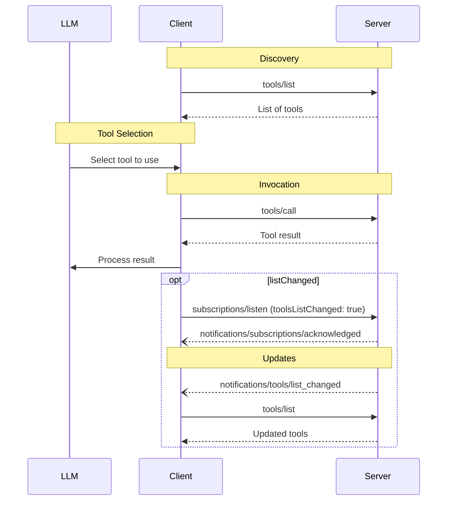

## Summary

Tools > Message Flow

## Compressed

## Message Flow

## Detailed

## Message Flow

## Provenance

Section "Tools > Message Flow" of https://modelcontextprotocol.io/specification/draft/server/tools (parent b9cb8b57df1cd6771f4bba1cbf247bebce7db79cb6ac01465126a9ed56994824)