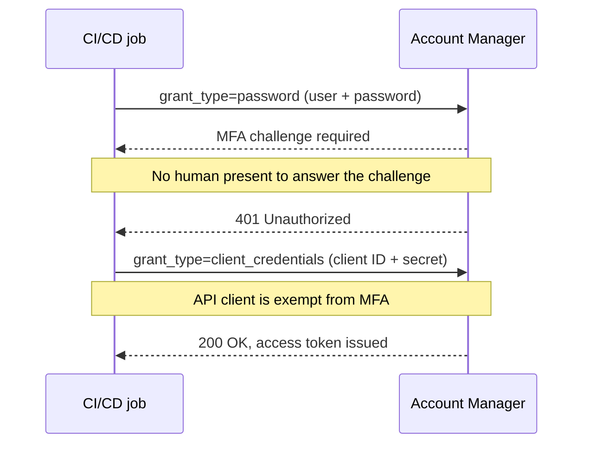
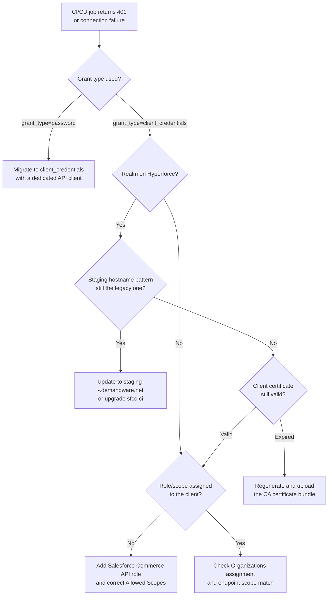

Someone on your team pings the channel: "sandbox:start just started failing, nothing changed on our end." You check the pipeline logs and find a 401. You check `dw.json` — the config file that holds the credentials your CLI uses to log in to the instance. Same client ID, same password, same everything it had last week when it worked fine. So you re-run it. Still 401. And now you're staring at a CI job that has run unattended for two years, wondering what exactly changed if nothing you touched did.

What changed is Account Manager, not your config. Account Manager is Salesforce's identity provider for B2C Commerce — it's the system that issues the OAuth tokens your CI pipeline, your custom code, and every login to Business Manager (SFCC's web-based admin console) all depend on. Salesforce now enforces multi-factor authentication (MFA) on Account Manager user accounts, and once that enforcement lands on your organisation, the resource-owner password grant that your CI has quietly relied on for years — logging in with a plain username and password, the way older tools have always done it — stops working. Not because your credentials are wrong. Because that grant type was never built to survive a challenge for a second factor that a headless script can't answer.

## What Actually Broke

People conflate two things here, and separating them is the whole fix.

`sfcc-ci` and the newer [`@salesforce/b2c-cli`](https://www.npmjs.com/package/@salesforce/b2c-cli) (the `b2c` command) are the command-line tools most SFCC teams script into CI pipelines to deploy code, manage sandboxes, and run other Business Manager tasks without a human clicking through the UI. `auth:login` (`b2c auth login` in the newer tool) opens a browser and walks a person through an interactive OAuth login — not something you script into a headless pipeline in the first place. The command teams actually put in CI is `client:auth` (`b2c auth client` in the newer tool), and it quietly supports two different grant types depending on what credentials it finds: give it only a client ID and secret and it requests a `client_credentials` token; leave a Business Manager username and password in `dw.json` or the environment alongside those, and it switches to the resource-owner password grant, `grant_type=password`, instead.

Most SFCC teams set up their CI years ago with a Business Manager user's Account Manager username and password sitting in that config next to the client ID and secret, because at the time nothing distinguished the two paths — the CLI just used whichever grant type matched the credentials it found. It worked. Until MFA enforcement caught up with that user account.

Salesforce's own documentation on [MFA enforcement for Account Manager users](https://help.salesforce.com/s/articleView?id=sf.account_manager_mfa_enforcement.htm&language=en_US&type=5) confirms enforcement began rolling out on May 1, 2022, and that once a user account is enforced, admins cannot turn the MFA requirement back off for that user. The rollout wasn't a single flag flipped for everyone at once. It moved through organisations gradually, and that's exactly why a pipeline that ran fine for years can suddenly start failing with no code change on your side: your organisation's turn simply came up. This is one piece of the [broader B2C Commerce security hardening](/secure-coding-in-salesforce-b2c-commerce-cloud/) Salesforce has pushed for years. It just happens to be the piece that lands on your CI/CD instead of your storefront code.

Here's the part that trips people up: [Salesforce documents API clients as exempt from this requirement](https://help.salesforce.com/s/articleView?id=000392688&language=en_US&type=1). MFA is a user-login concept — it exists to stop a human logging in with a stolen password. A properly configured API client authenticating with `client_credentials` never presents a username and password to challenge in the first place, so there's no second factor to fail. MFA didn't break API access — it exposed that this CI job was never really authenticating as an API client at all. From Account Manager's point of view, a resource-owner password login is indistinguishable from a person logging in, and that login now needs a factor your pipeline doesn't have.

## Password Grant vs. Client Credentials

These two grants look interchangeable from the CLI's perspective, but Account Manager treats them completely differently once you look at what's actually being sent.

- **Resource-owner password grant (`grant_type=password`):** you send a Business Manager user's Account Manager username and password directly to the token endpoint. This is what `client:auth` (or `b2c auth client`) falls back to whenever a username and password are present alongside the client credentials. It authenticates as a person, which means it's subject to whatever login requirements Account Manager enforces on that person's account — including MFA once it's turned on.
- **Client credentials grant (`grant_type=client_credentials`):** you send a client ID and client secret, both belonging to an API client record in Account Manager, not to any individual user. There's no resource owner in this exchange at all — just two systems proving to each other who they are. This is what `client:auth` (or `b2c auth client`) uses once you drop the username and password from the config.

This is the correct modern approach, and not only because MFA doesn't apply to it. Salesforce's [OAuth 2.0 client credentials flow guide](https://help.salesforce.com/s/articleView?language=en_US&id=sf.remoteaccess_oauth_client_credentials_flow.htm&type=5) documents it as the intended server-to-server pattern, with no refresh token in play. You request a fresh token each time instead of refreshing a stale one, which fits a CI job that runs, authenticates, does its work, and exits. And for SCAPI — the Salesforce Commerce API, B2C Commerce's newer REST API — it isn't a stylistic preference: [SCAPI Admin APIs only support the client credentials grant](https://developer.salesforce.com/docs/commerce/commerce-api/guide/authorization-for-admin-apis.html), full stop. If you're calling `products`, `catalogs`, `orders`, or CDN zone endpoints from a deploy script, there was never a password-grant path available for those. You were already on client credentials whether you realised the distinction mattered or not.

## Setting Up an API Client the Right Way

Rotating the password on the Business Manager user you'd been using won't fix this. You need to create (or fix) an Account Manager API client and assign roles to the client itself, not to a person.

1. **Create the API client.** In Account Manager, add a new API client with a **Display Name** and a **Password** — this is the client secret, and unlike a user's Account Manager password, [it does not expire](https://help.salesforce.com/s/articleView?id=000392688&language=en_US&type=1). That's a deliberate design choice for automation, and it's the detail that makes API clients the right tool for unattended jobs.
2. **Assign Organizations.** Link the client to the Account Manager organisation(s) that own the instances it will talk to. Skip this and every call fails before it even gets to a role check.
3. **Assign the role.** For [SCAPI Admin APIs specifically](https://developer.salesforce.com/docs/commerce/commerce-api/guide/authorization-for-admin-apis.html), that's the **Salesforce Commerce API** role, added directly to the API client record — not inherited from a user, because there's no user here to inherit anything from. This role and scope configuration lives entirely on the client record in Account Manager, a separate concept from the [Business Manager user roles and permissions](https://help.salesforce.com/s/articleView?id=cc.b2c_roles_and_permissions.htm&language=en_US&type=5) that govern what a person is allowed to click on.
4. **Configure Allowed Scopes.** List the specific scopes the client needs — things like `sfcc.catalogs`, `sfcc.products`, `sfcc.orders`, or `sfcc.cdn-zones` / `sfcc.cdn-zones.rw` if the job manages CDN configuration. Don't grant every scope you can find "just in case." A CI job that only deploys code doesn't need order-write access, and a client with narrower scopes is a smaller blast radius if the secret ever leaks.
5. **Set Token Endpoint Auth Method and Access Token Format.** Use `client_secret_post` for the auth method, and JWT for the access token format — the same JWT format covered in [the UUID-to-JWT migration post](/the-deprecation-of-the-uuid-token-for-api-clients/) if you want the background on why JWT replaced the old UUID token. If you're setting up JWT authentication for OCAPI — Open Commerce API, B2C Commerce's older REST API, still in use behind some existing integrations — rather than SCAPI, [the full walkthrough is here](/how-to-setup-oauth-jwt-for-the-ocapi/).

Once the client exists with the right role and scopes, point your CI at it instead of a personal login. For `sfcc-ci` and the B2C CLI, that means keeping `client:auth` (or `b2c auth client`) in your pipeline but dropping the username and password from `dw.json` (or your CI secrets store) so only a `client-id` and `client-secret` pair remain — that's what forces the client-credentials grant instead of the password fallback. No more Business Manager user in the loop, no more MFA to trip over, and — as a side benefit — no more pipeline failures the day someone rotates their personal Account Manager password because it happened to expire.

One token-lifetime detail worth knowing before you assume this is "set and forget": a SCAPI access token from the client credentials grant expires after 30 minutes, and an OCAPI Business Manager user grant token expires after just 15. Long-running deploy jobs that sit idle between steps can outlive the token. If a job authenticates once at the start and then does something slow in the middle, build in a re-authentication step rather than assuming the token from minute one is still good at minute forty.

## The Hyperforce Wrinkle

If your realm has moved to Hyperforce, there's a second failure mode layered on top of the MFA one, and it looks similar enough on the surface that it's easy to misdiagnose as the same problem. A realm is Salesforce's term for the group of instances — sandboxes, staging, production — provisioned for your organisation, and Hyperforce is the newer cloud infrastructure platform Salesforce is gradually migrating those realms onto.

In my experience, older `sfcc-ci` versions rewrite or assume a legacy staging hostname pattern — `cert.staging.<realm>.<customer>.demandware.net` — because that's what every pre-Hyperforce instance used. Salesforce's [code deployment documentation](https://developer.salesforce.com/docs/commerce/b2c-commerce/guide/b2c-code-deployment.html) confirms that legacy hostname pattern — and its server-side certificates — expire September 24, 2026 and won't be renewed. Post-migration, the pattern changes to `staging-<realm>-<customer>.demandware.net` (or the standard Business Manager hostname). A pipeline pointed at the old pattern, or a CLI version old enough to construct URLs against it internally, starts failing certificate validation or DNS resolution against an instance that migrated weeks ago — and the error can look enough like an auth failure that teams chase the wrong fix. Salesforce's [Hyperforce realm move documentation](https://help.salesforce.com/s/articleView?id=002888834&language=en_US&type=1) covers the migration process itself, including the pre-move step of uploading 2FA client certificates to eCDN.

And before you assume this is purely a hostname string problem: code uploads to staging on Hyperforce also expect a client certificate as an additional security factor. Code gets pushed to an instance over WebDAV, the file-transfer protocol Business Manager and the CLI both use to move code versions onto a server. On Hyperforce, that upload path runs through eCDN, the CDN layer that also validates the client certificate before it accepts the upload. Salesforce's [code deployment documentation](https://developer.salesforce.com/docs/commerce/b2c-commerce/guide/b2c-code-deployment.html) notes the CA certificate bundle used for this is valid for a maximum of 365 days. Regenerate and upload the new bundle before the old one lapses — a code upload that silently fails because a certificate expired at 2 a.m. on a Tuesday is not a fun thing to debug at 9 a.m.

## When It's a Custom Controller, Not a CI Job

The same underlying issue shows up outside the pipeline, too. A custom controller endpoint returning a plain `401 Unauthorized` to an external integration is rarely an MFA problem. Look at the client side instead: the API client calling that endpoint is missing a role, or the scope it presents doesn't match what the controller expects.

Because authorisation for B2C Commerce API resources runs on client permissions rather than user permissions, the fix follows the same checklist as the CI case: confirm the client has the right role assigned, confirm the Allowed Scopes list actually includes what the controller is asking for, and confirm the Organizations assignment covers the instance you're calling. The controller code is rarely the culprit. The real cause usually sits back in Account Manager — a client that was configured for a different purpose, or configured once and never revisited since.

If your storefront also uses [SLAS session bridging or Hybrid Auth](/slas-under-the-hood-session-bridging-and-hybrid-auth/)SLAS session bridging or Hybrid Auth for shopper-facing tokens, keep that mental model separate from this one — those flows deal with shopper sessions, not the server-to-server API clients this post covers. Mixing the two up is an easy way to spend an afternoon debugging the wrong system.

MFA enforcement is only going to reach more Account Manager organisations, and Hyperforce migrations are only going to become more common, not less. If your pipeline still authenticates with a username and password, it's worth fixing before enforcement fixes it for you at a less convenient hour.
