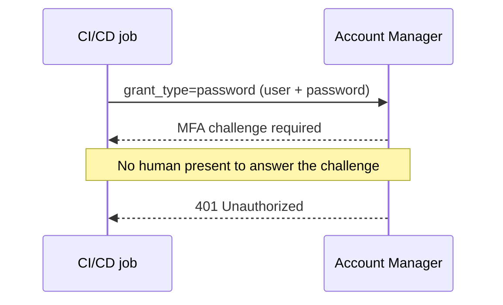
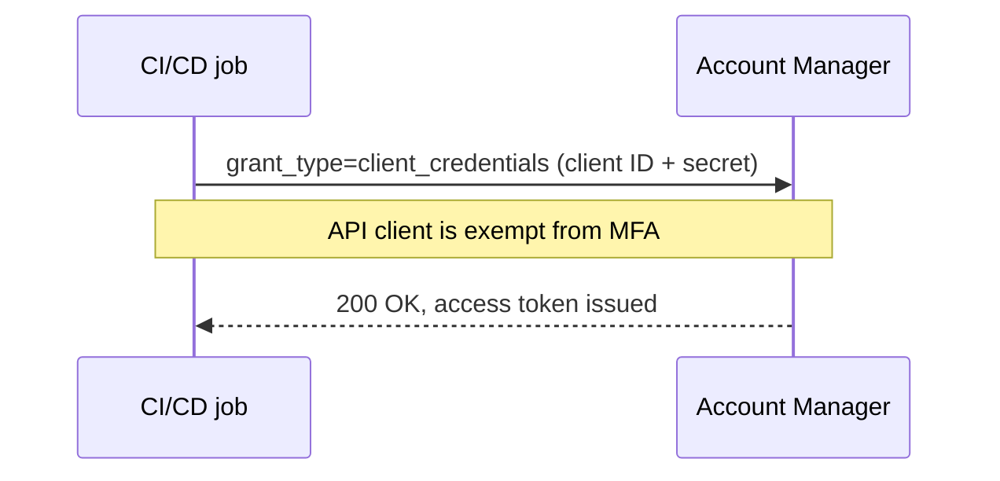
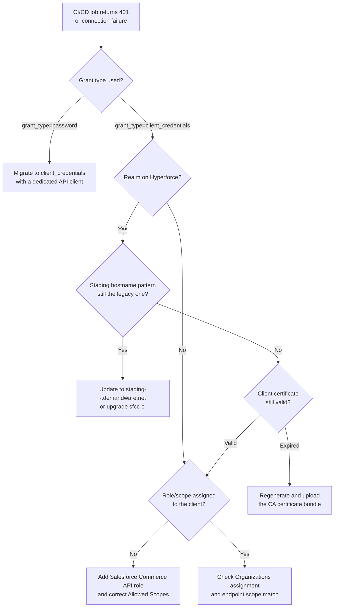

This CI/CD pipeline is brand new: the first deploy job on this project, nothing legacy about it. And it's been hanging at the authentication step for twenty minutes. There's no error and no timeout message, just a deploy log that stops dead after "Authenticating..." You check the CI secrets, the client ID and secret your pipeline injects as environment variables at runtime rather than pulling from a [checked-in config file](https://salesforcecommercecloud.github.io/b2c-developer-tooling/guide/configuration). They look right: same client ID, same secret, the same Business Manager user you tested with locally an hour ago. You kill the job and run it again. Same thing happens: twenty minutes of silence, then a `401`.

What changed isn't your config. It's Account Manager. This has been true for a while, you just hadn't built anything that touched it yet. Account Manager is Salesforce's identity provider for B2C Commerce. It issues the OAuth tokens that your CI pipeline, your custom code, and every login to Business Manager (SFCC's web-based admin console) all depend on. Salesforce enforces multi-factor authentication (MFA) on Account Manager user accounts. That enforcement kicks in the moment a pipeline logs in with a plain username and password, a method called the resource-owner password grant. Older tools fall back to it whenever a `dw.json` file or CI secrets template still has a username and password sitting in it. Not because your credentials are wrong. Because that login method was never built to survive a security check that a headless script can't answer.

## What Actually Broke

People conflate two things here, and separating them is the whole fix.

[`sfcc-ci`](https://github.com/SalesforceCommerceCloud/sfcc-ci) and the newer [`@salesforce/b2c-cli`](https://www.npmjs.com/package/@salesforce/b2c-cli) (the `b2c` command) are the command-line tools most SFCC teams script into CI pipelines. Teams use them to deploy code, manage sandboxes, and run other Business Manager tasks without a human clicking through the UI. One command, `auth:login` (`b2c auth login` in the newer tool), opens a browser and walks a person through an interactive login. That's not something you can script into a headless pipeline in the first place, since there's no person there to click through it.

The command teams actually put in CI is different: `client:auth` ([`b2c auth client`](https://salesforcecommercecloud.github.io/b2c-developer-tooling/cli/auth.html) in the newer tool). It quietly supports two separate login methods, and it picks between them based on what credentials it finds. Give it only a client ID and secret, and it requests a `client_credentials` token, the machine-to-machine method described below. Give it a username and password too, and it switches to the resource-owner password grant instead: `grant_type=password`, a plain username-and-password login.



Where those credentials come from differs by tool, and it's worth knowing the difference. In `sfcc-ci`, a [`dw.json`](https://salesforcecommercecloud.github.io/b2c-developer-tooling/guide/configuration) with `username` and `password` fields feeds directly into this check, right alongside `client-id` and `client-secret`. In the newer `b2c-cli`, `dw.json`'s `username`/`password` fields are reserved for a separate purpose (WebDAV file access), so they won't trigger this on their own. There, the password grant is triggered by the `--user`/`--user-password` flags, or the `SFCC_OAUTH_USER_NAME`/`SFCC_OAUTH_USER_PASSWORD` environment variables.

Most SFCC teams set up their CI years ago with a Business Manager user's Account Manager username and password stored right next to the client ID and secret. At the time, nothing distinguished the two paths. The CLI just used whichever login method matched the credentials it found. It worked. Until MFA enforcement caught up with that user account.

Salesforce's own documentation on [MFA enforcement for Account Manager users](https://help.salesforce.com/s/articleView?id=sf.account_manager_mfa_enforcement.htm&language=en_US&type=5) confirms that enforcement began rolling out on May 1, 2022, and that once a user account is enforced, admins can't turn the MFA requirement back off for that user. The rollout wasn't a single flag flipped for everyone at once. It moved through organisations gradually. That's exactly why a pipeline that ran fine for years can suddenly start failing with no code change on your side: your organisation's turn simply came up. It's one piece of the [broader B2C Commerce security hardening](/secure-coding-in-salesforce-b2c-commerce-cloud/) Salesforce has pushed for years. It just happens to be the piece that lands on your CI/CD instead of your storefront code.

None of this is breaking news. Salesforce finished that rollout years ago. So a project built from scratch today rarely walks into it: a modern `b2c-cli` setup goes straight to `client-id` and `client-secret`, with no username-and-password fallback sitting around to trip over. Where it still shows up is misconfiguration. Someone left a Business Manager username and password next to the client credentials, in `sfcc-ci`'s `dw.json` or in `b2c-cli`'s `--user`/`--user-password` flags (or the matching environment variables), so the tool quietly falls back to the password grant. The giveaway isn't a clean, instant 401. The job hangs for something like half an hour before it finally fails, because Account Manager is waiting on an MFA challenge nobody is there to answer. The other place this bites is an old pipeline: one wired up before May 2022, left alone since, that worked fine right up until your organisation's turn in the rollout arrived.

Here's the part that trips people up: [Salesforce documents API clients as exempt from this requirement](https://help.salesforce.com/s/articleView?id=000392688&language=en_US&type=1). MFA is a user-login concept. It exists to stop a human logging in with a stolen password. A properly configured API client authenticating with `client_credentials` never presents a username and password to challenge in the first place, so there's no second factor to fail. MFA didn't break API access — it exposed that this CI job was never really authenticating as an API client at all. From Account Manager's point of view, a resource-owner password login is indistinguishable from a person logging in, and that login now needs a factor your pipeline doesn't have.

## Password Grant vs. Client Credentials

These two grants look interchangeable from the CLI's perspective. Account Manager treats them completely differently once you look at what's actually being sent. (A "grant" here just means the method used to prove who's asking for a token: a person's login, or a system's credentials.)

- **Resource-owner password grant (`grant_type=password`):** you send a Business Manager user's Account Manager username and password directly to Account Manager's login endpoint, the URL that hands out tokens. This is what `client:auth` (or `b2c auth client`) falls back to whenever a username and password are present alongside the client credentials. It authenticates as a person. That means it's subject to whatever login requirements Account Manager enforces on that person's account, including MFA once it's turned on.
- **Client credentials grant (`grant_type=client_credentials`):** you send a client ID and client secret, both belonging to an API client record in Account Manager, not to any individual user. There's no person logging in at all here, just two systems proving to each other who they are. This is what `client:auth` (or `b2c auth client`) uses once you drop the username and password from the config.

This is the correct modern approach, and not only because MFA doesn't apply to it. Salesforce's [OAuth 2.0 client credentials flow guide](https://help.salesforce.com/s/articleView?language=en_US&id=sf.remoteaccess_oauth_client_credentials_flow.htm&type=5) documents it as the intended server-to-server pattern, with no refresh token in play. You request a fresh token each time instead of refreshing a stale one. That fits a CI job that runs, authenticates, does its work, and exits. For SCAPI, the Salesforce Commerce API and B2C Commerce's newer REST API, it isn't just a stylistic preference either: [SCAPI Admin APIs only support the client credentials grant](https://developer.salesforce.com/docs/commerce/commerce-api/guide/authorization-for-admin-apis.html), no exceptions. If you're calling `products`, `catalogs`, `orders`, or CDN zone endpoints from a deploy script, there was never a password-grant path available for those. You were already on client credentials, whether you realised the distinction mattered or not.

**Resource-owner password grant:**

**Client credentials grant:**

## Setting Up an API Client the Right Way

Rotating the password on the Business Manager user you'd been using won't fix this. You need to create (or fix) an Account Manager API client and assign roles to the client itself, not to a person.

1. **Create the API client.** In Account Manager, add a new API client with a **Display Name** and a **Password**. That Password field is the client secret, and unlike a user's Account Manager password, [it does not expire](https://help.salesforce.com/s/articleView?id=000392688&language=en_US&type=1). That's a deliberate design choice for automation, and it's the detail that makes API clients the right tool for unattended jobs. It also means Account Manager will never force rotation for you, so treat that secret like any other long-lived credential: store it in your CI secrets manager, not in a repo or a shared doc, and rotate it on your own schedule rather than assuming "doesn't expire" means "never needs to change." If it ever leaks, generate a new one and update your pipeline immediately, the same day you'd rotate a leaked database password.
2. **Assign Organizations.** Link the client to the Account Manager organisation(s) that own the instances it will talk to.
3. **Assign the role.** For [SCAPI Admin APIs specifically](https://developer.salesforce.com/docs/commerce/commerce-api/guide/authorization-for-admin-apis.html), that's the **Salesforce Commerce API** role, added directly to the API client record. There's no user account behind an API client, so there's nothing to inherit the role from; you assign it directly. That role and scope configuration lives entirely on the client record in Account Manager, a separate concept from the [Business Manager user roles and permissions](https://help.salesforce.com/s/articleView?id=cc.b2c_roles_and_permissions.htm&language=en_US&type=5) that govern what a person is allowed to click on.
4. **Configure Allowed Scopes.** List the specific scopes the client needs: things like `sfcc.catalogs`, `sfcc.products`, `sfcc.orders`, or `sfcc.cdn-zones` / `sfcc.cdn-zones.rw` if the job manages CDN configuration. Don't grant every scope you can find "just in case." A CI job that only deploys code doesn't need order-write access. Give a client narrower scopes, and less damage is possible if the secret ever leaks.
5. **Set Token Endpoint Auth Method and Access Token Format.** Use `client_secret_post` for the auth method. Use JWT (JSON Web Token) for the access token format. See [the UUID-to-JWT migration post](/the-deprecation-of-the-uuid-token-for-api-clients/) for background on why JWT replaced the old UUID token, if you're curious. If you're setting up this same JWT authentication for OCAPI (Open Commerce API, B2C Commerce's older REST API, still in use behind some existing integrations) instead of SCAPI, [the full walkthrough is here](/how-to-setup-oauth-jwt-for-the-ocapi/).

Once the client exists with the right role and scopes, point your CI at it instead of a personal login. For `sfcc-ci` and the B2C CLI, that means keeping `client:auth` (or `b2c auth client`) in your pipeline. Just drop the username and password from `dw.json` (or your CI secrets store), so only a `client-id` and `client-secret` pair remain. That's what forces the client-credentials grant instead of the password fallback. No more Business Manager user in the loop. No more MFA to trip over. And as a free side benefit: no more pipeline failures the day someone rotates their personal Account Manager password because it happened to expire.

One token-lifetime detail worth knowing before you assume this is "set and forget": a SCAPI access token from the client credentials grant expires after 30 minutes, and an OCAPI Business Manager user grant token expires after just 15. Long-running deploy jobs that sit idle between steps can outlive the token. If a job authenticates once at the start and then does something slow in the middle, build in a re-authentication step rather than assuming the token from minute one is still good at minute forty.

## The Hyperforce Wrinkle

If your realm has moved to Hyperforce, there's a second failure mode layered on top of the MFA one. A realm is Salesforce's term for the group of instances provisioned for your organisation: sandboxes, staging, production. Hyperforce is the newer cloud infrastructure platform Salesforce is gradually migrating those realms onto. This second failure mode looks similar enough on the surface to the MFA problem that it's easy to misdiagnose as the same thing.

In my experience, older `sfcc-ci` versions rewrite or assume a legacy staging hostname pattern: `cert.staging.<realm>.<customer>.demandware.net`. That's because it's what every pre-Hyperforce instance used. Salesforce's [code deployment documentation](https://developer.salesforce.com/docs/commerce/b2c-commerce/guide/b2c-code-deployment.html) confirms that this legacy hostname pattern, along with its server-side certificates, expires September 24, 2026 and won't be renewed. Post-migration, the pattern changes to `staging-<realm>-<customer>.demandware.net` (or the standard Business Manager hostname). A pipeline pointed at the old pattern starts failing certificate validation or DNS resolution against an instance that migrated weeks ago. So does a CLI version old enough to build URLs against the old pattern internally. The error can look enough like an auth failure that teams chase the wrong fix. Salesforce's [Hyperforce realm move documentation](https://help.salesforce.com/s/articleView?id=002888834&language=en_US&type=1) covers the migration process itself, including a pre-move step: uploading client certificates for two-factor authentication to eCDN, the CDN layer Hyperforce uses to serve and secure your instances.

And before you assume this is purely a hostname string problem: code uploads to staging on Hyperforce also expect a client certificate as an additional security factor. Code gets pushed to an instance over WebDAV, the file-transfer protocol Business Manager and the CLI both use to move code versions onto a server. On Hyperforce, that upload path runs through eCDN, the CDN layer that also validates the client certificate before it accepts the upload. That same documentation notes that the CA (certificate authority) bundle used for this is valid for a maximum of 365 days. Regenerate and upload the new bundle before the old one lapses. A code upload that silently fails because a certificate expired at 2 a.m. on a Tuesday is not a fun thing to debug at 9 a.m.

## When It's a Custom SCAPI Endpoint, Not a CI Job

The same underlying issue shows up outside the pipeline, too. Most new integrations expose custom business logic through a [Custom API endpoint](https://developer.salesforce.com/docs/commerce/commerce-api/guide/custom-api-authentication.html), SCAPI's framework for that purpose, secured the same way as the SCAPI Admin APIs above. Older projects may instead still be calling into a legacy custom controller in a cartridge, typically authorised through OCAPI's Data API client permissions rather than SCAPI scopes. Either way, a `401 Unauthorized` (or, for a scope mismatch, `403 Forbidden`) returned to an external integration is rarely an MFA problem. Look at the client side instead: the API client calling that endpoint is missing a role, or the scope it presents doesn't match what the endpoint expects.

Authorisation for these B2C Commerce API resources runs on client permissions, not user permissions. So the fix follows the same checklist as the CI case:

- Confirm the client has the right role assigned.
- Confirm the Allowed Scopes list actually includes what the endpoint is asking for.
- Confirm the Organizations assignment covers the instance you're calling.

The endpoint's own code is rarely the culprit. The real cause usually sits back in Account Manager: a client that was configured for a different purpose, or configured once and never revisited since.

Your storefront may also use [SLAS session bridging or Hybrid Auth](/slas-under-the-hood-session-bridging-and-hybrid-auth/)SLAS session bridging or Hybrid Auth for shopper-facing tokens, Salesforce's separate login system for storefront shoppers. Keep that mental model separate from this one. Those flows deal with shopper sessions, not the server-to-server API clients this post covers. Mixing the two up is an easy way to spend an afternoon debugging the wrong system.

MFA enforcement already covers every Account Manager organisation at this point; the only open question is whether your oldest pipeline has caught up to it yet. Hyperforce migrations are only going to become more common, not less. If you've still got an old pipeline lying around that authenticates with a username and password, even one nobody runs anymore, fix it now. Leave it as-is and someone will copy it into the next project, take it for the correct pattern, and hand you this exact problem all over again.
