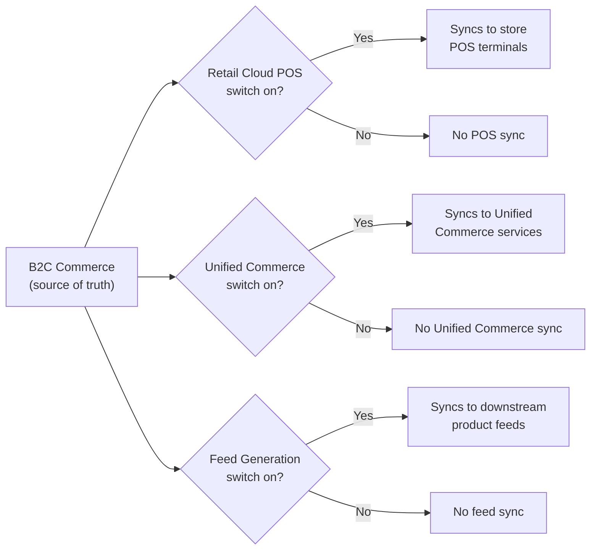
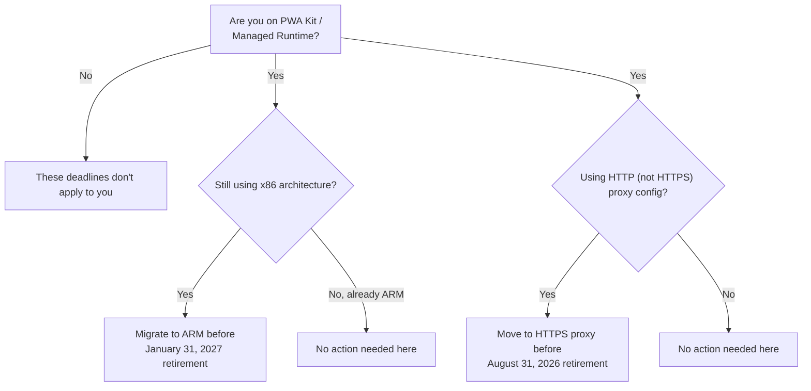

Every August release lands in the same window: July 21 to August 20, 2026 for [26.8](https://help.salesforce.com/s/articleView?id=release-notes.rn_b2c_26_8.htm&release=262&type=5), and every year someone on the team asks whether it is worth reading the notes at all. This one is. Not because of a single headline feature, but because three separate parts of the stack move at once: how your catalog gets to the point of sale, how Business Manager finds things, and how much longer your Managed Runtime environment will run on the architecture it is on today.

> [!NOTE]
> A 2026 update: these notes are from an earlier release cycle. For what's shipped since, browse the [release notes archive](/category/release-notes/).

There are eleven major items in the official notes. We are not walking through all eleven line by line — some are cosmetic, and a post that tries to cover everything ends up telling you nothing. What follows is the subset that changes what you do on a Monday morning, grouped by where it actually bites: catalog and monitoring, search, Business Manager itself, the API layer, and the storefront runtimes. One of those items points back to a feature we should have covered last month, so we're closing that gap here too.

## Catalog Unification: One Source, Several Destinations

If you run both B2C Commerce and a physical retail footprint, this is the item to read twice. [Catalog Unification](https://help.salesforce.com/s/articleView?id=release-notes.rn_b2c_catalog_unification.htm&language=en_US&release=262&type=5) makes B2C Commerce the single source of truth for product data, and syncs it out to point-of-sale systems behind three [feature switches](https://help.salesforce.com/s/articleView?id=cc.b2c_feature_switches.htm&language=en_US&type=5): [Retail Cloud POS](https://www.salesforce.com/commerce/point-of-sale/), [Unified Commerce](https://trailhead.salesforce.com/content/learn/modules/cc-digital/experience-unified-b2c-commerce), and Feed Generation. You turn on the switches that match your setup; the ones you leave off simply don't sync. Flipping the switches isn't the whole job, either: you still need to link your Merchant Locale Region under Merchant Tools | Site Preferences | Point of Sale before any data actually starts moving.

In my experience, the part that trips teams up isn't the sync itself, it's the assumption that "single source of truth" means every attribute you maintain in B2C Commerce automatically means something to a POS terminal. It doesn't. Before you flip a switch, walk the attribute mapping with whoever owns the retail side, and check what happens to a product that exists in B2C Commerce but was never meant to sell in a physical store. That's not a hypothetical: online-exclusive SKUs are common enough that "sync everything" is rarely the right first setting.

## Watching the Platform Watch Itself

Log Center and the Business Manager dashboards both get smarter this release — a tacit admission that manual log-diving doesn't scale.

**Anomaly Detection** now runs against Log Center in real time, flagging performance regressions and security anomalies such as error spikes and failed-login clusters. Nobody has to open a log file first. You find out about a problem because the platform flagged a pattern in the data, not because a shopper vented about it on Twitter three hours later.

The **On-Site Search dashboard** gets a smaller addition, but a practical one: a Click-Through Rate metric now sits next to Top Search terms. Merchandisers ask "are people actually clicking on what they search for" often enough that teams used to build this metric themselves. Now it ships with the platform.

Neither of these replaces your own alerting. Anomaly Detection tells you something looks unusual against B2C Commerce's own baseline; it doesn't know your business logic, your seasonal traffic patterns, or that Tuesday's error spike was a scheduled job you meant to run. Treat it as another set of eyes, not a replacement for the ones you already have on your dashboards.

## Agentic Commerce Search: The Bigger Story Behind an App Launcher Shortcut

The 26.8 notes list a small convenience: you can now open Agentic Commerce Search directly from the App Launcher instead of navigating through Merchant Tools. That's the visible change. What actually matters shipped one release earlier, in 26.7, in an article we never covered here: Agentic Commerce Search went generally available as a separate, extra-cost add-on.

It's not a feature B2C Commerce grew on its own. Agentic Commerce Search is built on Cimulate, an AI-powered product-discovery company Salesforce acquired in March 2026 specifically to strengthen search and discovery for Agentforce Commerce. What shipped in 26.7 is Cimulate's intent-aware context engine, plugged into your existing catalog.



It replaces native keyword search with an AI model trained on your catalog data, shopper behaviour, and simulated queries, ranking products by relevance and conversion instead of exact keyword matches, and handling natural language, typos, and emerging search trends on its own. You stop maintaining synonym lists, stop-word lists, and search rules for every edge case.

That last sentence is also the catch. Those synonym lists and search rules are usually where merchandisers encoded years of product-specific knowledge: the regional terms shoppers actually use, the seasonal names that don't match the catalog. Handing ranking to a model doesn't erase that knowledge, it moves the lever out of Business Manager and into a training process you don't control directly. Ask what happens to that tuning before anyone turns this on for a live site, not after.

Turning it on takes budget as much as it takes configuration. It's priced separately, so someone needs sign-off from procurement before a merchandiser can even find the switch. Once approved, it lives in **Merchant Tools | Agentic Commerce Search | Search Preferences | Enable Agentic Commerce Search** — the same place the new App Launcher shortcut points to, just faster to reach.

## Business Manager Gets a Redesign, Not Just a Coat of Paint

The footer is gone. That sounds trivial until you remember it's where the version number, instance details, and POD information (which infrastructure group your instance runs on) used to live. That information now lives in the navigation panel instead, with instance and site timezone tucked into a tooltip. If you have a runbook step that says "check the footer for the POD," update it now — it'll be wrong the next time someone follows it.

More useful: a new **Unified Header Search** bar sits across the top of Business Manager and searches Merchant Tools and Administration at the same time. Anyone who has opened the waffle menu, guessed wrong, closed it, and tried again knows exactly what this fixes. It's a minor UI tweak, but it removes a daily point of friction.

The **Merchandising workspace** is now customisable. You can start from a pre-built template or set it up manually, adding and moving modules and grouping them into your own sections. Do this once per site with the merchandising team in the room, not just IT. The default layout is a reasonable guess at what most people need. It isn't a guess at what your team needs.

Last one in this group: **Commerce App Connection Status** reporting. Integrations now report a health state — healthy, degraded, unhealthy, or unknown — with error messages, timestamps, and remediation steps attached. Compare that to the old failure mode, where an integration going quiet meant someone had to notice the absence of data before anyone knew anything was wrong. Absence of data is a bad signal to depend on. A status field you can check is a better one.

## SCAPI: Metrics, Baskets, and Order Management Endpoints

SCAPI (the Salesforce Commerce API layer) changes rarely make headlines, but a few of these deserve a look from whoever owns your integration layer.

- **Metrics API**: in closed beta as of the June 30 SCAPI release, with availability targeted for July 1 — access still requires a request through your account manager rather than a self-service opt-in. It gives you programmatic access to time-series operational metrics across nine categories — overall, sales, eCDN, third-party, SCAPI, SCAPI hooks, MRT, controller, and OCAPI. If you've ever built a custom dashboard by scraping Business Manager reports on a cron job, this is the API you were missing.
- **Shopper Baskets v2 (2.9.0)**: a new `promote` action converts a temporary basket into a permanent one, clearing its `isTemporary` flag, and the PATCH endpoint for payment instruments now accepts a `paymentReferenceRequest`. If you're on the [temporary basket flow that shipped back in 23.10](/salesforce-b2c-commerce-cloud-23-10-release-a-comprehensive-overview/), this closes a gap — you now have a documented endpoint to graduate a temporary basket into a full one, instead of relying on custom logic to do it.
- **Shopper Orders (1.15.0)**: new endpoints for order cancellation, returns, and reason codes, tied to Salesforce Order Management. If OMS already sits behind your storefront, wire these in before you build a custom cancellation flow you'll end up maintaining yourself.
- **Shopper Products (1.10.0)**: new endpoints for pulling product images, prices, and active promotions by product ID, without a full product detail fetch.
- **Shopper Search (1.10.0)**: page meta tags in search results now include a `type` field — name, property, title, `jsonld` — instead of returning everything as one undifferentiated block.

None of these are breaking changes on their own, but that doesn't make them safe to skip. A new PATCH field or endpoint is exactly the kind of thing that slips past review, then surfaces three sprints later when QA asks why a feature that should work doesn't.

## Storefront Next v1.1.0 and the Mandatory Router Upgrade

Storefront Next[Storefront Next](/storefront-next-extensibility-explained/) picked up the **Beauty Street template** as part of the 26.8 release on July 21, 2026 — a purpose-built layout and theme for beauty and cosmetics catalogues. If that's your industry, it's a head start; if it isn't, you can skip past it. It arrives alongside, but as a separate release from, Storefront Next v1.1.0, which shipped July 9, 2026.

What you can't skip past is the **React Router 7.18 upgrade**, and it's marked mandatory rather than recommended. It fixes a remote code execution vulnerability plus four additional security advisories. If you're running Storefront Next and haven't planned this upgrade in, that's the one item from this whole release worth escalating today rather than filing under "next sprint." Security patches described as fixing an RCE don't get a grace period.

The other Storefront Next item is smaller but solves a common annoyance: **subdomain session maintenance** through a shared parent-cookie-domain configuration. If your storefront spans subdomains — a regional site on one subdomain, a brand microsite on another — sessions can now survive moving between them instead of resetting at the boundary.

## PWA Kit and Managed Runtime: Two Clocks Are Ticking

Two deadlines sit in this release, and neither one moves once the date passes.

**x86 architecture retires January 31, 2027.** ARM is already the default for new projects, so if you spun up a Managed Runtime environment recently, you're likely fine. If you're on an older environment that's never been migrated, this is your notice, and five months isn't nothing but it also isn't a lot once you factor in a testing window.

**HTTP proxy support retires August 31, 2026** — a month after this release window closes. Only HTTPS proxy configurations work after that date. Of the two, this is the one that catches teams off guard: it lands a lot sooner than the x86 retirement, and a proxy setting doesn't look like a hard deadline until it becomes one.

The deadlines aren't the only change in this section. **HttpOnly session cookies** stop JavaScript from reading SLAS tokens directly, which means server-side token injection becomes a requirement rather than an option — that's extra implementation work, so check any custom code that assumed client-side token access before you flip this on. And **SOM integration** gives PWA Kit default implementations for shopper order tracking, cancellation, and returns, without you writing that flow yourself.

## SLAS: Passkeys Grow Up

The Shopper Login and API Access Service[Shopper Login and API Access Service](/slas-under-the-hood-session-bridging-and-hybrid-auth/) picked up passkey improvements on July 7, 2026: passkeys now track a creation date, a last-used timestamp, and a usage count, and a single shopper can register passkeys across multiple sites instead of one passkey per site. Alongside that, OTP and passwordless authentication now enforce a six-attempt rate limit within any ten-minute window.

Test that rate limit before it surprises a shopper. If your storefront retries a failed OTP silently — a common pattern for smoothing over a flaky network — six attempts inside ten minutes arrives faster than you'd expect, and the failure mode is a locked-out customer wondering why login stopped working. We covered a related [Account Manager MFA rollout that broke CI pipelines](/account-manager-mfa-broke-sfcc-cicd/) last month; this is the same family of change, aimed at shoppers instead of pipelines, and it deserves the same amount of attention before go-live.

## What Actually Needs a Ticket

If you only take three things out of 26.8, make it these: check whether your Managed Runtime environment is still on x86 or an HTTP proxy, because those two deadlines don't move; plan the React Router 7.18 upgrade on Storefront Next as a security patch, not a routine bump; and walk the Catalog Unification feature switches with your retail team before you turn any of them on. Everything else in this release is good to know. Those three earn a calendar entry.
