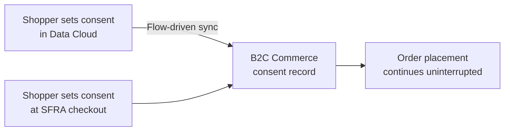
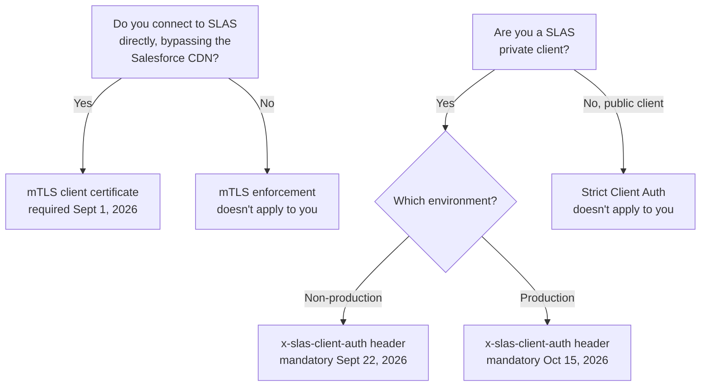

Every 26.x release notes page tells you the handful of things product management wants you to notice. It doesn't tell you that three separate SLAS enforcement deadlines quietly landed in a different document entirely, while almost everyone was reading the release notes and few were reading that one. That's the real story of 26.9.

The release window opened August 18, 2026, and runs through October 1. [26.8](/b2c-commerce-cloud-26-8-release/), which we covered on July 23, ran from July 21 through August 20 — so the two release windows actually overlap for about three days rather than 26.8 wrapping up before 26.9 begins. In between, two documents kept moving on their own schedules: the release notes, with six headline items this time, and the [Commerce API changelog](https://developer.salesforce.com/docs/commerce/commerce-api/references/about-commerce-api/about.html#changelog), which tracks Shopper Login and API Access Service (SLAS)[Shopper Login and API Access Service (SLAS)](/slas-under-the-hood-session-bridging-and-hybrid-auth/) and SCAPI (the Salesforce Commerce API layer) changes on a cadence that has nothing to do with anyone's monthly release cycle. If you only read the first document, 26.9 looks like a new app workspace and a consent checkbox. Read the second, and you'll find dates in September and October that decide whether your SLAS integration still authenticates at all.

## Commerce Apps Dedicated Workspace: One Home for Every App

Business Manager gets a new **Commerce Apps Dedicated Workspace**: a single catalog for discovering, installing, and managing native Salesforce apps, partner apps, and your own custom apps, with setup progress tracked in one place. If your team currently juggles a spreadsheet of "which apps are installed on which sandbox," this is the place that spreadsheet was always trying to become. It's a merchandising and IT-ops convenience more than a technical change — nothing about how apps run underneath it shifts — but it saves someone real time every time a new environment gets provisioned, twenty minutes by a rough guess.

## Consent Finally Has a Home

Two related items arrived together this release, and they read better as one story than two separate bullet points.

Data Cloud can now sync shopper consent preferences to B2C Commerce automatically, once you build a flow from Salesforce's own consent-sync template, instead of a custom integration someone on your team built and now has to maintain. And SFRA storefronts pick up native consent capture at checkout, without interrupting order placement — the shopper says yes or no to whatever your legal team requires, and the order still goes through either way.

That second half — consent capture that doesn't block checkout — is the part that matters operationally. In my experience, "add a consent step to checkout" arrives from legal with zero opinion on UX, and someone on the storefront team ends up gating order submission on a checkbox nobody tested under load. Having this shipped natively in SFRA, rather than as a bespoke gate someone builds and forgets to test, means one less place where a legal requirement turns into a checkout bug.

## Business Manager, Still Redesigning Itself

26.8 pulled the footer out of Business Manager and moved instance and POD details into the navigation panel. 26.9 keeps going: a new **Utility Bar** now holds alerts, tools, storefront preview, and user preferences, all of it moved out of the header. If your team built any documentation or training material around "click the icon in the top-right corner," that documentation is stale again. Two releases in a row have relocated something familiar, so if you maintain onboarding guides for junior merchandisers, spend five minutes checking before someone asks why the screenshot doesn't match reality.

The other Business Manager change this release is much less visible: B2C Commerce now shows a **data residency advisory** when your instance's region and your target Salesforce org's region don't match, or when the region can't be determined at all. It only warns — it doesn't block anything — but it exists because someone, somewhere, connected a Data Cloud flow across regions without realising it and found out the hard way. If you've got multi-region orgs, expect to see this the first time someone wires up a new integration.

## Ten Tax Lines Instead of One

The last of the six headline items is a data-model change: baskets can now carry up to **10 individual tax items per line item**, each with its own ID, value, and rate, alongside the aggregated tax total that's always been there. If you sell into jurisdictions that stack multiple tax types on a single line — state, county, and a special district levy, say — you can now represent that breakdown instead of collapsing it into one number and hoping nobody asks for a receipt that itemises it.

The release notes do answer the backward-compatibility question, if you read closely: individual tax items automatically sum into the existing aggregated tax fields, and Salesforce is explicit that you manage either the aggregated field or the individual tax items, not both. So integrations that only ever read the aggregate should keep working without changes — the new fields sit alongside the old one rather than replacing it. Tax items are set through Script API and apply only at the basket line-item level; you can't set them at the order level. Test it anyway if you have downstream tax reporting or invoicing logic, but the documented behaviour answers the question directly: nothing changes for aggregate-only consumers.

## The Changelog Easy to Miss: SLAS's Three Deadlines

This is the section that isn't in the release notes at all. The [Commerce API changelog](https://developer.salesforce.com/docs/commerce/commerce-api/references/about-commerce-api/about.html#changelog) tracks SLAS and SCAPI changes separately, dated individually rather than bundled into a named release, and several of the August entries carry deadlines that don't move once the date passes.

**mTLS (mutual TLS) enforcement takes effect September 1, 2026.** The SLAS gateway will require a valid client certificate, but only for connections that hit the SLAS origin directly, bypassing the Salesforce CDN. If everything you run goes through the CDN like most storefront traffic does, this doesn't touch you. If you've got a service that talks to SLAS directly — a batch job, an internal tool, anything that skips the usual path — find out now, not on September 2.

**Strict Client Auth enforcement follows for SLAS private clients**, on two separate dates: mandatory in non-production September 22, 2026, and mandatory in production October 15, 2026. Private clients will need to send an `x-slas-client-auth` header or authentication fails. Three weeks between the non-production and production deadlines isn't a lot of runway if you haven't started testing yet.

A third change lands with the same August 25 batch but isn't a future enforcement deadline like the two above — it's a throttle that takes effect that day: a **refresh token can be exchanged at most three times within any 60-second window**, and additional attempts return HTTP 429 with a `Retry-After` header. If your token-refresh logic retries aggressively on failure — a pattern that's easy to write and easy to forget you wrote — this is where it starts getting throttled instead of quietly working.

The rest of the August 25 batch is smaller, but scan it anyway:

- **SLAS Admin batch logout** can now invalidate up to 50 shopper sessions and refresh tokens in a single request, instead of one call per shopper.
- The **Delete Shopper** endpoint now enforces a rate limit of 100 requests per minute per tenant, returning 429 past that.
- Custom `c_*` headers are now forwarded to ECOM (the B2C Commerce instance itself, as distinct from the SLAS gateway in front of it) on the `/login` call, which matters if you're running third-party bot mitigation that depends on custom headers surviving the hop.
- The OAuth `state` parameter is now preserved end-to-end in Trusted Agent On Behalf flows, closing a gap where it could get dropped along the way.
- SLAS Admin extended both the idle-session timeout and the Account Manager JWT acceptance window to 30 minutes.

None of this touches the session-bridging mechanics we covered in a previous SLAS deep-dive[session-bridging mechanics we covered in a previous SLAS deep-dive](/slas-under-the-hood-session-bridging-and-hybrid-auth/) directly, but it's the same family of change: authentication getting stricter in ways that only surface once a request that used to succeed starts failing.

## SCAPI: New Endpoints, New Timeouts

This stretch of the SCAPI changelog runs from June 23 through August 12, 2026 (the August 25 batch above was SLAS-only), and a handful of entries in that window deserve a spot in your backlog rather than a "read later" tag.

- **Custom API timeouts (B2C Commerce 26.8+, dated August 12)**: now configurable through the Timeouts API. The default moved to 60 seconds, up from the old 10-second default on Shopper Custom APIs, with a maximum of 120 seconds. Salesforce's own guidance is to dial shopper-facing Custom APIs back down to a 10-second timeout to keep storefronts responsive — the higher default is a ceiling for APIs that can tolerate it, not a green light to let every request run longer. This is a different lever from response caching, which we've [covered separately](/caching-rest-apis-in-sfcc/): it caps how long the platform lets a custom API run before killing the request, while caching governs how long a stored response stays fresh.
- **Shopper Delivery Estimates API (1.1.0, July 21)**: a new endpoint for carrier-calculated delivery date ranges — the API behind an "arrives by" message on a product page instead of a vague shipping estimate.
- **Shopper Orders (1.17.1, July 21)**: guests can now request a six-digit, time-limited access code to view an order and self-serve a cancellation or return, without creating an account first. Anyone who has watched a guest checkout abandon at "please log in to view your order" will recognise exactly what this fixes.
- **Shopper Baskets v2 (2.11.1, July 21)**: `expand=approaching_discounts` now returns order- and shipping-level promotions the shopper is close to unlocking. Separately — and easy to conflate with that discount language, but unrelated to it — three new extension hooks (`beforePOST`, `afterPOST`, `modifyPOSTResponse`) now cover the `actions/promote` endpoint, the one that converts a temporary basket into a persistent one. "Promotion" here means the basket's own lifecycle, not marketing promotions.
- **Shopper Promotions (1.3.0, July 21)**: bulk retrieval by ID, now returning validation errors for unknown IDs or invalid date ranges (start without end, end without start, or end before start).
- **Shopper Products (1.10.0, June 23)**: dedicated endpoints for images, prices, and promotions — new REST alternatives that sit alongside the existing `expand` parameters. The changelog only documents a deprecation for `expand=images` (via a separate entry the same window), not for the prices or promotions `expand` values — keep an eye on `expand=images` specifically if your product-detail calls lean on it; the other two aren't flagged for retirement yet. This still points in the same direction as [how price books resolve pricing under the hood](/how-sfcc-price-books-actually-work/), just at the API surface instead of the pricing engine.
- **Shopper Availability API (May 20, reaching 1.3.0 by July 21)**: a dedicated availability endpoint with better caching, deprecating `expand=availability` on Shopper Products.
- **Preferences API (May 20)**: new admin endpoints for global and site preference groups, with GET, PATCH, and search operations — programmatic access to preferences that used to mean a Business Manager click-through.
- **Metrics API**: still in closed beta as of the most recent changelog entry (July 21) — the original July 1 GA target has already passed with no new date announced. If you requested access when we mentioned this in the 26.8 post, now's the time to check whether it actually landed, since Salesforce hasn't said when broader availability is coming next.

None of these are breaking on their own. The `expand` deprecations are the pair to watch, since deprecated doesn't mean removed yet, but it does mean the migration path exists now and gets less convenient to ignore with every release that follows.

## What Actually Needs a Ticket

If you only take three things out of 26.9, make it these: **check whether anything in your stack talks to SLAS directly instead of through the Salesforce CDN**, because the mTLS deadline on September 1 doesn't care whether you noticed it; **if you run SLAS private clients, get the `x-slas-client-auth` header into your non-production environment before September 22**, because three weeks isn't much runway to fix what testing turns up before the production deadline on October 15; and **walk your basket tax logic against the new multi-item tax structure** before a jurisdiction that stacks tax types starts sending baskets your reporting wasn't built to read. Everything else in this release is good to know. Those three earn a calendar entry.
