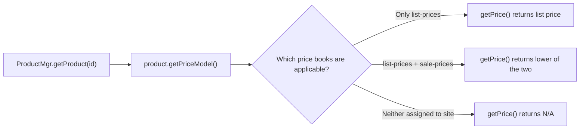
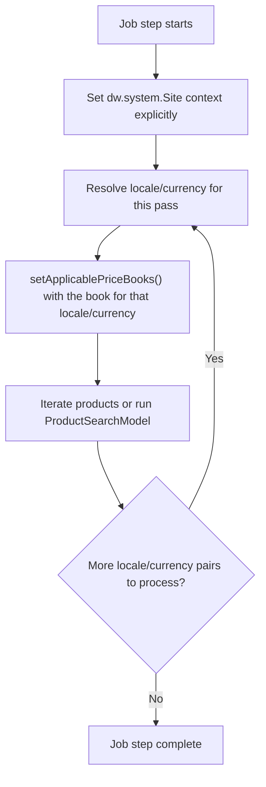
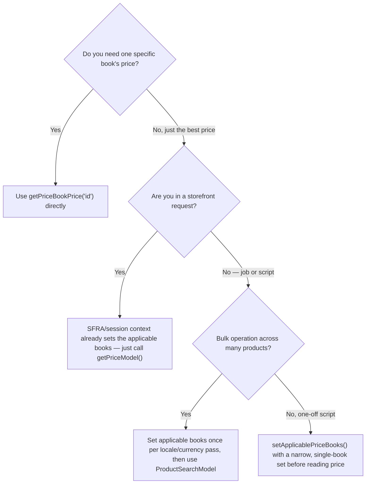

"What's the best way of retrieving a product's 'sale' price when there are 2 pricebooks — list-prices, sale-prices? With `product.getPriceModel().price` the price shown is always the one coming from the 'parent' pricebook, the list price."

I've now seen a version of that sentence in four different Slack channels in the space of a few weeks: #sfra, #b2c-general, #scapi, #storefront-next. Same setup, same confusion, same moment of "wait, why isn't this working." It's one of the most reliably recurring questions in the SFCC community, and it keeps recurring because the answer isn't spelled out anywhere outside the Script API class reference itself — and a lot of the older bookmarked links to that reference (legacy `documentation.b2c.commercecloud.salesforce.com` URLs, or the old `/references/script-api-for-commerce-cloud/current/...` path on developer.salesforce.com) now 404, which sends people hunting through Slack history instead. The current reference, under `/docs/commerce/b2c-commerce/references/b2c-script-api/`, is live and has the full method signatures — you just have to know to look there. Let's fix that.

## The applicable set, not the price book you assigned

Here's the root cause, and it's almost always the same one: `getPriceModel().price` doesn't evaluate every price book that exists on your instance. It only evaluates whatever's currently in the *applicable* set for the session, and if your sale price book was never added to that set, the platform genuinely does not know it exists.

Someone finally ran this down in one of those threads by checking `PriceBookMgr.getApplicablePriceBooks()` — `PriceBookMgr` is the Script API class for reading and setting which price books are in scope for the current session — and getting back a single price book: the list book. Not the sale book, even though it was configured correctly in Business Manager (SFCC's merchant-facing admin tool), assigned to the site, and had entries for the product in question. The sale book just wasn't in scope for that request.

Once you see it, the rest of the confusion collapses into one sentence: **`ProductPriceModel.getPrice()` returns the minimum price across whatever price books are currently applicable — nothing more, nothing less.** If only the list book is in the applicable set, the "lowest price" happens to be the only price, and that's what you get back from a plain `ProductMgr.getProduct(id).getPriceModel().getPrice()` call every time. (`ProductPriceModel` is the class `Product.getPriceModel()` actually returns — there's no separate `PriceModel` class in the Script API.)



Where does the applicable set come from by default? Whichever price books are assigned to the site and match the session's currency (per Salesforce's own [price lookup rules](https://help.salesforce.com/s/articleView?id=cc.b2c_price_books_for_developers.htm&type=5)), plus their direct parent price books. Storefront controllers built on SFRA (Storefront Reference Architecture, SFCC's standard storefront framework) don't usually need to think about this. The platform resolves the applicable price books for you automatically at the start of each request. The moment you step outside that request lifecycle — a script you run by hand in Business Manager, a job, a custom SCAPI (Salesforce Commerce API, the newer headless REST layer) endpoint — you're on your own, and the applicable set defaults to whatever the platform decides for that context. Often, that's just the list book.

## Fixing it: setApplicablePriceBooks(), correctly

The fix, in Script API (SFCC's server-side JavaScript API) context, is `dw.catalog.PriceBookMgr.setApplicablePriceBooks()`, called before you read any price. The signature is `setApplicablePriceBooks(priceBooks: PriceBook...)` — variable arguments, meaning you pass each `PriceBook` object as its own argument, not a `List`, array, or `ArrayList` wrapping them. Here's what a correct call looks like, in a script you might run from Business Manager, a job step, or a custom endpoint:

```js
var PriceBookMgr = require('dw/catalog/PriceBookMgr');
var ProductMgr = require('dw/catalog/ProductMgr');

var listPriceBook = PriceBookMgr.getPriceBook('my-list-prices');
var salePriceBook = PriceBookMgr.getPriceBook('my-sale-prices');

// Correct: each PriceBook as its own argument (varargs), not a List
PriceBookMgr.setApplicablePriceBooks(listPriceBook, salePriceBook);

var product = ProductMgr.getProduct('my-product-id');
var price = product.getPriceModel().getPrice(); // lowest of the two books
```

One developer in #b2c-general hit this exact mistake, just in the other direction. They'd built a `dw.util.ArrayList` of the two price books and called `PriceBookMgr.setApplicablePriceBooks(applicableBooks)` with the whole collection as a single argument — the pattern that works for plenty of other multi-object Script API calls. It didn't throw; it just quietly returned only the list price, because the method only recognises individual `PriceBook` arguments, not a collection wrapping them. The API reference states the varargs signature plainly enough once you know to look for it, but it's an easy pattern to get backwards coming from other parts of the API that do take a `List`.

There's a second gotcha layered on top of the first. Once you *do* call `setApplicablePriceBooks()` with a broad set — say, both a GBP book and a Euro-currency book, because your site sells in both — `getPriceModel().getPrice()` still just returns the minimum across everything in that set. If GBP happens to be numerically lower than EUR after conversion, you'll get GBP back even when your storefront is rendering in EUR. The "lowest price wins" rule is doing exactly what it's told — it's just now working against a set that's bigger than you meant it to be.

## When you want a specific book, skip the minimum logic entirely

If what you actually need is "the price from *this* book," don't widen the applicable set and hope `getPrice()` lands on the right one. Call `ProductPriceModel.getPriceBookPrice('pricebook-id')` directly, on the same `product` from the example above:

```js
var priceModel = product.getPriceModel();
var listPrice = priceModel.getPriceBookPrice('my-list-prices');
var salePrice = priceModel.getPriceBookPrice('my-sale-prices');
```

Reach for this pattern anywhere you need to show both prices at once — a strikethrough list price next to a sale price on a product tile, for instance — because `getPrice()` by design only ever gives you one number.

One quirk worth knowing before you rely on this: someone in the same thread reported that `getPriceBookPrice('pricebook ID')` didn't return anything useful *until* they commented out the earlier `setApplicablePriceBooks()` call in the same script. I haven't been able to pin down the exact interaction from the (thin) official docs, but the practical lesson holds up: if you're reaching for `getPriceBookPrice()` for a specific book, don't also call `setApplicablePriceBooks()` with a narrower or conflicting set upstream in the same execution. Pick one mechanism per code path and don't mix them.

A store-based fulfilment case makes the same point from a different angle: one setup had three price books — one per store, physical versus virtual — with the applicable books set correctly. But `getPriceModel().getPrice()` kept returning the lowest of the three ($500) instead of the one tied to the current store ($900), because "lowest wins" doesn't know which store the shopper is in.

The fix that was reached is the right one: set *only* the single price book you want as the applicable set at the point you call the product or search factory, rather than leaving all three in scope and hoping the "lowest wins" rule happens to pick the right one. If you need more than one book active at a time, use `getPriceBookPrice()` per book instead of `getPrice()`.

> [!NOTE]
> Nobody in that thread had a clean answer for combining a specific price book with `PromotionMgr` (the Script API class for evaluating active promotions) — there's no native API to say "apply promotion X to price book Y specifically." Promotions apply to whatever the current price model resolves to. If your business logic needs promotions scoped per price book, budget time to test that interaction directly against your price book setup rather than assuming it composes cleanly.

## Reading list and sale price together via the parent book

Business Manager gives you a cleaner path for the common case of "show both prices," and it doesn't require juggling two separate `getPriceBookPrice()` calls with hardcoded IDs. Under **Merchant Tools > Site > Products and Catalogs > Price Books**, a price book's General tab has a **Based On** field — this is the parent price book relationship. Set your sale book's "Based On" to your list book, and `dw.catalog.PriceBook` exposes that relationship in script through `parentPriceBook`. The `priceModel` below is the same one from the `getPriceBookPrice()` example earlier — one product, one price model, two books:

```js
var salePriceBook = PriceBookMgr.getPriceBook('my-sale-prices');
var listPriceBook = salePriceBook.getParentPriceBook();

var salePrice = priceModel.getPriceBookPrice(salePriceBook.getID());
var listPrice = priceModel.getPriceBookPrice(listPriceBook.getID());
```

This buys you one real thing: you stop hardcoding the list book's ID in every script that needs both prices. Walk the relationship instead, and a merchant can rename or reorganise price books later without you needing to touch every price-display script.

## Job context: there's no session, so there's no free lunch

Jobs are where this whole model gets less forgiving. A storefront request arrives with a session, a locale, and a currency already resolved by the platform before your controller code runs a single line. A job step has none of that. There's no request, so there's nothing setting the applicable price books, the locale, or the currency for you — you have to do all three explicitly, in the right order, before you read a single price.

One question from mid-2024 asked exactly this for a multi-locale, multi-currency job and never got a public answer in the thread, so there's no canonical fix to point to — just a workaround people keep reinventing independently. The version most teams land on: explicitly set the site and locale context, then call `setApplicablePriceBooks()` with the correct book for that locale/currency combination *before* running your search or product loop, and repeat that sequencing for every locale/currency pair you need to touch. Skip a step, or run it out of order, and you'll get prices back for the wrong currency without any error telling you so.



For iterating products at scale, reach for `ProductSearchModel` rather than looping `ProductMgr.queryAllSiteProducts()` product by product. `ProductSearchModel` runs against the search index, which is the difference between a job step that finishes and one that times out on a catalog with any real size. Set your applicable price books once per locale/currency pass, run the search, and pull pricing off each `ProductSearchHit`. Note that `ProductSearchHit` itself doesn't expose a price model — its own `getMinPrice()`/`getMaxPrice()` come straight from the search index and, per Salesforce's own docs, can return different numbers than `ProductPriceModel`. For a price you can trust against live price book data, call `hit.getProduct().getPriceModel()` instead of relying on the hit's index-derived price alone.

## The SCAPI gap: there's no setApplicablePriceBooks() equivalent

Of all the recurring questions, this is the one that worries me most, because no answer exists anywhere I could find — not in a Slack thread, not in the official docs. The question came up again in mid-2026, this time in #scapi: is there a SCAPI equivalent to `PriceBookMgr.setApplicablePriceBooks()` and `Promotion.getPromotionalPrice`? Nobody replied.

There isn't one, and the reason runs deeper than a missing parameter. SCAPI's [Shopper Products API](https://developer.salesforce.com/docs/commerce/commerce-api/references/shopper-products) resolves price server-side as part of building the response — you don't get a script-context call graph you can insert `setApplicablePriceBooks()` into, because there's no equivalent "before you read the price" moment exposed to you. The price and `priceRanges` fields in a `getProduct` or `getProducts` response are already the outcome of whatever price books are assigned to the site and (per Salesforce's own documentation) [personalised through the Shopper Context API](https://developer.salesforce.com/docs/commerce/commerce-api/guide/shopper-context-api.html) — customer group, source code, or store ID context you set before the call, not price book IDs you pass on the call itself.

Promotions carry the same constraint one layer further. Salesforce's [Promotion Types and Requirements](https://developer.salesforce.com/docs/commerce/commerce-api/guide/promotion-details.html) guide states it plainly: promotional pricing is **only** returned for qualifying products with non-conditional purchase requirements, and pricing discounts for basket and shipping promotions are **never** returned by `getProduct` or `getProducts` at all. If your promotion has a condition attached — a minimum spend, a loyalty signup — SCAPI won't hand you a calculated promotional price up front; the shopper has to act first.

If you need custom price book logic in a headless implementation and none of that native resolution gets you there, the documented extension point is a hook, not a new SCAPI parameter. `dw.ocapi.shop.product.modifyGETResponse` runs after OCAPI has already resolved the product and built the response document — it hands you both the resolved Script API `Product` object and that document, so you can modify the document before it goes back to the client. (OCAPI is SFCC's original REST API; SCAPI reuses the same hook extension points under the hood, which is why the hook name still carries the `dw.ocapi` prefix.) [That lifecycle is covered in detail here](/how-to-use-ocapi-scapi-hooks/) if you haven't wired one up before. Inside that hook you have the full `dw.catalog` API available, including `setApplicablePriceBooks()` and `getPriceBookPrice()`, so you can attach whatever custom price data the native response doesn't give you as a `c_` field.

Two things to remember before you reach for this. SCAPI hooks don't run at all until someone turns on API hook execution under **Administration > Global Preferences > Feature Switches** in Business Manager. And the response is cached in JWA against the TTL (time-to-live: how long a cached response is served before the platform re-fetches it) configured in that same Feature Switches setup, so a custom price field you attach in the hook shares the same cache window as everything else in the response.

## Iterating all price tables of a product

The other question that surfaced independently in #b2c-general — how do you get *every* price table for a product programmatically, not just the applicable ones — has a straightforward brute-force answer and a faster one for scale.

The brute-force version: loop `PriceBookMgr.getAllPriceBooks()` and call `priceModel.getPriceBookPrice(priceBook.getID())` for each one.

```js
var allBooks = PriceBookMgr.getAllPriceBooks();
var prices = {};

while (allBooks.hasNext()) {
    var book = allBooks.next();
    var price = priceModel.getPriceBookPrice(book.getID());
    if (price.available) {
        prices[book.getID()] = price;
    }
}
```

This works, and it's fine for a one-off script against a single product in Business Manager. It does not scale to a job that touches every product in a large catalog, because you're paying the cost of that inner loop once per product per price book. For bulk operations, the same `ProductSearchModel` pattern from the job-context section is the better fit: constrain the applicable price book set to only the books you actually need for that pass, and let the search index do the filtering instead of asking every product about every book it might have an entry in.

## High Scale Price Books: the option nobody documents well

One thread mentioned High Scale Price Books as an alternative worth knowing about for jobs that update prices frequently, and I want to flag it honestly: I couldn't find solid official documentation to verify the details beyond what came up in that conversation, so treat this section as a pointer to go verify against your own instance, not a spec.

The pitch, as it came up in that thread: a standard price book keyed to a product-level custom attribute needs the catalog reindexed every time the job updates prices, and reindexing at that frequency gets expensive. High Scale Price Books (Salesforce's official docs call the resulting price book type "read-only price books," enabled by the High Scale Price Books feature switch) are built to bypass that reindex requirement entirely — Salesforce's own documentation confirms read-only price books "don't require product indexing for prices to take effect in the search index." The trade-off, per the same Slack source: no promotion support on that price book, and a more limited Business Manager UI for managing entries compared to a standard price book. The UI limitation checks out — Salesforce confirms you can't edit individual prices or price tables on a read-only price book through the standard Business Manager flow. The "no promotion support" claim is harder to pin down: a more recent release note describes storefront search surfacing products under price-book-based promotions even when they're only priced in a High Scale Price Book, which suggests that restriction may have loosened since the original Slack thread. Treat it as unconfirmed either way. If a job on your project needs to push price changes often enough that reindexing is the bottleneck, it's worth asking your Salesforce account team whether High Scale Price Books apply to your instance before you build around the standard price book model — check your own release notes rather than taking either source as the final word.

## Picking the right tool



Every path in that tree still ends at the same rule: `getPriceModel().getPrice()` only ever tells you the minimum across whatever's currently applicable, and "currently applicable" is something you own, not something the platform quietly gets right on your behalf outside a storefront request. Set it deliberately, or use `getPriceBookPrice()` and skip the guessing entirely.

If price books are new territory for you, the [Product and Catalog ERD](/salesforce-b2c-commerce-cloud-catalog-erd/) covers how price books sit next to the rest of the catalog model, and price resolution matters again the moment a shopper reaches [checkout](/sfcc-basket-order-erd/) — the basket re-evaluates prices against whatever's applicable at that point too. Worth knowing before your prices look right on the PDP (product detail page) and wrong in the cart.
