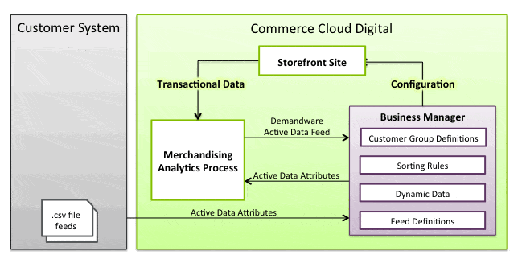

When working on personalisation and segmentation within Salesforce B2C Commerce Cloud, [Active Merchandising](https://help.salesforce.com/s/articleView?language=en_US&id=cc.b2c_active_merchandising.htm) is one of the tools to help you along the way. By utilising data collected automatically by Salesforce B2C Commerce Cloud, you can gain a deeper understanding of your customers' behaviour and tailor campaigns accordingly. For instance, we display a distinctive banner to frequent visitors compared to those who only visit sporadically.

## How is Active Data gathered



### Storefront

When looking at "out-of-the-box" data gathering, we mean all data gathered by analytics that happens on Salesforce B2C Commerce Cloud channels such as:

- Storefront Sites such as SiteGenesis / SFRA
- Headless OCAPI / SCAPI channels

The data collection happens either by client-side tracking (JavaScript - e.g. [`<isobject>`](https://developer.salesforce.com/docs/commerce/b2c-commerce/guide/b2c-tagging-pages-for-data-collection.html)) for information such as product views or server-side events such as placing orders.

```html
// Example of the client-side generated scripts
<script type="text/javascript"><!--
/* <![CDATA[ (viewProduct-active_data.js) */
dw.ac._capture({id: "5024501", type: "detail"});
/* ]]> */
// -->
</script>
```

PWA Kit / Headless SiteGenesis and SFRA make use of `<isactivedatahead>`, `<isactivedataconext>`, and `<isobject>` tags to insert JavaScript client side to take care of the tracking of information. This is not the case for the PWA Kit or custom headless implementations! A custom implementation will be needed to add support for some of these "standard" Active Data fields again.

## Extend Active Data

Besides [all of the standard fields](https://developer.salesforce.com/docs/commerce/b2c-commerce/guide/b2c-automating-feed-import-of-active-data.html) available for merchandising, you can extend the model with your own data!

This can be particularly useful if you create campaigns/personalisation based on customer actions originating on systems/places outside of Salesforce B2C Commerce Cloud.

As for the example flow, we are going to be using visits to a physical store as an example:

- Visits in the last 24 hours
- Visits in the last 30 days

By utilising this information, we can categorise individuals into a specific customer group and create a marketing campaign to target those who make purchases online and offline.

### Step 1: Extend the System Object

There are two System Objects that we can extend:

- [CustomerActiveData](https://salesforcecommercecloud.github.io/b2c-dev-doc/docs/current/scriptapi/html/api/class_dw_customer_CustomerActiveData.html)
- [ProductActiveData](https://salesforcecommercecloud.github.io/b2c-dev-doc/docs/current/scriptapi/html/api/class_dw_catalog_ProductActiveData.html)

In this case, we want to extend the Customer Active Data, so we head to: _Administration > Site Development > System Object Types > Customer Active Data _ On the "_ Attribute Definitions_" tab, we click "New" to start creating our new attributes.





As with any attribute, if we want to be able to view them in the Business Manager screens, we should not forget to add them to a new or existing "Attribute Group". To do this, we go to: _Administration > Site Development > System Object Types > Customer Active Data - Attribute Groups_ Once here, let us create a new group called "Physical Store Traffic", and assign our two new attributes.



Attribute Group For many screens, attributes that are not assigned to a group will not be visible or not function properly.

### Step 2: Create the feed definition (CSV)

Now that our attribute model has been extended, we need to create a way of importing that data. The first step to allowing CSV import is to create a "feed". To do this we need to head over to the "Feed Definitions": _Merchant Tools > Online Marketing > Active Data > Feed Definitions_ In the overview, we see our two types of active data again. Here we will be creating a feed for Customer Active Data. Click the "new" button and create our feed! On the next screen decide on the following fields:

- **ID:** The ID of the feed. We will need this in our CSV file later (I have chosen "customer-physical-store-information-feed")
- **Description:** Free text to describe the purpose of the feed
- **Fresh Period:** The value is the number of days after which the data becomes stale if it's not updated. 0 means the data is never considered stale.



### Step 3: Create the file to import

SFCC understands what we want to send to the system by defining the feed. Now on to creating the file for import! A simple CSV file, with the data that our external system is generating.

```text
‎
customer-physical-store-information-feed
customerNo,custom.physicalVisits,custom.physicalVisitsMonth
"W00000001",0,5
"W00000006",1,2
```

Some things to keep in mind with this file:

- The first line should be empty!
- The second line is the ID of the feed we defined earlier (it tells SFCC which feed this file is for)
- The third line is our header
- Custom attributes, like in code, are defined in the header starting with "custom."

### Step 4: Import the CSV file

There are two ways to import this file:

- Through the business manager _Merchant Tools > Online Marketing > Active Data > Import & Export_
- Through an automated job using the Job Step "[ImportActiveData](https://salesforcecommercecloud.github.io/b2c-dev-doc/docs/current/jobstepapi/html/api/jobstep.ImportActiveData.html)"

### Step 5: Check that it worked

Once the import has been completed we can go and check on a profile if that import succeeded!



And with this new addition, we can start creating new [Dynamic Customer Groups](https://help.salesforce.com/s/articleView?language=en_US&id=cc.b2c_creating_a_dynamic_customer_group.htm), for example!



Active Data Custom feed imports do not show in the Business Manager if the "standard" Active Data fields are empty for a customer or product. You might have to do a manual import on your sandbox to force the visibility. For that reason, I have provided an example file below!

```text
‎
Demandware Customer Active Data
customerNo,visitsWeek,visitsMonth,orderValueMonth,productsViewedMonth,productsAbandonedMonth,visitsYear,orders,orderValue,discountValueWithoutCoupon,discountValueWithCoupon,giftUnits,avgOrderValue,sourceCodeOrders,topCategoriesOrdered,productsOrdered,giftOrders
"W00000001",0,0,0.0,,,0,1,37.29,0.0,0.0,0.0,37.29,0,,"""8571677"",""8642255"",""8705308""",0
"W00000006",0,0,0.0,,,0,1,18.1,0.0,0.0,0.0,18.1,0,,"""8704168"",""8714462""",0
```
