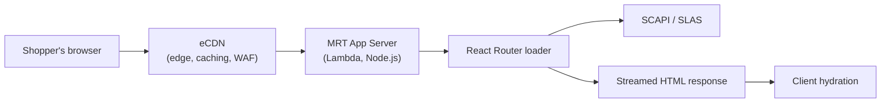

A developer mid-RFP, deciding architecture on the spot, asked the question that should have been answered months earlier: does the request from a mobile app go through Managed Runtime, and if React Router returns HTML, how does that work for a TV app? They were already sketching a second backend-for-frontend (BFF) — a service layer that sits between client apps and backend APIs, shaping responses for whatever device is asking — in case the answer was "it doesn't." It doesn't. A Salesforce engineer confirmed it plainly in the same thread: mobile apps connect directly to SCAPI (the Salesforce Commerce API — SFCC's REST API for products, pricing, carts, and checkout), and there's no BFF starting point on MRT today.

I've heard some version of this question from every PWA Kit and Storefront Next developer I've worked with, usually followed by three more: does MRT do server-side rendering, what happens when the backend API it's calling is slow, and why did a routine deploy just return `403` on every environment including the one you rolled back to. All four questions come from the same gap. Managed Runtime (MRT) is the infrastructure every headless SFCC storefront runs on, and Salesforce's own docs describe its pieces individually without ever drawing the full picture in one place. This is that picture.

## What MRT Actually Is

Strip away the marketing name and MRT is a Node.js, Lambda-based serverless layer: an Express app running your React storefront, deployed as a "bundle," executed on demand. There's no server sitting idle waiting for traffic. A request comes in, Lambda spins up (or reuses a warm) execution context, your app renders a response, and the function returns.

That single fact explains most of the behaviour that confuses people coming from SFRA or the old web tier. There's no persistent process to inspect with `top`, no server you SSH into, and no in-memory state that survives between unrelated requests. A "cold start" — Lambda spinning up a brand-new execution environment because no warm one was available — means the next request pays a startup cost the previous one didn't; anything you cached in memory from an earlier request is gone unless you've deliberately built it to survive that reset. Business Manager's web tier model — a fixed pool of application servers behind load balancers — doesn't map onto this at all. MRT's "routing" isn't a web-tier URL rule engine; it's whatever your React Router configuration decides to do once the Lambda function has already been invoked.

Organisations contain projects, projects contain environments, and each environment runs exactly one deployed bundle at a time. That hierarchy matters operationally: production and staging are different environments with their own Node version, environment variables, and log streams, not different branches of the same running process.

## SSR, Streaming, and the Slow-API Problem

Here's the anxiety question, almost word for word from a Storefront Next evaluation: if a page needs live inventory or custom pricing and that call takes nearly a second, doesn't standard SSR just stall the Lambda function while the shopper stares at a blank screen?

Under classic, blocking SSR, yes. The server can't send anything until every data dependency for the page has resolved, so a slow SCAPI call becomes a slow page, full stop. Storefront Next doesn't render that way. It's built on React 19 with React Router 7 in framework mode — React Router acting as the full application framework, handling routing, data loading, and server rendering together instead of just client-side navigation — and React 19 ships with Node.js streaming support built in. Instead of waiting for the whole page, the server sends the shell first — layout, navigation, whatever has no slow dependency — and streams in the rest as each `Suspense` boundary resolves.

The pattern in practice: wrap the slow section (say, a live-pricing panel) in its own `Suspense` boundary with a loading skeleton as the fallback, and use the `use()` hook or an `Await` pattern to resolve the promise inside it. Storefront Next's own guidance is to give each async operation its own boundary rather than one big one around the page, specifically so a stalled pricing call doesn't hold the product images and add-to-cart button hostage too. One slow section degrades gracefully; it doesn't take the whole page down with it.

No, the shopper doesn't stare at a blank screen — the skeleton renders immediately. Whether streaming to thousands of concurrent shoppers stresses the server is a separate question, one Salesforce's own docs don't fully answer: they describe streaming's benefits (efficient memory use, incremental rendering) without publishing hard concurrency numbers. What is documented is the ceiling each request runs against regardless of how much of it streams: MRT's App Server execution time limit is 20 seconds in production, 16 seconds in non-production. A `Suspense` boundary buys you a responsive first paint under a slow API; it does not buy you unlimited time to resolve that data. If the underlying call routinely takes longer than that, streaming is cosmetic and the real fix is caching or a faster upstream.

Which brings up the other half of the trade-off nobody asks about directly: when should you skip SSR for a piece of data and fetch it client-side after the shell has loaded? If the data is genuinely optional for the first render — a "recently viewed" carousel, a loyalty balance, anything that isn't load-bearing for the shopper's first decision on the page — fetching it client-side after hydration (the point where the browser takes over rendering from the server and the page becomes interactive) keeps it off the server's execution-time clock altogether. Reserve server streaming for data the page can't meaningfully render without.

## Deploying: pnpm push, mrt-deploy, and Where They Diverge

The generic MRT deploy tooling (the `mrt-deploy` GitHub Action, or the raw push CLI from PWA Kit) and the Storefront Next path are not interchangeable, and the failure mode when you mix them up is unhelpful: "Exactly one of `ssr.js`, `ssr.mjs`, `streamingHandler.js`, or `streamingHandler.mjs` must be included in `ssr_shared` or `ssr_only`."

Use the command Storefront Next ships with — `pnpm sfnext push` — instead of reaching for the generic action out of habit. It's the same underlying toolkit, but it generates the Storefront Next-specific SSR bundle parameters (which streaming handler target to register) for you. The `mrt-deploy` action can still work, but only if you construct the `--ssr-*` flags yourself, which is extra work for no benefit unless you have a reason to avoid the bundled command.

Bundle limits worth knowing before a push fails for a boring reason: 400 MB total, with `ssr_only` and `ssr_shared` files combined capped at 249 MB.

Timing varies just as much as size. Deploying to a brand-new environment can take up to an hour the first time; every push after that is closer to a minute, or up to fifteen if the CDN configuration itself changed.

## What Breaks, and Why

### Node version warnings that turn into a full outage

A developer pushed a routine bundle and every environment, including a rollback to a previously working bundle, started returning `403 Forbidden`. The logs carried a line easy to dismiss: `AWS Lambda has removed support for callback-based function handlers starting with Node.js 24.` It reads like a deprecation notice, and it is one — but it's also a signal, not noise. Node.js 25 is not supported on MRT at all; bundles built against it won't deploy. The eventual fix in that case wasn't a config tweak — it was standing up a fresh MRT environment and redeploying, because the existing one had degraded into a state a rollback couldn't recover from.

Check your Node version against MRT's supported range before you push, not after a 403 sends you spelunking through logs. As of this writing, 24.x is the current recommended version and 22.x is fully supported. 20.x reached its own end-of-life date on April 30, 2026, and 18.x reached end of life earlier still, on September 1, 2025 — deployments using either version are expected to fail outright, not just warn. Deploying itself needs Node.js 24.13.0 or later locally, paired with pnpm 10.28.0 or later.

### Environment variables that silently don't apply

Each MRT environment supports up to 100 environment variables, with a combined value size cap of 32 KB. Names that start with a reserved prefix (`AWS`, `MRT`, `X_MRT`, `MOBIFY`, `X_MOBIFY`, `SSR_PROXY`, `NODE`) or that match a reserved name outright (`BUNDLE_ID`, `DEPLOY_ID`, `NODE_ENV`, and a handful of others MRT uses internally) are rejected before they ever reach your code — if a variable you set isn't showing up at runtime, check the name against that list before assuming a deploy problem.

### CSP and preview iframe elements

Storefront Preview (the tool behind Page Designer's live preview) embeds your storefront inside an iframe served from Runtime Admin, and if your Content Security Policy's `frame-ancestors` directive doesn't explicitly allow `https://runtime.commercecloud.com`, the iframe simply refuses to render — no error toast, just a blank preview pane. If your preview stopped working after you tightened CSP headers, that directive (plus `connect-src` and `script-src`, which also need that origin) is the first place to look.

### Log tailing, when you actually need to see it happen

For anything you can't diagnose from a static error, tail logs live: `npm run tail-logs -- --environment $ENV_ID`. Sessions cap at 60 minutes, and an environment supports up to 100 concurrent tailing sessions, which is generous enough that you won't be fighting a teammate for the one available slot.

Production environments also get Log Center, with MRT metrics, CDN error logs, and correlation ID tracing across a request — the correlation ID is UUID v4, available through a `useCorrelationId` hook, and worth forwarding to SCAPI via the `correlation-x` header if you're trying to stitch a shopper's request across systems. That stitching stops at the SCAPI boundary today, though: there's no unified pane that follows a request from a storefront action hook, through SCAPI, into a Commerce App cartridge hook. Correlation IDs are the only connective tissue you get, and you'll be pasting them between two different log viewers by hand.

## Decision Guide: SSR or Client-Side Fetch

I default to this checklist when a new page's data requirements come up in planning:

- **Render-blocking for the shopper's first decision** (price, availability, the primary product image): stream it server-side, in its own `Suspense` boundary, so the shell paints immediately even if this section lags a beat behind.
- **Nice-to-have, not decision-critical** (recently viewed, related products, loyalty points): fetch it client-side after hydration. It never touches the App Server's execution-time clock, and a slow response there degrades to a spinner instead of a slower page.
- **Routinely slower than a couple of seconds, no matter what you do**: fix the upstream, or cache it. No amount of streaming or boundary placement saves you if the underlying call is close to the 16-to-20-second execution ceiling — that's a capacity problem dressed up as a rendering problem.
- **Needed on every navigation, not just the first load**: after the initial streamed page, Storefront Next's own navigations are client-side through React Router, so this data doesn't need to be server-rendered again anyway.

None of this replaces reading the actual response times your APIs return under real load. But it's a reasonable place to start the argument the next time someone in your team asks whether a page "needs SSR," because the honest answer is almost always "parts of it, not all of it."

For the layer above MRT — how Storefront Next's own architecture builds on top of everything here — see [Storefront Next: Architecture and the PWA Kit Migration](/storefront-next-architecture-and-migration-from-pwa-kit/). And if you're deploying to MRT through CI/CD, the authentication layer that trips people up first is usually Account Manager, not MRT itself — see [Account Manager MFA: Why It Broke Your SFCC CI/CD Pipeline](/account-manager-mfa-broke-sfcc-cicd/).


For how Commerce Apps and Extensions compile and deploy on top of this layer, see [Storefront Next Extensibility Explained](/storefront-next-extensibility-explained/).

