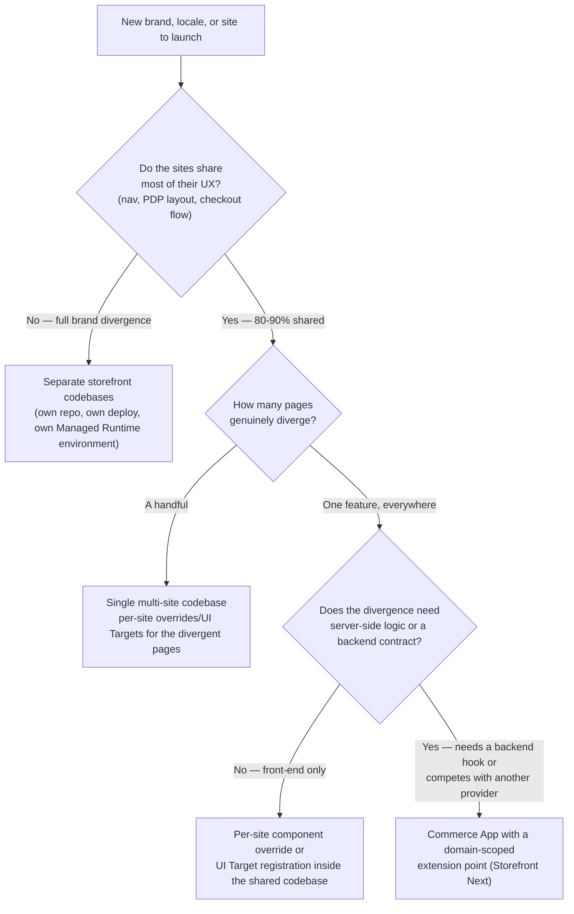
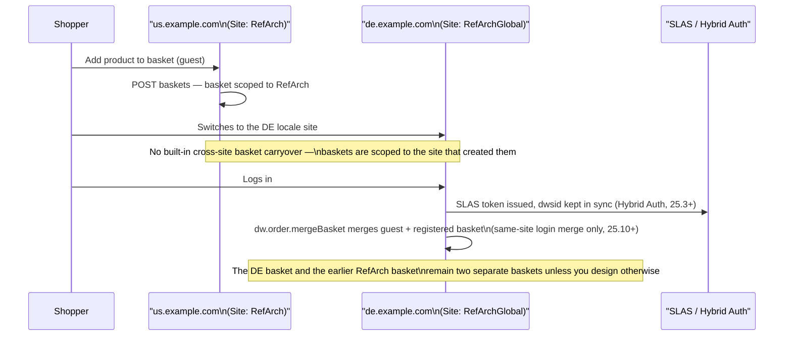

Two questions landed in two different Slack channels the same week, wearing different clothes. In `#storefront-next`, someone building a multi-brand rollout wanted to know how far Storefront Next would let their homepages and PDPs (product detail pages — the page a shopper lands on for a single product) diverge before the "one codebase" pitch stopped making sense. In `#pwa-kit`, someone else was chasing a bug where a shopper's basket vanished the moment they switched from the US site to the Canadian one, and wanted to know why auth and basket state weren't just... there. Same underlying question, asked from opposite ends: should our sites share a codebase, or not?

Somebody answered the PWA Kit thread well, buried three replies deep: split codebases for brands that genuinely diverge, one multi-site codebase for the ones that don't, and Commerce Apps for the shared-but-exceptional bits in between. That's the right answer. It just never made it out of the thread.

## The Part That's Already Shared, Whatever You Decide

Before the codebase question, there's a layer question, and it's easy to skip past because it's true regardless of which storefront framework you pick. B2C Commerce is "structured as an organization containing one or more sites (storefronts)," per Salesforce's own [localisation guide](https://developer.salesforce.com/docs/commerce/b2c-commerce/guide/b2c-localization.md). One org, many sites, and every site already gets its own catalogs, price books, content, and [site preferences](/custom-preferences-in-sfcc/) whether or not you write a single line of storefront code differently. The codebase decision you're weighing is entirely about the presentation layer sitting on top of that. The data layer is multi-site from day one, no matter what you decide up here.

That matters because it changes what question you're answering. You're not deciding whether to support multiple sites — B2C Commerce already does that. You're deciding how much of the storefront's *rendering* logic gets to say "if site A, do this; if site B, do that" before that branching stops being maintainable and starts being its own liability.

## The Rubric

Here's the decision, as a flowchart rather than a Slack thread:



The two ends of that tree are easy calls. It's the middle — "mostly shared, but this one thing is different" — where teams either over-engineer a split they didn't need or under-engineer a shared codebase that turns into a maze of `if (site.ID === 'EU-DE')` blocks. The rest of this post is about that middle ground, on both the framework you're probably running today and the one you might be moving to.

## Splitting the Codebase: Full Brand Divergence

If two brands don't share a header, a checkout flow, or a design system, don't force them into one repository just because they happen to run on the same B2C Commerce instance. A split codebase — separate repos, separate deploy pipelines, in PWA Kit or Storefront Next terms, separate Managed Runtime environments (Managed Runtime is Salesforce's hosting platform for these headless storefront apps — each environment is its own deployed instance) — costs you duplicated plumbing (auth wiring, analytics, error boundaries) in exchange for never having to reason about brand B's checkout while you're mid-refactor on brand A's. For genuinely divergent brands, that trade is usually worth it. The org-level sharing from the section above — catalogs, price books, customer data if you want it — still applies underneath both codebases. Splitting the storefront doesn't mean splitting the business data.

Where this goes wrong is when "divergent" gets defined by logo and colour palette rather than by actual UX. Swap the header and the accent colour on an otherwise identical PDP and checkout, and nothing about the actual UX has moved. That's a theme, and it belongs in the middle tier below, not its own repository.

## Sharing on SFRA: Site Preferences and Feature-Switch Branching

Classic SFRA — Storefront Reference Architecture, Salesforce's older server-rendered, MVC-style storefront framework — handles multi-site with the mechanism it's always leaned on: [site preferences](/custom-preferences-in-sfcc/). A site preference scoped per-site is the natural home for anything that varies by brand without changing the shape of the page — a feature flag, a threshold, a copy string, a boolean gating whether a promo banner renders at all. Read it with `Site.getCurrent().getCustom()`, branch on it in your controller or ISML template (SFCC's server-side templating language, short for Internet Store Markup Language), and you've got per-site variation without touching the template file itself.

The trap is scale. One or two site preferences gating one or two `<isif>` blocks is a perfectly reasonable pattern. Ten preferences gating branching logic scattered across a dozen templates is a maintenance problem wearing a multi-site costume — every new site added to the storefront means auditing every one of those branches to check it still does the right thing for a site nobody had in mind when it was written. If you're finding yourself writing `if (dw.system.Site.getCurrent().ID === 'BrandB')` directly in a controller rather than reading a preference, that's usually the signal the divergence has outgrown the feature-switch pattern and belongs in a real per-site override, or in its own codebase.

> [!NOTE]
> Classic SFRA doesn't ship a documented, first-class hook for "switch a shopper between locale-specific sites and carry their session forward." If you've got that working today, it's almost certainly custom controller logic your team built, not a Salesforce-provided mechanism. Worth knowing before you inherit someone else's multi-site SFRA project and go looking for the platform feature that isn't there.

## Sharing on the Composable Stack: `sites.js` and Template Extensibility

PWA Kit — Salesforce's React-based, headless storefront framework, launched in 2021 as the composable alternative to SFRA — takes the same underlying idea, one codebase, several sites, and gives it real configuration surface instead of scattered preference checks. `config/sites.js` defines every site your project serves, each with its own locales, currencies, and defaults:

```javascript
// config/sites.js
module.exports = [
  {
    id: "RefArch",
    l10n: {
      supportedCurrencies: ["USD"],
      defaultCurrency: "USD",
      defaultLocale: "en-US",
      supportedLocales: [
        { id: "en-US", alias: "us", preferredCurrency: "USD" },
        { id: "en-CA", preferredCurrency: "USD" },
      ],
    },
  },
  {
    id: "RefArchGlobal",
    l10n: {
      supportedCurrencies: ["GBP", "EUR", "JPY"],
      defaultCurrency: "GBP",
      supportedLocales: [
        { id: "de-DE", alias: "de", preferredCurrency: "EUR" },
        { id: "en-GB", preferredCurrency: "GBP" },
        { id: "ja-JP", preferredCurrency: "JPY" },
      ],
      defaultLocale: "en-GB",
    },
  },
];
```

`config/default.js` sets which site is the default and maps site IDs to the URL aliases shoppers actually see (`RefArch` becomes `/us`, `RefArchGlobal` becomes `/global`), and Salesforce's own [multiple sites guide](https://developer.salesforce.com/docs/commerce/b2c-commerce/guide/multiple-sites.md) is explicit that the canonical site and locale IDs stay valid even once aliases are in play. For teams that want each brand on its own domain rather than a shared one with path-based sites, the same guide covers deploying via environment-specific configuration files — `config/env-customer-1.js`, `config/env-customer-2.js` — one Managed Runtime environment per domain, still one codebase behind them.

Per-site divergence at the component level rides on [template extensibility](https://developer.salesforce.com/docs/commerce/b2c-commerce/guide/template-extensibility.md), the feature PWA Kit v3 shipped and turned on by default for any project generated after June 15, 2023. Declare a base template, declare an `overrides` directory, and any file you recreate at the same path in that directory silently replaces the base template's version at build time — no forked repository, no duplicated boilerplate for the 90% of the app that doesn't change. It's the mechanism, not a site-ID branch, that does the per-site (or per-brand) swap: override the home page component for brand B, leave everything else pointed at the shared base.

Salesforce's own docs are upfront about the cost on the other side of that convenience: "the more files that you override, the more effort is required to keep up with changes in the base template." An override you wrote once against a base-template file that later gets restructured fails at build time with an error like `export 'CAT_MENU_DEFAULT_ROOT_CATEGORY' ... was not found`, and you find out the day you upgrade, not the day you wrote the override. That's a fair trade for a handful of genuinely divergent pages. It's a bad trade for the same "we override half the app for every brand" pattern that should have been a split codebase in the first place.

## Storefront Next: Page Designer, Extensions, and When Commerce Apps Earn Their Keep

Storefront Next splits the same problem into two different tools depending on what kind of variation you're solving for, and I covered the extensibility side of this in more depth in [Storefront Next Extensibility Explained](/storefront-next-extensibility-explained/). The short version, applied to multi-site:

**Content variation is Page Designer's job, not a code branch.** A headless Page Designer page (`arch_type: "headless"`) is configured in Business Manager — SFCC's admin interface for merchandising and site configuration — per site: you build the homepage layout for Brand A in one Business Manager site, a different layout for Brand B in another, and both are fetched with the same `usePage()` hook from `@salesforce/commerce-sdk-react` and rendered through the same React components. The site-awareness lives in Business Manager content. Your React tree renders the same components no matter which site asked for them. If two sites need genuinely different homepage layouts and the difference is "what content goes where," that's a merchandising decision, not an engineering one, and it shouldn't cost you a code branch.

**Component and layout variation is Extensions and UI Targets.** When the divergence is structural rather than content — brand B's PDP needs a review widget brand A doesn't have — that's a component registered against a UI Target (`sfcc.pdp.reviews.rating` and similar named slots), scoped to render only where you've declared it. It replaces the file-shadowing `overrides/` pattern from PWA Kit with something that doesn't accumulate merge-conflict debt against the base template.

**Shared-but-exceptional, with real backend logic, is Commerce Apps.** This is the tier the Slack thread's partial answer was pointing at. When a feature needs to plug into server-side orchestration — tax, shipping, anything that competes with another provider for the same lifecycle moment — the platform gives it a domain-scoped extension point (`sfcc.app.tax.calculate` rather than the old shared `dw.order.calculateTax` hook every integration used to fight over), packaged as a Commerce App and installed per site — each site tracks its own install and configuration state, while the UI Target placeholders the app fills on the storefront (`sfcc.pdp.reviews.rating` and the like) are wired in at build time by a Vite plugin, not injected at runtime. It's currently a Storefront Next mechanism; SFRA support is on Salesforce's stated roadmap<!-- TODO verify: Salesforce's public Commerce Apps roadmap listed SFRA support under an August 2026 wave, marked "subject to change" under Safe Harbor — re-check GA status close to publish since today's date falls inside that window --> rather than shipped everywhere today, so this specific tool isn't yet available if your multi-site project is still on SFRA.

## Worked Example: Session and Basket Continuity Across Locale Domains

This is the part that trips people up on both platforms, so walk through it deliberately instead of assuming it just works.



A basket created through SCAPI's `POST baskets` (SCAPI is the Salesforce Commerce API, the headless REST API composable storefronts call, and this is the headless path) or the Script API's `getCurrentOrNewBasket()` (the SFRA path) is scoped to the site that created it — Salesforce's own [hybrid implementation guidance](https://developer.salesforce.com/docs/commerce/commerce-api/guide/hybrid-storefront-baskets.md) is explicit that you should call the API matching whichever technology owns that page, never mix SCAPI calls into Script API controllers. Nothing in that guidance promises a basket travels with a shopper from one site to another, because sites are the unit baskets are scoped to in the first place. Switching from `us.example.com` to `de.example.com` mid-session is, from the platform's point of view, closer to switching stores than switching pages.

Two mechanisms bear directly on continuity, and they solve different problems:

- **Hybrid Auth (25.3+)** keeps a `dwsid` cookie (the session cookie used by SFRA and SiteGenesis, SFRA's older predecessor framework) and a SLAS JWT (SLAS is Shopper Login and API Access Service, the platform's shopper auth service; JWT is the signed token it issues) in sync for storefronts that mix SFRA and headless technology on the *same* site. It replaced the older Plugin SLAS approach and is the recommended path for that kind of hybrid — I walked through it in more depth in [Storefront Next: Architecture and the PWA Kit Migration](/storefront-next-architecture-and-migration-from-pwa-kit/). It's an auth-sync mechanism, not a cross-site basket bridge.
- **`dw.order.mergeBasket`** (added in B2C Commerce 25.10) merges a guest shopper's basket into their registered-shopper basket on login, invoked either via the `transferBasket` SCAPI endpoint with `merge=true` or from controller logic in SFRA. It solves guest-to-registered continuity within one site. A basket sitting in site A stays in site A; `mergeBasket` was never built to reach across that boundary.

So: if your locale sites need to feel like one continuous shopping session to the shopper — add to basket on the US site, see the same items after switching to Canada — that's a deliberate design decision you make, not a platform default you inherit. Teams that need it typically pick one of a few paths: keep the shopper on one canonical site and use locale switching within it rather than separate site IDs, explicitly carry a basket reference across the switch via your own logic, or simply accept the reset and message it clearly ("Switching regions starts a new basket") rather than let shoppers discover it as a bug. None of those is wrong. Picking one on purpose, rather than finding out in a bug report, is the point.

## What Doesn't Scale Forever

Even the "share everything" end of the rubric has a ceiling. A [B2C Commerce instance caps custom object types at 300 across the whole organisation](/a-survival-guide-to-sfcc-platform-limits/) — a real constraint if your multi-site strategy is "one instance, twenty brands, and every brand wants its own custom data model." That's an argument for shared, well-designed system object extensions over one-off custom objects per brand, not an argument for splitting codebases on its own. But it's exactly the kind of ceiling that turns up eighteen months into a rollout that looked fine at launch, so check it before you commit to "share everything" as the plan for every future brand, not just the ones you've scoped so far.

## The Rubric, Restated

- **Full brand divergence** — different UX end to end, not just different branding on the same layout: separate storefront codebases. Shared org-level data (catalog, price books, site preferences) underneath, separate presentation layer on top.
- **80–90% shared UX with a handful of divergent pages**: one multi-site codebase. SFRA leans on site preferences and disciplined feature-switch branching; the composable stack leans on `sites.js`, environment-specific deployment config, and per-site component overrides or UI Target registrations.
- **One feature that's shared everywhere except it needs to behave differently, or plug into shared backend orchestration, per site**: that's where Commerce Apps earn their keep on Storefront Next — a domain-scoped extension point instead of a shared hook every integration quietly fights over.

Neither Slack thread was wrong. They were both describing the same rubric from a different starting point. Write it down once, and the next time the question shows up in a channel with a different name, you won't need to go dig through a thread to answer it.
