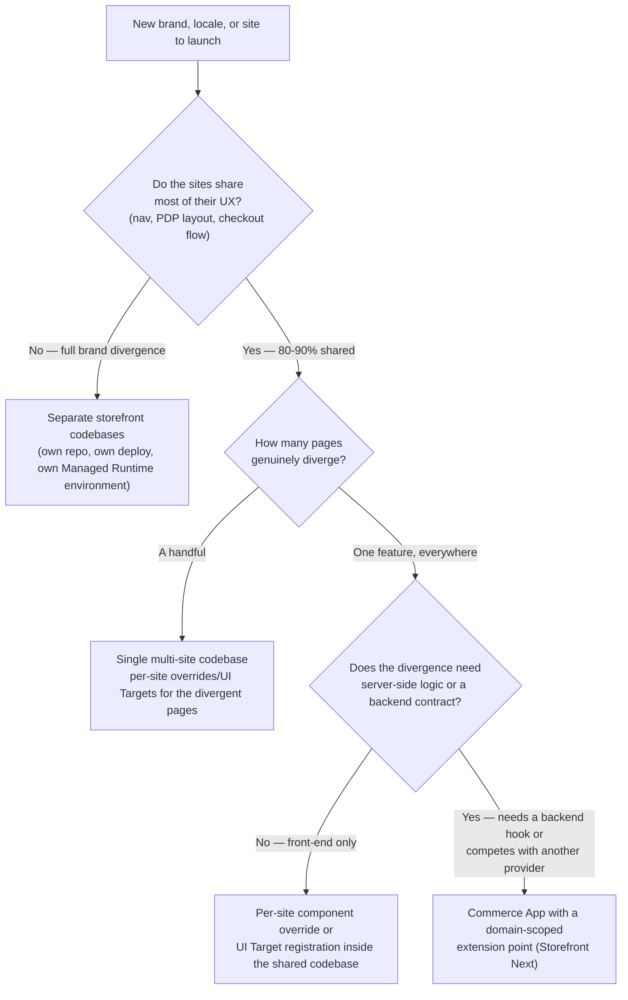
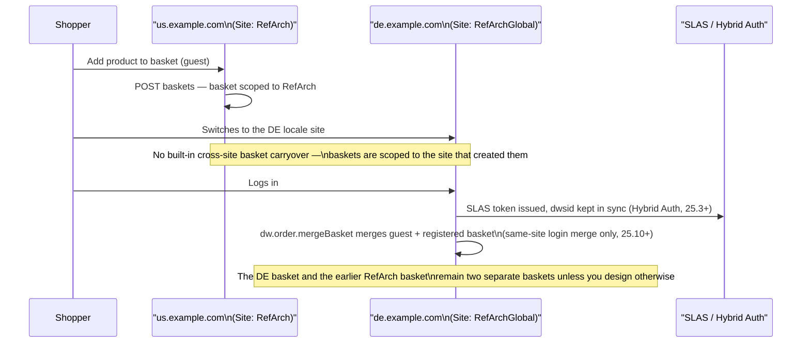

Two questions landed in two different Slack channels the same week, wearing different clothes. In `#storefront-next`, someone building a multi-brand rollout wanted to know how far Storefront Next would let their homepages and product detail pages (PDPs) diverge before the "one codebase" pitch stopped making sense. In `#pwa-kit`, someone else was chasing a bug where a shopper's basket vanished the moment they switched from the US site to the Canadian one, and wanted to know why auth and basket state weren't just... there. Same underlying question, asked from opposite ends: should our sites share a codebase, or not?

Somebody answered the PWA Kit thread well, buried three replies deep: split codebases for brands that genuinely diverge, one multi-site codebase for the ones that don't, and Commerce Apps for the shared-but-exceptional bits in between. That's the right answer. It just never made it out of the thread.

## The Part That's Already Shared, Whatever You Decide

Before the codebase question, there's a layer question that's easy to skip past, because the answer holds regardless of which storefront framework you pick. B2C Commerce is "structured as an organization containing one or more sites (storefronts)," per Salesforce's own [localisation guide](https://developer.salesforce.com/docs/commerce/b2c-commerce/guide/b2c-localization.html). One org, many sites, and every site already gets its own catalogs, price books, content, and [site preferences](/custom-preferences-in-sfcc/) whether or not you write a single line of storefront code differently. The codebase decision you're weighing is entirely about the presentation layer sitting on top of that. The data layer is multi-site from day one, no matter what you decide up here.

That matters because it changes what question you're answering. You're not deciding whether to support multiple sites — B2C Commerce already does that. You're deciding how much of the storefront's *rendering* logic gets to say "if site A, do this; if site B, do that" before that branching stops being maintainable and starts being its own liability.

## The Rubric

Here's the decision, as a flowchart rather than a Slack thread:



The two ends of that tree are easy calls. It's the middle — "mostly shared, but this one thing is different" — where teams either over-engineer a split they didn't need or under-engineer a shared codebase that turns into a maze of `if (site.ID === 'EU-DE')` blocks. The rest of this post is about that middle ground, on both the framework you're probably running today and the one you might be moving to.

## Splitting the Codebase: Full Brand Divergence

If two brands don't share a header, a checkout flow, or a design system, don't force them into one repository just because they happen to run on the same B2C Commerce instance. A split codebase means separate repos and separate deploy pipelines — in PWA Kit or Storefront Next terms, a separate Managed Runtime environment for each brand. (Managed Runtime is Salesforce's hosting platform for headless storefront apps; each environment is its own deployed instance.) You pay for that split in duplicated plumbing: auth wiring, analytics, error boundaries. What you buy is never having to reason about brand B's checkout while you're mid-refactor on brand A's. For brands that diverge that completely, the trade is usually worth it. The org-level sharing from the section above — catalogs, price books, customer data if you want it — still applies underneath both codebases. Splitting the storefront doesn't mean splitting the business data.

Where this goes wrong is when "divergent" gets defined by logo and colour palette rather than by what the shopper does on the page. Swap the header and the accent colour on an otherwise identical PDP and checkout, and the UX hasn't moved. That's a theme, and it belongs in the middle tier below, not its own repository.

## Sharing on SFRA: Site Preferences and Feature-Switch Branching

Classic SFRA — Storefront Reference Architecture, Salesforce's older server-rendered, MVC-style storefront framework — handles multi-site with the mechanism it's always leaned on: [site preferences](/custom-preferences-in-sfcc/). A site preference scoped per-site is the natural home for anything that varies by brand without changing the shape of the page: a feature flag, a threshold, a copy string, a boolean gating whether a promo banner renders at all. Read it with `Site.getCurrent().getCustomPreferenceValue('myPref')` and branch on it in your controller, or in an ISML template (Internet Store Markup Language, SFCC's server-side templating language). Either way, the variation comes out of configuration, so one shared template covers every site instead of a separate copy per brand.

The trap is scale. One or two site preferences gating one or two `<isif>` blocks is a perfectly reasonable pattern. Ten preferences gating branching logic scattered across a dozen templates is a maintenance problem wearing a multi-site costume — every new site added to the storefront means auditing every one of those branches to check it still does the right thing for a site nobody had in mind when it was written. If you're finding yourself writing `if (dw.system.Site.getCurrent().ID === 'BrandB')` directly in a controller rather than reading a preference, that's usually the signal the divergence has outgrown the feature-switch pattern and belongs in a real per-site override, or in its own codebase.

> [!NOTE]
> Classic SFRA doesn't ship a documented, first-class hook for "switch a shopper between locale-specific sites and carry their session forward." If you've got that working today, it's almost certainly custom controller logic your team built, not a Salesforce-provided mechanism. Worth knowing before you inherit someone else's multi-site SFRA project and go looking for the platform feature that isn't there.

## Sharing on the Composable Stack: `sites.js` and Template Extensibility

PWA Kit — Salesforce's React-based, headless storefront framework, launched in 2021 as the composable alternative to SFRA — takes the same underlying idea of one codebase serving several sites and gives it real configuration surface instead of scattered preference checks. `config/sites.js` defines every site your project serves, each with its own locales, currencies, and defaults:

```javascript
// config/sites.js
module.exports = [
  {
    id: "RefArch",
    l10n: {
      supportedCurrencies: ["USD"],
      defaultCurrency: "USD",
      defaultLocale: "en-US",
      supportedLocales: [
        { id: "en-US", alias: "us", preferredCurrency: "USD" },
        { id: "en-CA", preferredCurrency: "USD" },
      ],
    },
  },
  {
    id: "RefArchGlobal",
    l10n: {
      supportedCurrencies: ["GBP", "EUR", "JPY"],
      defaultCurrency: "GBP",
      supportedLocales: [
        { id: "de-DE", alias: "de", preferredCurrency: "EUR" },
        { id: "en-GB", preferredCurrency: "GBP" },
        { id: "ja-JP", preferredCurrency: "JPY" },
      ],
      defaultLocale: "en-GB",
    },
  },
];
```

`config/default.js` sets which site is the default and maps site IDs to the URL aliases shoppers see (`RefArch` becomes `/us`, `RefArchGlobal` becomes `/global`), and Salesforce's own [multiple sites guide](https://developer.salesforce.com/docs/commerce/b2c-commerce/guide/multiple-sites.html) is explicit that the canonical site and locale IDs stay valid even once aliases are in play. For teams that want each brand on its own domain rather than a shared one with path-based sites, the same guide covers deploying via environment-specific configuration files — `config/env-customer-1.js`, `config/env-customer-2.js` — one Managed Runtime environment per domain, still one codebase behind them.

Per-site divergence at the component level rides on [template extensibility](https://developer.salesforce.com/docs/commerce/b2c-commerce/guide/template-extensibility.html), the feature PWA Kit v3 shipped and turned on by default for any project generated after June 15, 2023. Declare a base template, declare an `overrides` directory, and any file you recreate at the same path in that directory silently replaces the base template's version at build time — no forked repository, no duplicated boilerplate for the 90% of the app that doesn't change. Template extensibility, rather than a site-ID branch, is what performs the per-site (or per-brand) swap: override the home page component for brand B, leave everything else pointed at the shared base.

Salesforce's own docs are upfront about the cost on the other side of that convenience: "the more files that you override, the more effort is required to keep up with changes in the base template." Every override you keep is a small API contract you've taken on: an override that doesn't re-export everything its base-template counterpart exported breaks the build, with errors like `export 'CAT_MENU_DEFAULT_ROOT_CATEGORY' ... was not found in 'retail-react-app/app/constants'`. Write one override and that's easy to keep straight. Carry fifty across a base template that keeps moving, and each upgrade becomes a hunt for the ones that no longer line up. That's a fair trade for a handful of divergent pages. It's a bad trade for the same "we override half the app for every brand" pattern that should have been a split codebase in the first place.

## Storefront Next: Page Designer, Extensions, and When Commerce Apps Earn Their Keep

Storefront Next splits the same problem across three tools, depending on what kind of variation you're solving for. I covered the extensibility side of this in more depth in [Storefront Next Extensibility Explained](/storefront-next-extensibility-explained/). The short version, applied to multi-site:

**Content variation belongs to Page Designer.** A headless Page Designer page (`arch_type: "headless"`) is configured per site in Business Manager, SFCC's admin interface for merchandising and site configuration. You build the homepage layout for Brand A in one Business Manager site and a different layout for Brand B in another. Both are fetched the same way — a route loader calls `fetchPageWithComponentData()`, and the page renders through the same `<Region>` components — so the site-awareness lives entirely in the content and your React tree renders identically no matter which site asked for it. When two sites need genuinely different homepage layouts and the difference is only which content goes where, that's a merchandising decision, and it shouldn't cost you a code branch.

**Structural variation is what Extensions and UI Targets are for.** When the divergence is layout rather than content — brand B's PDP needs a review widget brand A doesn't have — you register a component against a named UI Target such as `sfcc.pdp.reviews.rating`, scoped to render only where you've declared it. A Vite plugin swaps those placeholders for real components during the build, so this is build-time composition rather than runtime injection. It replaces the file-shadowing `overrides/` pattern from PWA Kit with something that doesn't accumulate merge-conflict debt against the base template.

**Commerce Apps are the answer when the exception needs real backend logic.** This is the tier the Slack thread's partial answer was pointing at. When a feature has to plug into server-side orchestration — anything that competes with another provider for the same lifecycle moment — the platform can give it a domain-scoped extension point instead of a shared hook. Tax calculation gets `sfcc.app.tax.calculate` in place of the old `dw.order.calculateTax` hook that every integration used to fight over. Worth knowing before you plan around this: tax is currently the only domain with platform-defined extension points, and the other domains are still being rolled out.

The install model is the part that matters for multi-site, and it splits in a way that mirrors the whole post. What a Commerce App deploys — cartridges, service definitions, custom object types — lands once at the instance level and is shared across every site on that instance. Installation itself is tracked per site: each site carries its own installation record, its own cartridge path entry, and its own configuration state. One deployment underneath, per-site activation on top.

One caveat before you plan a multi-site rollout around that third tier: Commerce Apps are a Storefront Next mechanism today. Salesforce's [supported domains guide](https://developer.salesforce.com/docs/commerce/b2c-commerce/guide/supported-domains.html) puts SFRA support in the Wave 2 rollout alongside the shipping and fraud domains, dated August 2026 and carrying the usual Safe Harbor note that roadmap dates move. Check where that table stands when you read this. If your multi-site project is still on SFRA, this is the one tier of the rubric you may not be able to reach yet.

## Worked Example: Session and Basket Continuity Across Locale Domains

This is the part that trips people up on both platforms, so walk through it deliberately instead of assuming it just works.



Baskets get created two ways, depending on which stack owns the page: `POST baskets` through SCAPI (the Salesforce Commerce API, the headless REST API composable storefronts call), or `getCurrentOrNewBasket()` through the Script API on the SFRA side. Either way, the basket is scoped to the site that created it. Salesforce's own [hybrid implementation guidance](https://developer.salesforce.com/docs/commerce/commerce-api/guide/hybrid-storefront-baskets.html) is explicit that you should call the API matching whichever technology owns that page, and never mix SCAPI calls into Script API controllers. Nothing in that guidance promises a basket travels with a shopper from one site to another, because sites are the unit baskets are scoped to in the first place. Switching from `us.example.com` to `de.example.com` mid-session is, from the platform's point of view, closer to switching stores than switching pages.

The distinction that decides whether this bites you is site versus locale, and it is easy to blur. In the `sites.js` example above, `en-CA` is a *locale* of `RefArch`, not a site of its own, so a shopper moving from `en-US` to `en-CA` stays inside one site and keeps their basket. Route that same shopper to a separate Canadian site ID instead and the basket is gone. Identical-looking switch from the shopper's side; entirely different outcome underneath.

Two mechanisms bear directly on continuity, and they solve different problems:

- **Hybrid Auth (25.3+)** keeps two session identities in sync for storefronts that mix SFRA and headless technology on the *same* site: the `dwsid` cookie that SFRA and its predecessor SiteGenesis rely on, and the signed token issued by SLAS (Shopper Login and API Access Service, the platform's shopper auth service). It replaced the older Plugin SLAS approach and is the recommended path for that kind of hybrid — I walked through it in more depth in [Storefront Next: Architecture and the PWA Kit Migration](/storefront-next-architecture-and-migration-from-pwa-kit/). It syncs auth; it does not bridge baskets across sites.
- **`dw.order.mergeBasket`** (added in B2C Commerce 25.10) handles the moment a guest shopper logs in. Note the direction, because it's easy to get backwards: the guest's basket becomes the current basket, and the registered shopper's *stored* basket is merged into it. Invoke it either through the `transferBasket` SCAPI endpoint with `merge=true`, or from controller logic in SFRA. It solves guest-to-registered continuity within one site. A basket sitting in site A stays in site A; `mergeBasket` was never built to reach across that boundary.

So: if your locale sites need to feel like one continuous shopping session to the shopper — add to basket on the US site, see the same items after switching to Canada — that's a deliberate design decision you make, not a platform default you inherit. Teams that need it usually take one of three paths:

- Keep the shopper on one canonical site and switch locale within it, rather than routing them to a separate site ID.
- Carry a basket reference across the switch explicitly, in your own logic.
- Accept the reset and message it clearly — "Switching regions starts a new basket" — instead of letting shoppers discover it as a bug.

None of those is wrong. Picking one on purpose, rather than finding out in a bug report, is the point.

## What Doesn't Scale Forever

Even the "share everything" end of the rubric has a ceiling. A [B2C Commerce instance caps business object definitions at 300](/a-survival-guide-to-sfcc-platform-limits/), and that ceiling counts the platform's own system object types alongside anything you define, so the headroom left for per-brand data models is considerably smaller than 300 suggests. That's a real constraint if your multi-site strategy is "one instance, twenty brands, and every brand wants its own custom data model." That's an argument for shared, well-designed system object extensions over one-off custom objects per brand, not an argument for splitting codebases on its own. But it's exactly the kind of ceiling that turns up eighteen months into a rollout that looked fine at launch, so check it before you commit to "share everything" as the plan for every future brand, not just the ones you've scoped so far.

## One Rubric, Two Frameworks

Neither Slack thread was wrong. They were describing the same rubric from opposite starting points, and the question was never really SFRA versus Storefront Next — both frameworks draw the line in the same place. What differs is the cost of getting the middle tier wrong.

On SFRA, a bad call turns into site-ID branches scattered through controllers, each one a quiet bet that nobody will add a site the author didn't anticipate. On Storefront Next, it turns into a pile of overrides you maintain against a base template that keeps moving underneath them. Neither failure announces itself at launch. Both surface long after the rollout that looked fine, which is roughly when the question gets asked in a Slack channel again — and someone has to go dig through a thread to answer it.
