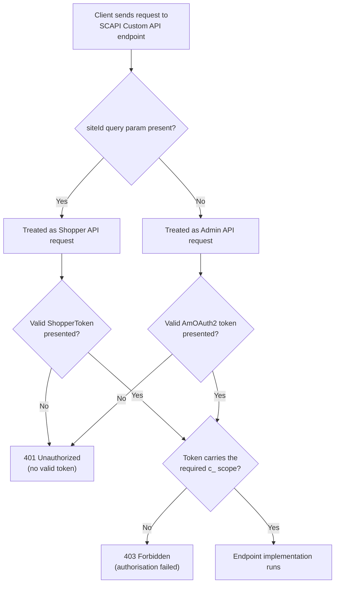

Deploy a custom SFRA (Storefront Reference Architecture) controller and it is reachable by anyone who knows the URL. Deploy a custom SCAPI (Salesforce Commerce API) endpoint and it may be reachable by nobody at all, including you, holding a valid token. Those are the two ways to add your own endpoint to SFCC (Salesforce B2C Commerce Cloud), and their default security postures are exact opposites. One trusts every caller until you write the check yourself. The other trusts nobody until the configuration is exactly right.

So "how do I secure my custom endpoint" is really two questions wearing one sentence. On the SFRA side you are adding gates that don't exist yet, and the mistake that costs you is forgetting one. On the SCAPI side the gates are already standing, and the mistake that costs you is a typo in a scope name capped at 25 characters, which doesn't reject your request so much as make the endpoint stop existing.

Both paths share the property that makes this miserable to debug. Controller checks, CSRF (Cross-Site Request Forgery) validation, OCAPI (Open Commerce API) client permissions, OAuth scopes: each one can stop a request before your code runs. The status code you get back narrows it down a little: a missing client ID is a `400`, a client without permission a `401`, a valid token missing a scope a `403`, an endpoint that never registered a `404`. What no response tells you is *which setting* has to change. That's why the same endpoint can answer you and reject your teammate a minute later with nothing in the code having changed.

This post walks through the whole stack for both kinds of custom endpoint. Everything here is checked against official Salesforce documentation and the [storefront-reference-architecture](https://github.com/SalesforceCommerceCloud/storefront-reference-architecture) source, Salesforce's official SFRA code repository, browsable once your GitHub account is [SSO-linked to your Account Manager identity](/sfcc-github-repo-access/). Where the platform's behaviour is documented, I say so and link it. Where I'm reading intent out of the base cartridge's own code, I say that instead.

## Controller Auth: What SFRA Actually Gives You

A custom SFRA controller is a JavaScript module in your cartridge's `controllers` folder. A cartridge is the folder-based package SFCC uses to deploy code, templates, and configuration as one unit. By default, a controller has no authentication at all. `server.get('MyRoute', function (req, res, next) {...})` is reachable by anyone who knows the URL. Whatever access control happens, you write it yourself, chained in as middleware before your handler runs.

SFRA ships two concrete building blocks for this in the base cartridge, both under `cartridges/app_storefront_base/cartridge/scripts/middleware/`:

- **`userLoggedIn.js`** exports `validateLoggedIn` and `validateLoggedInAjax`. Both check `req.currentCustomer.profile` and, if it's empty, either redirect to `Login-Show` or return a `500` with a `redirectUrl` in the JSON body for the AJAX variant. That `500` looks like a bug and isn't one. It's a contract with SFRA's own client-side JavaScript, whose jQuery `error` handler reads `redirectUrl` off the failed response and assigns it to `window.location.href`, which is how an expired session on an AJAX call turns into a login page instead of a silent failure. Write your own AJAX caller and you have to handle it the same way, or the request just looks like a server crash. Chain `validateLoggedIn` in front of your route and an unauthenticated shopper never reaches your handler: `res.redirect()` sets `res.redirectUrl`, and the chain's own `next()` in `modules/server/route.js` returns early the moment it sees that. `validateLoggedInAjax` behaves differently, and the difference is easy to miss. It sets a status code and view data, never `res.redirectUrl`, so `next()` finds nothing to break on and your handler runs regardless. The caller gets a `500`, but your code already executed. On an AJAX route that writes anything, check `req.currentCustomer.profile` yourself inside the handler rather than trusting the middleware to have stopped the request.
- **`csrf.js`**, covered in detail below, validates that a request carries a valid CSRF token before your handler runs.

If you've arrived from an older codebase looking for `guard.ensure(['loggedIn'])`, that's the SiteGenesis-era equivalent, and Salesforce's [authentication and authorisation guide](https://help.salesforce.com/s/articleView?id=cc.b2c_developer_authentication_and_authorization.htm&language=en_US&type=5) still documents both side by side. On SFRA the middleware chain replaced it.

Once you need more than "is this a logged-in shopper", there is no named platform construct to reach for. Nothing ships for an API key header, for HTTP Basic Auth on a partner integration, or for a shared secret on a webhook receiver. You write a middleware function shaped like the two above: check `req.httpHeaders.get('x-api-key')` or decode an `Authorization: Basic` header with `dw.util.StringUtils`, and either call `next()` to continue the chain or short-circuit with a `401` via `res.setStatusCode(401)`. That's the platform being honest rather than incomplete. Authentication for a bespoke partner integration is bespoke by definition, and SFRA gives you the middleware chain to hang it on rather than a pre-built check for every possible secret scheme.

**If you get this wrong, you leak whatever that endpoint returns to anyone who finds the URL.** Controller URLs are guessable. Obscurity is not a security layer.

Writing the check is the small part. Four things the platform won't do for you:

- **Put the secret somewhere built for secrets.** Salesforce's [secret storage guidance](https://help.salesforce.com/s/articleView?id=cc.b2c_secret_storage.htm&language=en_US&type=5) names three mechanisms: service credentials read through `dw.svc`, a custom object attribute typed `PASSWORD` so it's encrypted at rest, and Business Manager-managed keys and certificates. An ordinary custom site preference is not on that list. It's readable by anyone with Business Manager access to that preference group and it travels in site exports, which is exactly what you don't want for a partner credential.
- **Never log the credential.** That sounds obvious until you're debugging the 401 you just built, at which point `req.httpHeaders` is the first thing you reach for. Log Center opens straight from Business Manager under Administration > Site Development > Development Setup with no separate login, and Account Manager grants standalone access through its [Log Center User role](https://help.salesforce.com/s/articleView?id=cc.b2c_account_manager_roles.htm&language=en_US&type=5). A single debug line hands your integration secret to everyone who can read logs on that instance.
- **There's no constant-time comparison anywhere in `dw.crypto`.** `MessageDigest` and `Mac` hand you bytes and leave the comparison to you, which means `===` and a theoretical timing signal. Hashing both sides first and comparing fixed-length digests narrows the window; rotating short-lived keys matters more in practice.
- **Nothing rate-limits a custom controller route.** Salesforce's documented [throttling](https://developer.salesforce.com/docs/commerce/b2c-commerce/guide/throttle-rates.html) covers specific SCAPI families, not your code, and its own guidance for the analogous guest-shopper case is to build rate limiting and CAPTCHA yourself. While you're there: don't chain the `cache.js` middleware onto a credential-gated route, because the page cache has no per-credential key and will happily serve one partner's response to another.

## The "Works for Me" Problem: Where to Actually Look

Before getting into CSRF and SCAPI specifics, the teammate who gets rejected while the same call works for you is worth pulling apart, because the pattern shows up in controllers, OCAPI, and SCAPI alike. Plenty of things vary per developer, per environment, or per client, and each produces a failure that looks like somebody's bad code. Start with these four, then keep reading. They are the configuration-level causes, not the whole list.

One thing to know before the list: `401` does not mean the same thing everywhere on this platform. In OCAPI it means a resolved client without permission on the resource. In a SCAPI Custom API it means a missing or invalid token, and the permission failure is a `403` instead. Same number, different question to ask.

- **Business Manager IP allowlisting.** Salesforce's [Configure Access Settings](https://help.salesforce.com/s/articleView?id=cc.b2c_ip_address_settings.htm&language=en_US&type=5) guide documents an allowlist and a second list of explicitly denied addresses under **Administration > Global Preferences > Security > Access Restriction**. If your teammate is on a different network, say home Wi-Fi instead of the office VPN, and that list is active, Business Manager can reject their login before credentials are even checked. That ordering only holds for a direct Business Manager login where Unified Authentication isn't in use. Unified Authentication, covered in Salesforce's [user authentication guide](https://help.salesforce.com/s/articleView?id=cc.b2c_user_authentication_and_authorization.htm&language=en_US&type=5), means logging in to Business Manager through Account Manager with one set of credentials rather than a password local to that instance. Check which one your project uses before you reason about the ordering. For WebDAV or agent-user logins, and for any login when Unified Authentication is enabled, the same allowlist is checked *after* credentials are verified instead. This is a login-time control rather than a per-API-call check, so the obvious symptom is a teammate locked out of Business Manager or WebDAV. It reaches further than that, though. Salesforce's [OCAPI OAuth](https://developer.salesforce.com/docs/commerce/b2c-commerce/references/b2c-commerce-ocapi/oauth.html) reference notes the same allowlist governs token requests made with the Business Manager user grant, which come back as `unauthorized_client` when the calling origin isn't listed. That note scopes itself to that one grant type and never mentions client credentials, so a pure server-to-server integration is *probably* unaffected. That's me reading the omission, though, not something Salesforce states. Either way, there's no allowlist scoped to an individual client ID.
- **OCAPI client ID resolution and permissions.** Every OCAPI request must resolve to a client ID, and Salesforce's [Client Application Identification](https://developer.salesforce.com/docs/commerce/b2c-commerce/references/b2c-commerce-ocapi/clientapplicationidentification.html) doc sets a strict precedence order: a Bearer token's embedded client ID wins first, then the `client_id` query parameter, then the `x-dw-client-id` header. If your teammate's tooling sends a Bearer token issued to a *different* API client than the one you tested with, permissions configured for your client don't apply to theirs. Same endpoint, same code, different identity resolved server-side. A missing client ID returns `400`; a resolved client ID without permission on that resource returns `401`.
- **Site-specific vs. global OCAPI settings.** Salesforce's [OCAPI Settings](https://developer.salesforce.com/docs/commerce/b2c-commerce/references/b2c-commerce-ocapi/ocapisettings.html) documentation confirms that site-specific client permissions override global ones, and that changes are cached for up to three minutes before taking effect. If you just saved a permission change and your teammate tests thirty seconds later against a different site than you did, they can hit stale-cache or wrong-site behaviour that looks identical to a permissions bug.
- **Missing or mismatched scopes.** This is the SCAPI Custom API equivalent, and it's covered in its own section below. A token that's valid but missing the right `c_`-prefixed scope returns `403`, not `401`, and an endpoint whose scope was misconfigured at deploy time returns `404` no matter whose token you send.

Those four are the ones people configure and then forget. But Salesforce's own [Custom API troubleshooting](https://developer.salesforce.com/docs/commerce/commerce-api/guide/custom-api-troubleshooting.html) checklist puts something duller first, and it is right to: **check that you are both hitting the same instance, with the same active code version, with the cartridge actually on that site's path.** Two developers on separate on-demand sandboxes are on two separate instances with their own OCAPI settings, their own SLAS clients, and their own code. Nothing is misconfigured; it just isn't the same environment. Worth knowing too: Custom APIs sit behind a [circuit breaker](https://developer.salesforce.com/docs/commerce/b2c-commerce/guide/custom-api-circuit-breaker.html), which is a per-endpoint switch that trips when your implementation script's error rate crosses 50% of the previous 100 requests. Once it trips, every call to that endpoint returns a `503` for the next 60 seconds no matter who sends it. So your failing test run can hand your teammate a `503` on a request that is perfectly valid.

## CSRF: Non-Negotiable for AJAX, and Selectively Applied

CSRF protection in SFRA runs through `dw/web/CSRFProtection`, wrapped by the middleware at `cartridges/app_storefront_base/cartridge/scripts/middleware/csrf.js`. That file exports exactly three functions, and reading them tells you the whole story. The `require` lines, `module.exports`, and the JSDoc comment blocks are trimmed here for space. Put them back if you're copying this. Without `module.exports` the module resolves to an empty object, so `csrfProtection.validateAjaxRequest` is `undefined`, and a chain with `undefined` in it fails at route registration rather than at request time, which means the route is simply missing rather than broken in a way that points at the cause:

```js
function validateRequest(req, res, next) {
    if (!csrfProtection.validateRequest()) {
        CustomerMgr.logoutCustomer(false);
        res.redirect(URLUtils.url('CSRF-Fail'));
    }
    next();
}

function validateAjaxRequest(req, res, next) {
    if (!csrfProtection.validateRequest()) {
        CustomerMgr.logoutCustomer(false);
        res.redirect(URLUtils.url('CSRF-AjaxFail'));
    }
    next();
}

function generateToken(req, res, next) {
    var viewData = res.getViewData();
    if (!viewData.csrf) {
        res.setViewData({
            csrf: {
                tokenName: csrfProtection.getTokenName(),
                token: csrfProtection.generateToken()
            }
        });
    }
    next();
}
```

`generateToken` runs on the route that renders the form (`Checkout-Begin`, for example, chains it in explicitly) and puts `csrf.tokenName` and `csrf.token` on the view data. Templates then render it as a hidden field. Here's the real pattern from `checkout/billing/billing.isml` in that source, unedited:

```html
<input type="hidden" name="${pdict.csrf.tokenName}" value="${pdict.csrf.token}"/>
```

One caveat before you reuse that pattern for your own values. A bare `${...}` is encoded according to the content type of the output stream, and per the [`iscontent` reference](https://developer.salesforce.com/docs/commerce/b2c-commerce/guide/b2c-iscontent.html) a storefront render defaults to `text/html`, so HTML encoding is on. That default isn't universal. A template rendering email through the SendMail pipelet or `dw.net.Mail` defaults to `text/plain`, and any template that declares `<iscontent encoding="off"/>` opts the rest of the stream out. It's safe here because a CSRF token name and value are platform-generated, but for anything a shopper can influence, reach for `<isprint value="${...}" encoding="htmlcontent"/>` so the escaping is explicit instead of inherited from whichever template set the content type first.

On the submitting route, `validateRequest` or `validateAjaxRequest` runs as middleware before the handler, checking that submitted token against the session. **CSRF is non-negotiable for any AJAX POST that mutates state.** Skip it, and any site the shopper has open in another tab can silently submit forms on their behalf.

But this doesn't hold for every checkout POST route in SFRA. Pulling the actual controller source confirms it, route by route:

| Route | CSRF middleware? | Why |
| --- | --- | --- |
| `CheckoutShippingServices-SelectShippingMethod` | No | Fired automatically when a shipping method radio button changes. Not a form submission, just a background sync of basket state |
| `CheckoutShippingServices-UpdateShippingMethodsList` | No | Same category: a background call that refreshes available shipping methods as the shopper edits an address field |
| `CheckoutShippingServices-SubmitShipping` | Yes (`csrfProtection.validateAjaxRequest`) | The actual shipping form submission, with the hidden token field rendered in `checkout/shipping/shipmentCard.isml` |
| `CheckoutServices-SubmitPayment` | Yes (`csrfProtection.validateAjaxRequest`) | The billing form submission, same pattern as shipping |
| `CheckoutServices-PlaceOrder` | No | Triggered by a "Place Order" button click, not a new form submission. No address or payment fields are posted at this step; they were validated and stored in the basket during `SubmitPayment` |

The pattern holds: **CSRF middleware sits on the routes that actually receive posted form fields from a rendered form**. `SelectShippingMethod`, `UpdateShippingMethodsList`, and `PlaceOrder` are all POST routes, and all three read from the basket or query string rather than validating a set of hidden and visible form inputs against a fresh token. That's a reasonable read of *why* the pattern looks the way it does, based on what the source does. Salesforce's docs don't state it explicitly. The "which routes have the middleware" table above, by contrast, is a direct read of `CheckoutServices.js` and `CheckoutShippingServices.js`, not an inference.

If you're adding your own AJAX POST route to checkout or anywhere else that mutates session or persistent state, the safe default is to add `csrfProtection.validateAjaxRequest` unless you have a specific, defensible reason your route doesn't submit a form. When in doubt, add it. A false sense of security from a missing token check costs a lot more than one extra middleware call.

With one important exception: a CSRF token is bound to a browser session, and there is no code path that skips validation when no token was ever issued. So chaining this onto a route called by a payment gateway callback, a webhook, or any server-to-server integration doesn't harden that route. It breaks it permanently, because those callers have no session cookie and can never present a valid token. Authenticate machine callers with a credential instead, which is what the decision table below recommends for them.

Two more things the source makes obvious once you look. Both middleware variants call `CustomerMgr.logoutCustomer(false)` on failure, so a stale token from a second browser tab or a double-submit race doesn't just reject the request, it logs a legitimate shopper out of their account. And if your route has no rendered page to hold a hidden field, you need somewhere to get a token: chain `generateToken` into a GET or AJAX call that already runs earlier in the flow and read `csrf.tokenName` and `csrf.token` off the JSON response. SFRA ships a `CSRF-Generate` route that does exactly this, but it's gated to non-production instances, so don't build against it.

## SCAPI Custom APIs: A Different Security Model Entirely

Custom SFRA controllers live inside the storefront session model: cookies, CSRF tokens, `req.currentCustomer`. SCAPI Custom APIs are a separate framework, defined as OAS (OpenAPI Specification) 3.0 contracts under a `rest-apis` folder in your cartridge, and they use OAuth security schemes instead of CSRF. Salesforce's Custom API documentation never mentions CSRF, cookies, or sessions at all, and the design explains why: every request carries its own bearer token instead of leaning on an ambient session cookie. That distinction is the whole of it. A browser attaches cookies to a cross-site request automatically, which is precisely what CSRF abuses, but it never attaches an `Authorization` header that your own code didn't set. With no ambient credential, there is nothing for a forged request to ride on.

A Custom API endpoint has a URL that always follows this shape, per Salesforce's [Custom APIs guide](https://developer.salesforce.com/docs/commerce/commerce-api/guide/custom-apis.html):

```text
https://{shortCode}.api.commercecloud.salesforce.com/custom/{apiName}/{apiVersion}/organizations/{organizationId}/{endpointPath}
```

`custom` is a fixed literal that marks the whole request as hitting the Custom API family rather than a standard SCAPI resource. The version segment is derived automatically from your OAS contract's `info.version` field: only the major segment survives, prefixed with `v`. So `1.0.1` becomes `v1`, and `2.1.1` becomes `v2`. Use whatever minor and patch granularity you like internally; the URL only ever exposes the major version.

Every endpoint picks exactly one of two security schemes, and mixing them up is the single most common setup mistake:

- **`ShopperToken`**: for Shopper APIs, storefront-facing, obtained through [Shopper Login and API Access (SLAS)](/how-to-set-up-slas-for-the-composable-storefront/). Shopper endpoints *require* a `siteId` query parameter; omit it and the request is treated as an Admin API call instead, which is a confusing failure mode if you didn't mean it.
- **`AmOAuth2`**: for Admin APIs, back-office tooling, obtained through Account Manager using the `client_credentials` grant only. Admin endpoints must *omit* `siteId` entirely.

SLAS and Account Manager are two separate token issuers, not two names for the same one, and it's worth fixing that distinction early. SLAS is shopper-facing: it mints tokens for guests and logged-in shoppers, scoped to one site. Account Manager is back-office: it mints tokens for an API client you registered, with no shopper in the picture. Credentials for one will not get you a token from the other, so pointing your Account Manager client ID and secret at a SLAS endpoint fails on identity rather than on scopes.

Each scheme requires exactly one custom scope, and Salesforce's [Custom API Authentication guide](https://developer.salesforce.com/docs/commerce/commerce-api/guide/custom-api-authentication.html) is specific about the naming rules: a custom scope must begin with `c_`, contain only alphanumeric characters, periods, hyphens, or underscores, and be no more than 25 characters long. Get that wrong with a typo, a scope over the character limit, or an endpoint carrying zero or two schemes, and the consequence isn't a clean error message. **The endpoint simply isn't registered.** It behaves as if it doesn't exist. The fastest way to see that is the [Custom API status report](https://developer.salesforce.com/docs/commerce/b2c-commerce/guide/custom-api-status-report.html), the DX (Developer Experience) endpoint covered below, which returns a `not_registered` status and an `errorReason` for each endpoint it rejected. Business Manager's Log Center is the fallback when that isn't detailed enough, searchable with an LCQL (Log Center Query Language) query on the `CustomApiRegistry` category.

That silent failure is exactly the kind of thing that produces a support ticket instead of a stack trace, and the `404` it produces is documented rather than incidental. Salesforce's [Custom API troubleshooting guide](https://developer.salesforce.com/docs/commerce/commerce-api/guide/custom-api-troubleshooting.html) states that an unregistered endpoint returns `404 - Not Found` with a `resource-not-found` payload, and its registration checklist puts security-scheme and scope mistakes in the same bucket as a missing cartridge path. So a `404` on a brand-new Custom API has two candidate causes that look identical from the client: a routing mistake in `api.json`, or a scope or scheme problem that stopped registration. Read the status report before you go hunting for a bug in your contract.

There's a second, separately documented scope requirement layered on top of your functional `c_` scopes: the Custom API DX endpoint, the tooling that shows you registration status, needs the Account Manager scope `sfcc.custom-apis` for read access or `sfcc.custom-apis.rw` for read-write. That applies whatever functional scope your business logic requires. Confusing the two is a common source of "I have a working token but the DX tooling still says unauthorised". The functional scope authorises your endpoint's logic; the diagnostic scope authorises the framework's own visibility into it.



### SLAS Tokens: The Part That Bites You in Production

If your Custom API uses `ShopperToken`, the token itself comes from SLAS. Several SLAS behaviours tend to surprise people in production rather than in a sandbox.

First, ShopperToken access tokens are valid for 30 minutes, per [Salesforce's SLAS guide](https://developer.salesforce.com/docs/commerce/commerce-api/guide/slas.html). They can also only be used against the instance and site they were issued for. A token minted for one site's `channel_id` will not authenticate a Custom API call scoped to a different site, even on the same instance.

Second, guest token requests using `client_credentials` or `authorization_code_pkce` grants must include a `channel_id` parameter identifying the site. Salesforce enforced this for all production tenants starting March 25, 2025. A request missing it now gets a flat `400 invalid refresh token` error rather than a token. Don't over-learn that error string, though: since January 8, 2026 Salesforce returns the identical `400 invalid refresh token` for an unrelated cause, a public client reusing an already-consumed refresh token under OAuth 2.1 single-use rotation. Same message, two very different mistakes.

Third, and on a clock: SLAS Strict Client Auth stops being optional for private clients. The `x-slas-client-auth` header, carrying a base64-encoded `client_id:client_secret`, becomes mandatory on **September 22, 2026** for non-production and **October 15, 2026** for production. After those dates a private-client token request without it gets a `401`. If your Custom API is fronted by a private SLAS client, this is a dated, imminent break rather than a best practice.

Three more things decide whether this holds up under load:

- **Know which kind of SLAS client you have.** A public client holds no secret and uses PKCE (Proof Key for Code Exchange), the flow browsers and mobile apps use when they can't keep a secret. A private client holds a secret and authenticates much like the Account Manager flow below. A server-to-server Custom API almost always wants a private client, and that choice decides whether the header above applies to you at all.
- **Cache the token.** SLAS rate-limits its token endpoint per instance: 24,000 requests a minute in production, 500 outside it. A design that mints a fresh token per call sails through production review and falls over in staging, returning `429` with a `Retry-After`. Reuse the token for its 30 minutes instead.
- **Refresh tokens live far longer than access tokens:** 90 days for registered shoppers, 30 for guests in production, 9 outside it. For public clients they're also single-use. That rotation rule is what sits behind the overloaded `400` above.

Two smaller traps worth knowing before they cost you an afternoon: SLAS answers rapid repeated calls carrying the same Unique Shopper ID with a `409`, so retry logic that doesn't vary the USID can trip a bot-mitigation control while doing nothing wrong. And token revocation on password change is on by default only in production, so a sandbox test of "does changing the password kill the session" can pass without proving anything.

For Admin-scheme endpoints, the `AmOAuth2` token comes from Account Manager instead. As of late 2026 it uses the `client_credentials` grant exclusively. There is no authorisation-code flow for Admin APIs, though Salesforce has already shipped groundwork for user authorisation on Admin APIs, so treat the "only" as current rather than permanent. Credentials go in an HTTP Basic `Authorization` header as a base64-encoded `client_id:secret` string, alongside a `scope` parameter that combines `SALESFORCE_COMMERCE_API:{realm}_{instance}` with your functional scopes. That access token is itself a JWT (JSON Web Token), valid for around 30 minutes based on Salesforce's documented example response.

## Decision Table: Which Approach Fits Which Situation

Pulling all of this together, here's the security model that fits the situations SFCC developers hit most often:

| Situation | Right approach | Key gotcha |
| --- | --- | --- |
| Public-facing SFRA form (checkout, login, registration) | `csrfProtection.validateAjaxRequest` on the submitting POST route, hidden `csrf.tokenName`/`csrf.token` fields on the render route | Only the route receiving posted form fields needs it; background AJAX syncs like shipping-method selection don't |
| Internal Business Manager tool or extension | A [`bm_extensions.xml`](https://developer.salesforce.com/docs/commerce/b2c-commerce/guide/b2c-customize-business-manager.html) menu or dialog action, authorised by granting permission on that action in Business Manager's Roles & Permissions | `req.currentCustomer` is a storefront shopper session and means nothing here. Business Manager extensions authorise through role permissions, and its IP allowlist is a login control on top of that, not a per-endpoint check |
| External system integration (webhook receiver, partner feed) | Custom header-based or Basic Auth middleware you write yourself, chained before the handler | There's no built-in SFRA construct for this. Treat the credential like any other secret, rotate it, and never log it |
| Custom SCAPI endpoint, storefront-facing | `ShopperToken` scheme with a `c_`-prefixed scope, `siteId` required | A missing `siteId` silently reclassifies the request as an Admin call and fails differently than you expect |
| Custom SCAPI endpoint, back-office/system-to-system | `AmOAuth2` scheme with a `c_`-prefixed scope, `siteId` omitted | Client credentials only; no browser redirect flow exists for this scheme |
| Headless storefront (PWA Kit, Managed Runtime, Storefront Next) calling a custom endpoint | Nothing new: the same `ShopperToken` scheme as any storefront-facing Custom API | The auth model genuinely doesn't change; what changes is that you're routing through a [Managed Runtime proxy config](https://developer.salesforce.com/docs/commerce/pwa-kit-managed-runtime/guide/proxying-requests.html), which must use HTTPS and is capped per environment |

One caveat applies to every row in that table: **nothing here is rate-limited for you.** Salesforce's throttling documentation is explicit that endpoints it doesn't name are no longer rate limited, and neither a custom SFRA controller nor a Custom API is on that list. Sitting behind the same host name as the standard APIs does not mean you inherit their protection.

Always validate. Never trust the client. The specific mechanism changes with the scenario, but that verdict doesn't.

If you're building the Custom API contract itself rather than just securing it, the [existing walkthrough on creating custom OCAPI endpoints](/creating-custom-ocapi-endpoints/) covers the routing and contract side this post assumes as background. And if the OCAPI client-permission model above is new territory, [Three Things to Secure SFCC](/three-things-to-secure-sfcc/) and [Secure Coding in Salesforce B2C Commerce Cloud](/secure-coding-in-salesforce-b2c-commerce-cloud/) both cover platform-wide practices that sit above endpoint-level auth.

On the OCAPI side, Salesforce's own [OCAPI Settings documentation](https://developer.salesforce.com/docs/commerce/b2c-commerce/references/b2c-commerce-ocapi/ocapisettings.html) states that OCAPI settings stop being available for realms provisioned for new customers starting September 1, 2026, with SCAPI recommended as the replacement for new implementations. Worth knowing before you commit, though: Salesforce's [why-use-SCAPI](https://developer.salesforce.com/docs/commerce/commerce-api/guide/why-use-scapi.html) page also concedes that some low-level system information and a handful of complex Data API tasks still have no Admin SCAPI equivalent. "Use SCAPI for new work" is the right default, not a promise of parity.

That is the shape of the whole problem. There is no single gate to configure here, and the layer that rejected your request is rarely the layer you were thinking about. Learn what each status code means on this platform, from `400` and `401` through `403`, `404`, `409` and `503`, and you stop guessing. Everything else here is just knowing which of them you're looking at.
