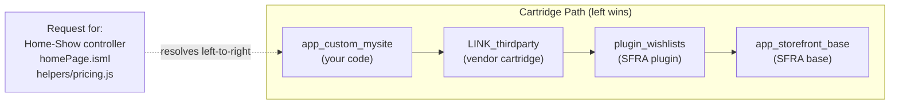

You add a cartridge to the path, put it first, override a template, deploy, and refresh the storefront. Nothing changes. You start doubting the cartridge assignment, then the Business Manager path, then your own sanity. Ninety minutes later you learn the file was fine — the code version wasn't.

That specific dead end is why this post exists. A quick definition before anything else: a cartridge is SFCC's packaging unit for code — a folder of controllers, templates, and scripts that Business Manager stacks together with other cartridges to build one storefront. Cartridge path mechanics show up in nearly every SFCC customisation, and the same handful of gotchas — hook order, `module.superModule`, SCSS imports, ISML that "isn't taking" — resurface every few months in the SFCC community Slack, phrased slightly differently by a different developer each time. There isn't one mechanism here. There are three, and most of the confusion comes from treating them as if they were one.

Before we start, a note on scope. Everything below describes SFRA and SiteGenesis-era cartridge mechanics: ISML templates, `module.superModule`, and the `sgmf-scripts` Sass build. [Storefront Next](https://developer.salesforce.com/docs/commerce/sfra/guide/sfra-overview.html), generally available for production since June 2026, swaps ISML for React components and the Sass toolchain for Vite, so the template and SCSS sections here don't carry over to it. SFRA itself carries no deprecation notice and remains fully supported.

## Three Mechanisms, Not One

People say "override" for all of the following, and then wonder why the advice they got doesn't apply to their case:

- **File-level resolution.** The application server walks the cartridge path and serves the first matching controller, template, script, or model it finds. Nothing runs the file from the cartridge behind it unless you write code that says so.
- **Module-level extension** via `module.superModule`. Inside a script, you deliberately reach past your own file to the next matching file further down the path — this is how you extend a base controller or model instead of fully replacing it.
- **Hook registration and execution** via `HookMgr`. Every cartridge that registers a script for the same extension point gets called, in cartridge-path order, regardless of whether any single cartridge "wins."

Conflating the second and third is the single most common failure mode reported in `#b2c-general` and `#sfra`: developers assume a hook works like a template override (highest cartridge wins, full stop) when it doesn't.

## How the Cartridge Path Actually Resolves Files

The cartridge path is always searched left to right. The first cartridge that contains a matching controller, ISML template, script, or model wins, and the application server stops looking the moment it finds one. That's documented behaviour, not community folklore: see the [B2C Commerce Cartridges guide](https://developer.salesforce.com/docs/commerce/b2c-commerce/guide/b2c-cartridges.html) and the [SFRA Features and Components guide](https://developer.salesforce.com/docs/commerce/sfra/guide/b2c-sfra-features-and-comps.html). ISML, if the acronym is new to you, is SFCC's server-side template format for rendering storefront HTML, and it's the file type behind most of the examples here.

Legacy pipelines are the one wrinkle. Per the [SFRA Modules guide](https://developer.salesforce.com/docs/commerce/sfra/guide/b2c-sfra-modules.html), controllers and pipelines get two separate full passes over the path rather than one merged search, so a rightmost cartridge's controller beats a leftmost cartridge's same-named pipeline. If your codebase is pure SFRA, you can forget this one.

A typical stack in SFRA (Storefront Reference Architecture, Salesforce's reference storefront codebase and the base most SFCC sites extend) looks like this:



If `app_custom_mysite` has its own `cartridge/templates/default/product/productTile.isml`, that file is served, and `app_storefront_base`'s version of the same path is never touched for that request. This is why cartridge order in **Administration > Sites > Manage Sites > [your site] > Settings tab** (the Cartridges field) isn't a suggestion — that's where the site's cartridge path string actually gets set, and per the [Cartridges guide](https://developer.salesforce.com/docs/commerce/b2c-commerce/guide/b2c-cartridges.html#register-a-cartridge), cartridges there "take precedence in order from left to right." Get the order wrong and your override is invisible even though the file is objectively there. Note also that the path is set per site, and Business Manager is itself a site with a separate path of its own. Assigning a cartridge to your storefront does nothing for Business Manager extensions, and the reverse holds too.

Multi-locale sites trip people up on one detail, because two different things both answer to the name "locale fallback." The configurable fallback chain (`en_US` > `en` > default) applies to localisable attribute *values* on objects like Product. It does not apply to file lookup: the [Localisation guide](https://developer.salesforce.com/docs/commerce/b2c-commerce/guide/b2c-localization.html) states the application server "doesn't consider the fallback locale when locating ISML templates, web forms, resource files in cartridges, or static content such as images."

That is not the same as saying templates have no locale resolution at all. They do, and it's a separate, non-configurable mechanism: per the [Templates guide](https://developer.salesforce.com/docs/commerce/b2c-commerce/guide/b2c-working-with-templates.html), templates live in a locale-specific folder under `cartridge/templates/`, with `cartridge/templates/default` as the default-locale folder, and "each cartridge has its own templates directory." The practical order this implies — check the current locale's folder, fall back to `default` **within that same cartridge**, and only then move on to the next cartridge — is reasoned from those two facts plus ordinary left-to-right resolution. Salesforce doesn't state that sequence outright in the current guide, so treat the exact locale-versus-cartridge search order as inference rather than a citation. The [Localisation guide](https://developer.salesforce.com/docs/commerce/b2c-commerce/guide/b2c-localization.html) documents the same locale-then-`default` fallback explicitly for static files, "on a per file basis," which is the nearest thing to a direct confirmation.

## module.superModule: Extending Instead of Replacing

Plain file-level resolution is all-or-nothing — you replace the whole file. Most of the time you don't want that. You want the base controller's route to still run its validation, its session handling, its rendering, and you just want to add or adjust one piece. That's what `module.superModule` is for: inside a script that shares its exact path and filename with a file further down the cartridge path, `module.superModule` refers to that next file, so you can call into it instead of duplicating it.

```js
// app_custom_mysite/cartridge/scripts/helpers/pricingHelper.js
'use strict';

var base = module.superModule;
var loyaltyHelper = require('*/cartridge/scripts/helpers/loyaltyHelper');

function getDisplayPrice(product, apiProduct) {
    var price = base.getDisplayPrice(product, apiProduct);

    // Add a loyalty-tier discount on top of the base calculation
    // instead of reimplementing the whole pricing helper.
    if (loyaltyHelper.isGoldTier()) {
        price = loyaltyHelper.applyDiscount(price);
    }

    return price;
}

module.exports = base;
module.exports.getDisplayPrice = getDisplayPrice;
```

> [!NOTE]
> `module.superModule` is documented platform behaviour, not a community convention: the [SFRA Modules guide](https://developer.salesforce.com/docs/commerce/sfra/guide/b2c-sfra-modules.html) devotes a full section to "Inheriting and Overriding Modules in Your Cartridge Stack Using Module.SuperModule," and the [Customise SFRA guide](https://developer.salesforce.com/docs/commerce/sfra/guide/b2c-customizing-sfra.html) uses the same property in its `Product.js` walkthrough. The mechanics below match those guides.

Two lines at the bottom of that example carry the actual teaching point. `module.superModule` hands you the *whole* exports object of the next file down the path, not just the one function you care about — so `base` already contains every other helper `pricingHelper.js` exposes further down the chain. `module.exports = base` copies all of those forward untouched, and only the line after it swaps in your extended `getDisplayPrice`. Skip that first assignment and every other function the base helper exports quietly disappears for anything that requires your cartridge's copy, even ones you never meant to touch.

The chain only works if the path and filename are byte-for-byte identical across cartridges. Per the SFRA Modules guide's own resolution-scenario table, `module.superModule` returns `null` when no matching module exists further down the path. Not `undefined`, and not a silent no-op. Reference a property on that `null`, as `base.getDisplayPrice(...)` does above, and you get an immediate `TypeError`. (That last step is ordinary JavaScript semantics rather than anything Salesforce documents, but it holds.) A loud failure is the good outcome here. It points you straight at the file.

The silent failure mode is the one to fear. Rename or move *your own* override file so it no longer matches the base file's path, and file-level resolution simply serves the unmodified base file. Your extension never runs. Nothing errors, because `module.superModule` is never reached in the first place. That's the case that costs you an afternoon: no stack trace, no log line, just a feature behaving like it was never shipped.

### When to Use require() Instead

`module.superModule` only makes sense when you're extending the *next* file down the same path slot. If you instead want to pull in a specific, known module — a utility, a constants file, a model you're not extending but composing with — plain `require()` is the right call, and the prefix you use changes what you get:

- `require('*/cartridge/scripts/util/collections')` — the `*/cartridge/...` prefix tells the module system to resolve against the cartridge path from the top, same as a template or controller lookup. You get whichever cartridge's copy comes first on the path.
- `require('~/cartridge/scripts/util/collections')` — the `~/` prefix pins the lookup to the *current* cartridge, from its root, no matter where in the folder tree the requiring file sits.
- `require('./util/collections')` — a relative require also resolves within the current cartridge, but relative to the requiring file rather than the cartridge root.

Reach for `module.superModule` when you're extending your own same-named file's predecessor. Reach for `require('*/cartridge/...')` when you deliberately want "whatever the cartridge path currently serves for this path," without caring which cartridge that is. And when you want your own cartridge's file and nothing else, guaranteed, reach for `~/` or a relative `./` require instead.

## HookMgr: All Cartridges Run, Only One Return Value Wins

A hook is a named extension point: the platform calls out to whichever script has registered for that name, and the caller doesn't need to know — or care — which cartridge, if any, is listening. That's the whole appeal of hooks over hardcoded calls. It's also where most of the Slack confusion lives, because once more than one cartridge registers for the same name, not every extension point behaves the same way. The dividing line isn't SFRA versus SCAPI, as it's often described — it's whether the extension point is genuinely custom or ships a system implementation.

For **SFRA custom hooks** (registered in `hooks.json`), the [SFRA Hooks guide](https://developer.salesforce.com/docs/commerce/sfra/guide/b2c-sfra-hooks.html) documents that when multiple cartridges register a script for the same extension point, **every one of them executes**, in cartridge-path order — but the value `HookMgr.callHook` returns to the caller is the value from the **last** hook that ran. Priority order and return-value order run in opposite directions. In a left-to-right cartridge path, "last" means the rightmost cartridge that implements the hook, closest to `app_storefront_base`. A higher-priority custom cartridge cannot override that return value just by implementing the hook — it runs earlier, and its return value gets discarded in favour of whatever the base cartridge hands back.

That ordering guarantee holds *across* cartridges only. The same guide is explicit that within one `hooks.json` you can register several modules for one extension point but "you can't control the order in which the modules are called" — so don't build a chain of same-cartridge registrations and expect them to fire in file order.

```mermaid
sequenceDiagram
    participant Caller as HookMgr.callHook()
    participant Custom as app_custom_mysite hook
    participant Link as LINK_thirdparty hook
    participant Plugin as plugin_wishlists hook
    participant Base as app_storefront_base hook

    Caller->>Custom: execute
    Custom-->>Caller: return value (discarded)
    Caller->>Link: execute
    Link-->>Caller: return value (discarded)
    Caller->>Plugin: execute
    Plugin-->>Caller: return value (discarded)
    Caller->>Base: execute
    Base-->>Caller: return value
    Note over Caller: Only the LAST cartridge's return value reaches the caller
```

Extension points that ship a system implementation behave the opposite way. The [Extensibility via Hooks guide](https://developer.salesforce.com/docs/commerce/commerce-api/guide/extensibility_via_hooks.html) documents that hooks for Shopper API extension points which return a value **skip** the system implementation and any subsequent registered hooks — the first return value wins, rather than the last. This isn't really a "SCAPI versus SFRA" split, even though it gets described that way. It's a property of the extension point. `dw.order.calculate` is the clearest proof: it has a default implementation you override, it follows skip-on-return semantics, and yet you call it with exactly the same `HookMgr.callHook` you'd use for any custom hook in storefront code. So before you reason about ordering, ask whether the extension point you're targeting has a system default — not which API surface you happen to be calling it from.

If you're weighing which of the two to learn first, the direction of travel is settled. Salesforce [marked OCAPI deprecated as of April 2026](https://developer.salesforce.com/docs/commerce/commerce-api/guide/why-use-scapi.html) — it keeps running on a security-only sunset clock for existing implementations, but no new features are being added, and SCAPI is where new hook capability goes. Check that guide for the current retirement date before committing new work to OCAPI. If you're wiring up a new Shopper API hook today, SCAPI is the one to reach for.

### What's Documented vs. What I Only Observed

I ran a hands-on experiment against custom hooks across a multi-cartridge path. Most of what came back turns out to be documented once you know where to look. Two parts aren't:

- Returning `Status.ERROR` from a custom hook implementation does not stop other cartridges' implementations of the same hook from running. (A `dw.system.Status` is SFCC's small pass/fail signal, used across hooks and pipelines to report success or failure back to whatever called them.) This is documented: the [Extensibility via Hooks guide](https://developer.salesforce.com/docs/commerce/commerce-api/guide/extensibility_via_hooks.html) states that "hooks for custom extension points will always execute all registered hook points regardless of their return value." Execution continues regardless of the status returned.
- Throwing an actual JavaScript error **does** stop the remaining cartridges' hook implementations from executing, but only because the exception propagates up and aborts the call chain. This part isn't spelled out in the guides above, so treat it as **observed behaviour**: wrap `HookMgr.callHook` in try/catch if you rely on it, or an unhandled error in a hook will do more damage than you intended.
- The community "unhooking" technique does **not** fully stop execution down the chain. The idea is to redefine `module.superModule.theHookFunction` as a no-op inside a higher-priority cartridge's hook script, killing a base cartridge's implementation without touching that cartridge. In my testing it suppressed only the *next* cartridge's implementation. With three or more cartridges registering the same hook, the third and everything beyond it still ran. **Observed behaviour**, documented nowhere.

The mechanism explains the limit. A cartridge's `hooks.json` registration is always local to that cartridge, whether its `script` value is written as a relative path or a `*/cartridge/...` identifier. That scoping comes from which cartridge's `package.json` points to the file, not from the path syntax. What crosses the cartridge boundary is `module.superModule` *inside* the hook script, reaching into the next implementation exactly as it would in any other module. Hook registration and module resolution are separate mechanisms, and that separation is why the no-op stops one cartridge down and no further.

So the unhooking trick is a **partial override of the next cartridge**, not a kill switch for the chain. If more than two cartridges on your path implement the same extension point, treat it as unreliable rather than as repeatable documented behaviour. Verify it against your own stack before depending on it in production, and don't assume a two-cartridge test generalises to four.

The correct modern file for registering custom hooks is **`hooks.json`**, referenced from `package.json` (for example `"hooks": "./cartridge/scripts/hooks.json"`), per both the SFRA Hooks guide and the Extensibility via Hooks guide. If you find `hooks.xml` in older tutorials or forum answers, that's a legacy reference — don't copy it into a current SFRA project.

## The ISML Override That Didn't Take

Here's the failure mode from the opening: you drop a template into `app_custom_mysite/cartridge/templates/default/product/productTile.isml`, matching the base cartridge's path exactly, cartridge order is correct, and the storefront still renders the old markup.

The official docs confirm the resolution mechanism itself — exact path match, locale folder then `default` within a cartridge, left-to-right across cartridges. They also confirm part of the fix: the [Code Deployment guide](https://developer.salesforce.com/docs/commerce/b2c-commerce/guide/b2c-code-deployment.html) states that when you activate a code version, "cached items (which might be dependent on a change to the compatibility mode) are cleared after activating a new code version." What it never does is name compiled templates as one of those "cached items" — so the existence of an ISML compilation cache is **observed field behaviour**, not a cited platform guarantee.

A term first, if it's new to you: a code version is a deployed folder of cartridges that Business Manager can hold alongside others, though only one is *active* and serving the storefront at a time. The platform appears to hold onto a compiled form of each template within an active code version, and activating a code version afresh is the fix developers consistently report reaching for.

Be careful with the word "caching" here. SFCC has three separate things that answer to it, and only two are documented. **Page Caching** (Administration > Sites > Manage Sites > [site] > Cache tab) caches rendered HTML for templates using `<iscache>`, and the [Content Cache guide](https://developer.salesforce.com/docs/commerce/b2c-commerce/guide/b2c-content-cache.html) recommends disabling it on sandboxes so changes show immediately. **Custom caches** (`dw.system.CacheMgr`, declared in `caches.json`) are yours to fill, and the [Custom Caches guide](https://developer.salesforce.com/docs/commerce/b2c-commerce/guide/b2c-custom-caches.html) confirms they clear when you change a file in the active code version. Neither is a compiled-template cache. There is no Business Manager switch labelled "template caching," so if you go looking for one you won't find it.

Turn page caching off first. It's real, it's documented, and it's the likelier culprit. That's a sandbox move only, though: on Production the platform enforces a minimum time-to-live, so you're changing TTLs and invalidating rather than disabling. If the stale render survives with caching off, you're into the undocumented territory this section describes, and that's where a code-version activation earns its place. Either way, rule caching out before you start doubting the cartridge path or your file names.

## SCSS @import Errors Are a Build-Time Problem, Not a Cartridge Path Problem

This is the other recurring thread, and it's a category error as much as a technical one. When you extend `app_storefront_base` styling from a custom cartridge, `@import` failures happen at **build time**, via `sgmf-scripts` compiling Sass — documented as part of SFRA's build tooling in the [SFRA Features and Components guide](https://developer.salesforce.com/docs/commerce/sfra/guide/b2c-sfra-features-and-comps.html). The runtime cartridge path plays no part in that compilation. Your Sass compiler resolves `@import` paths on the build machine, long before any request hits the application server.

The resolution isn't magic, and it isn't a hand-walked filesystem path either. The [Customise SFRA guide](https://developer.salesforce.com/docs/commerce/sfra/guide/b2c-customizing-sfra.html) documents a `paths` property in your cartridge's `package.json` that maps an alias to another cartridge's location on disk. You import through that alias. In `package.json`:

```json
{
  "name": "app_custom_mysite",
  "paths": {
    "base": "../storefront-reference-architecture/cartridges/app_storefront_base"
  }
}
```

```scss
// Anti-pattern: assumes the cartridge NAME is a valid import path
@import "app_storefront_base/variables";

// Also wrong: hand-computing a relative path into the base cartridge
@import "../../../../app_storefront_base/cartridge/client/default/scss/variables";

// Correct pattern: import through the alias defined in package.json
@import "~base/variables";
```

Reading the shipped `sgmf-scripts` source (v4.0.0, the current release on npm) makes the rest of the mechanism concrete, and explains the two details people most often get wrong. First, each `paths` entry is turned into a **webpack `resolve.alias`** — which is precisely why the import needs a leading `~`. That prefix is what hands a Sass `@import` over to webpack's resolver instead of Sass's own. Drop the `~` and the alias is never consulted. Second, the alias doesn't point at the cartridge root: the tooling appends `cartridge/client/default/scss` to whatever you configure. So `base` maps to `app_storefront_base/cartridge/client/default/scss`, and `~base/variables` lands on the file the hand-written relative path above was groping towards. Your `paths` value should stop at the cartridge folder and let the tooling add the rest.

Watch out if you copy a config from a tutorial. The `sgmf-scripts` README describes `paths` as an *array* of key/value pairs (`[{ "base": "..." }]`), but its own implementation iterates the value with `Object.keys` and resolves each entry as a string path. Hand it an array and you get an alias literally named `0` pointing at nothing usable. Every test fixture in the package uses the plain object form shown above. The README is simply out of step with the code.

Resolution is also transitive: if the cartridge you alias has its own `package.json` with `paths`, those entries get merged into your alias map too, so a plugin sitting between you and the base cartridge doesn't break the chain.

So when a cross-cartridge `@import` breaks, the fix is almost always a missing `~`, a missing or wrong `paths` entry, or a `paths` value that reaches too deep — not a recomputed relative path.

That neat split is only half true, though. Runtime cartridge-path resolution governs ISML, controllers, and scripts; build-time module resolution governs your SCSS imports. But the *compiled* CSS and JS that fall out of that build are static assets, and those do follow ordinary left-to-right cartridge-path resolution at runtime. The Customise SFRA guide is explicit about it: put `.css` and `.js` files at the same paths as the originals and they override like-named files in any cartridge to the right. So the cartridge path decides which cartridge's compiled stylesheet wins. It just has nothing to do with why the Sass compiler couldn't find `variables` in the first place.

## Troubleshooting Checklist: My Override Isn't Taking Effect

Work through these in order — they're roughly ordered from "most likely" to "least likely" based on what actually shows up in support threads:

1. **Confirm the cartridge is assigned to the site and correctly positioned.** Check **Administration > Sites > Manage Sites > [Site] > Settings tab** — the custom cartridge needs to be to the left of anything it's meant to override.
2. **Confirm the file path and name match exactly, case-sensitively**, between your cartridge and the one you're overriding. A single mismatched character is enough to make the override invisible. (No Salesforce doc I could find states the case-sensitivity rule outright. It follows from the Linux-based file system and matches everyone's field experience, so treat it as practical advice rather than a cited guarantee.)
3. **Rule out caching before you doubt the code.** Rebuild static assets; on a sandbox, switch page caching off on the site's Cache tab; for templates, activate a code version afresh. There is no "template caching" switch to find, and on Production page caching can't be turned off at all — invalidate there instead.
4. **If you're using `module.superModule` and it's not behaving as expected, check whether you're actually getting a `TypeError`.** A `module.superModule` reference that finds nothing further down the path resolves to `null`, and calling a method on it throws immediately — that's a loud failure pointing you at the file, not a silent one. The silent case is step 2's: the override file itself is misnamed or misplaced, so it never gets served in the first place.
5. **For hooks, verify the extension point name and its registration in `hooks.json`**, and confirm that file is correctly referenced from `package.json`. `HookMgr.hasHook(extensionPoint)` settles the "is anything registered at all?" question in one line, which beats guessing. Then confirm whether you actually need the hook to change the *return value* (only the last cartridge's hook wins that) or just need your side effect to run (in which case cartridge order among the hooks matters less, since — per the documented custom-hooks behaviour — every registered implementation executes).

Most "my override isn't taking effect" threads resolve at step 1 or step 3. The ones that don't are almost always a `module.superModule` typo or a misunderstanding of what `HookMgr.callHook`'s return value actually represents.

## Why This Matters Beyond the Bug Hunt

None of this is academic once a project has more than two or three cartridges. Third-party LINK cartridges, SFRA plugins, and your own custom cartridge all compete for the same file paths and the same extension points. (LINK cartridges are prebuilt integrations from partners like PayPal and Bazaarvoice. They moved to Salesforce's partner marketplace when the LINK Marketplace was retired. That marketplace went by AppExchange for years and was renamed AgentExchange in 2026, and Salesforce's own documentation still uses both names.)

The platform gives you very little visibility into that competition ahead of time. Nothing in Business Manager will tell you which cartridge *would* win a given lookup on a healthy request. You do get it after the fact on the error path, because a thrown script logs the full cartridge-qualified path of the file that ran, but that only helps once something has already broken.

So decide cartridge order deliberately, as an architectural choice made once, rather than as a trial-and-error setting you nudge every time something doesn't render. If you're reviewing a solution design instead of debugging a single override, those same three mechanisms are also the three places a badly ordered path will quietly break someone else's customisation six months from now, long after whoever set the order has moved to another project.

[Where SFRA lets you hook into a request or controller](/where-to-hook-into-an-sfra-controller/) is the natural next read. It covers the route-level `prepend`/`append`/`replace` behaviour that sits on top of everything explained here. For a broader tour of the cartridges worth knowing about before you decide where in the path they go, see [our survey of helpful SFCC cartridges](/helpful-salesforce-b2c-commerce-cloud-cartridges/), and if module organisation and scope confusion is a recurring theme on your team, [the field guide to custom caches](/field-guide-to-custom-caches-in-sfcc/) covers a related class of "it's silently doing the wrong thing" bug in SFCC.
