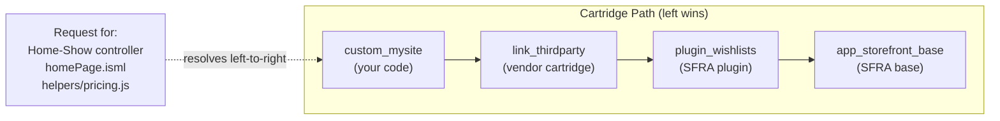
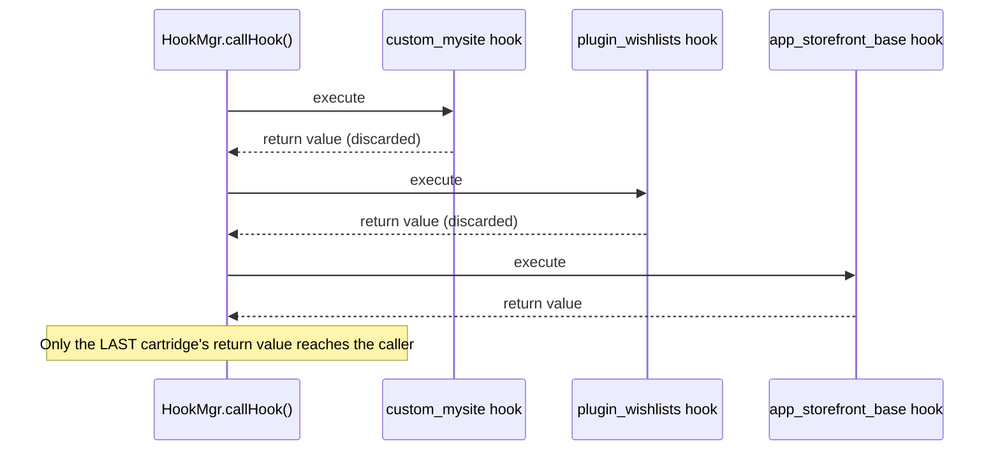

You add a cartridge to the path, put it first, override a template, deploy, and refresh the storefront. Nothing changes. You start doubting the cartridge assignment, then the Business Manager path, then your own sanity. Ninety minutes later you learn the file was fine — the code version wasn't.

That specific dead end is why this post exists. A quick definition before anything else: a cartridge is SFCC's packaging unit for code — a folder of controllers, templates, and scripts that Business Manager stacks together with other cartridges to build one storefront. Cartridge path mechanics show up in nearly every SFCC customisation, and the same handful of gotchas — hook order, `module.superModule`, SCSS imports, ISML that "isn't taking" — resurface every few months in the SFCC community Slack, phrased slightly differently by a different developer each time. There isn't one mechanism here. There are three, and most of the confusion comes from treating them as if they were one.

## Three Mechanisms, Not One

People say "override" for all of the following, and then wonder why the advice they got doesn't apply to their case:

- **File-level resolution.** The application server walks the cartridge path and serves the first matching controller, template, script, or model it finds. Nothing runs the file from the cartridge behind it unless you write code that says so.
- **Module-level extension** via `module.superModule`. Inside a script, you deliberately reach past your own file to the next matching file further down the path — this is how you extend a base controller or model instead of fully replacing it.
- **Hook registration and execution** via `HookMgr`. Every cartridge that registers the same hook ID gets called, in cartridge-path order, regardless of whether any single cartridge "wins."

Conflating the second and third is the single most common failure mode reported in `#b2c-general` and `#sfra`: developers assume a hook works like a template override (highest cartridge wins, full stop) when it doesn't.

## How the Cartridge Path Actually Resolves Files

The cartridge path is always searched left to right. The first cartridge that contains a matching controller, ISML template, script, or model wins, and the application server stops looking the moment it finds one. (ISML is SFCC's server-side template format for rendering storefront HTML — the file type behind most of the examples in this post.) That's documented behaviour, not community folklore — see the [B2C Commerce Cartridges guide](https://developer.salesforce.com/docs/commerce/b2c-commerce/guide/b2c-cartridges.html) and the [SFRA Features and Components guide](https://developer.salesforce.com/docs/commerce/sfra/guide/b2c-sfra-features-and-comps.html). A typical SFRA (Storefront Reference Architecture — Salesforce's reference storefront codebase, the base most SFCC sites extend) stack looks like this:



If `custom_mysite` has its own `cartridge/templates/default/product/productTile.isml`, that file is served, and `app_storefront_base`'s version of the same path is never touched for that request. This is why cartridge order in **Administration > Sites > Manage Sites > [your site] > Settings tab** (the Cartridges field) isn't a suggestion — that's where the site's cartridge path string actually gets set, and per the [Cartridges guide](https://developer.salesforce.com/docs/commerce/b2c-commerce/guide/b2c-cartridges.html#register-a-cartridge), cartridges there "take precedence in order from left to right." Get the order wrong and your override is invisible even though the file is objectively there.

One detail trips people up in multi-locale sites: the [Localisation guide](https://developer.salesforce.com/docs/commerce/b2c-commerce/guide/b2c-localization.html) confirms the application server does **not** apply locale fallback when locating templates or cartridge files — locale fallback is a thing for localisable attribute *values*, not for which physical file gets loaded. A missing template doesn't fall back to a "default locale" copy in the same cartridge; the platform just keeps walking the cartridge path.

## module.superModule: Extending Instead of Replacing

Plain file-level resolution is all-or-nothing — you replace the whole file. Most of the time you don't want that. You want the base controller's route to still run its validation, its session handling, its rendering, and you just want to add or adjust one piece. That's what `module.superModule` is for: inside a script that shares its exact path and filename with a file further down the cartridge path, `module.superModule` refers to that next file, so you can call into it instead of duplicating it.

```js
// custom_mysite/cartridge/scripts/helpers/pricingHelper.js
'use strict';

var base = module.superModule;

function getDisplayPrice(product, apiProduct) {
    var price = base.getDisplayPrice(product, apiProduct);

    // Add a loyalty-tier discount on top of the base calculation
    // instead of reimplementing the whole pricing helper.
    if (customer.isMemberOfLoyaltyTier('gold')) {
        price = applyLoyaltyDiscount(price);
    }

    return price;
}

module.exports = base;
module.exports.getDisplayPrice = getDisplayPrice;
```

> [!NOTE]
> `module.superModule` is documented platform behaviour, not a community convention: the [SFRA Modules guide](https://developer.salesforce.com/docs/commerce/sfra/guide/b2c-sfra-modules.html) devotes a full section to "Inheriting and Overriding Modules in Your Cartridge Stack Using Module.SuperModule," and the [Customise SFRA guide](https://developer.salesforce.com/docs/commerce/sfra/guide/b2c-customizing-sfra.html) uses the same property in its `Product.js` walkthrough. The mechanics below match those guides.

Two lines at the bottom of that example carry the actual teaching point. `module.superModule` hands you the *whole* exports object of the next file down the path, not just the one function you care about — so `base` already contains every other helper `pricingHelper.js` exposes further down the chain. `module.exports = base` copies all of those forward untouched, and only the line after it swaps in your extended `getDisplayPrice`. Skip that first assignment and every other function the base helper exports quietly disappears for anything that requires your cartridge's copy, even ones you never meant to touch.

The chain only works if the path and filename are byte-for-byte identical across cartridges. Per the SFRA Modules guide's own resolution-scenario table, if no matching module exists further down the path, `module.superModule` returns `null` — not `undefined`, and not a silent no-op. Reference a property or method on that `null` (as `base.getDisplayPrice(...)` does in the example above) and you get an immediate `TypeError`, which at least points you at the right file. The genuinely silent failure mode is different: rename or move *your own* override file so it no longer matches the base file's path, and file-level resolution simply serves the unmodified base file for that request — your extension never runs, and nothing errors because `module.superModule` is never even reached. That's the case that costs you an afternoon, because there's no stack trace or log line to chase — just a feature that behaves like it was never shipped.

### When to Use require() Instead

`module.superModule` only makes sense when you're extending the *next* file down the same path slot. If you instead want to pull in a specific, known module — a utility, a constants file, a model you're not extending but composing with — plain `require()` is the right call, and the prefix you use changes what you get:

- `require('*/cartridge/scripts/util/collections')` — the `*/cartridge/...` prefix tells the module system to resolve against the cartridge path from the top, same as a template or controller lookup. You get whichever cartridge's copy comes first on the path.
- `require('./util/collections')` — a relative require always resolves within the *current* cartridge, never crossing into another one on the path.

Reach for `module.superModule` when you're extending your own same-named file's predecessor. Reach for `require('*/cartridge/...')` when you deliberately want "whatever the cartridge path currently serves for this path," without caring which cartridge that is. And when you want your own cartridge's file and nothing else, guaranteed, reach for a relative `./` require instead.

## HookMgr: All Cartridges Run, Only One Return Value Wins

A hook is a named extension point: the platform calls out to whichever script has registered for that name, and the caller doesn't need to know — or care — which cartridge, if any, is listening. That's the whole appeal of hooks over hardcoded calls. It's also where most of the Slack confusion lives, because once more than one cartridge registers for the same name, SFRA's two hook systems don't behave the same way.

For **SFRA custom hooks** (registered in `hooks.json`), the [SFRA Hooks guide](https://developer.salesforce.com/docs/commerce/sfra/guide/b2c-sfra-hooks.html) documents that when multiple cartridges register the same hook ID, **every one of them executes**, in cartridge-path order — but the value `HookMgr.callHook` returns to the caller is the value from the **last** hook that ran. Priority order and return-value order run in opposite directions. In a left-to-right cartridge path, "last" means the rightmost cartridge that implements the hook, closest to `app_storefront_base`. A higher-priority custom cartridge cannot override that return value just by implementing the hook — it runs earlier, and its return value gets discarded in favour of whatever the base cartridge hands back.



This is the opposite of the platform's other hook system: the [Extensibility via Hooks guide](https://developer.salesforce.com/docs/commerce/commerce-api/guide/extensibility_via_hooks.html) for Shopper API hooks — the same hook behaviour applies whether you reach them through SCAPI (Salesforce's modern B2C Commerce API) or OCAPI (its older predecessor, the Open Commerce API) — documents that if a hook there returns a value, execution **skips** the system implementation and any subsequent registered hooks for that extension point. Same platform, same word "hook," genuinely different execution contract depending on which hook system you're in. If you've only ever worked with one of the two, the other one's behaviour will surprise you the first time you rely on it.

One currency note while you're deciding which of the two to learn first: Salesforce [marked OCAPI deprecated as of April 2026](https://developer.salesforce.com/docs/commerce/commerce-api/guide/why-use-scapi.html) — it keeps running with security fixes for existing implementations, but SCAPI is where new hook capability and platform investment goes. If you're wiring up a new Shopper API hook today, SCAPI is the one to reach for.

### What We Verified vs. What We Observed

The requester behind this post ran a hands-on experiment against custom hooks, and most of what came back is documented once you know where to look — only one part genuinely isn't:

- Returning a `dw.system.Status` object — SFCC's small pass/fail signal, used across hooks and pipelines to report success or failure back to whatever called them — with `Status.ERROR` from a custom hook implementation does not stop other cartridges' implementations of the same hook from running. This is documented: the [Extensibility via Hooks guide](https://developer.salesforce.com/docs/commerce/commerce-api/guide/extensibility_via_hooks.html) states that "hooks for custom extension points will always execute all registered hook points regardless of their return value." Execution continues regardless of the status returned.
- Throwing an actual JavaScript error **does** stop the remaining cartridges' hook implementations from executing — but only because the exception propagates up and aborts the call chain. This part isn't spelled out in the guides above, so treat it as **observed behaviour**: wrap `HookMgr.callHook` in try/catch if you rely on it, or an unhandled error in a hook will do more damage than you intended.
- The community "unhooking" technique — redefining `module.superModule.theHookFunction` as a no-op inside a higher-priority cartridge's hook script, intending to disable a base cartridge's hook implementation without touching that cartridge — does **not** fully stop execution down the chain. In the requester's testing it only suppressed the *next* cartridge's implementation. With three or more cartridges registering the same hook, the third and any beyond it still ran. This is also **observed behaviour**, not documented anywhere: a cartridge's `hooks.json` registration is always local to that cartridge, regardless of whether its `script` value is written as a relative path or a `*/cartridge/...` identifier — that scoping comes from which cartridge's `package.json` points to the file, not from the path syntax. What actually crosses the boundary is `module.superModule` *inside* that hook script, reaching into the next cartridge's implementation the same way it would in any other module — it's a separate mechanism from hook registration itself, and it's why the no-op doesn't propagate further than one cartridge down.

Which means the "unhooking trick" is a **partial override of the next cartridge only**, not a kill switch for the whole hook chain. If your cartridge path has more than two cartridges implementing the same hook ID, treat this technique as unreliable rather than as documented, repeatable behaviour — verify it against your own cartridge stack before depending on it in production, and don't assume a two-cartridge test generalises to a four-cartridge stack.

The correct modern file for registering custom hooks is **`hooks.json`**, referenced from `package.json` (for example `"hooks": "./cartridge/scripts/hooks.json"`), per both the SFRA Hooks guide and the Extensibility via Hooks guide. If you find `hooks.xml` in older tutorials or forum answers, that's a legacy reference — don't copy it into a current SFRA project.

## The ISML Override That Didn't Take

Here's the failure mode from the opening: you drop a template into `custom_mysite/cartridge/templates/default/product/productTile.isml`, matching the base cartridge's path exactly, cartridge order is correct, and the storefront still renders the old markup.

The official docs confirm the resolution mechanism itself — exact path match, no locale fallback, left-to-right search. They also confirm part of the fix: the [Code Deployment guide](https://developer.salesforce.com/docs/commerce/b2c-commerce/guide/b2c-code-deployment.html) states that when you activate a code version, "cached items (which might be dependent on a change to the compatibility mode) are cleared after activating a new code version." What the docs don't spell out is the exact nature of ISML template compilation caching itself — that part is genuinely **observed field behaviour**, not a cited platform guarantee.

One term before the fix: a code version is a deployed folder of cartridges that Business Manager can hold alongside others, but only one is *active* and actually serving the storefront at a time. Template caching in an active code version can hold onto a compiled version of a template, and a fresh code-version activation — which the guide above confirms clears cached items — is the practical fix developers report reaching for. In a sandbox or dev environment, disabling template caching while you iterate saves you from chasing a phantom bug that's actually a stale compiled template. Before you touch the cartridge path or your file names, rule out caching: activate a new code version, or the "did I even deploy" question will eat your afternoon instead.

## SCSS @import Errors Are a Build-Time Problem, Not a Cartridge Path Problem

This is the other recurring thread, and it's a category error as much as a technical one. When you extend `app_storefront_base` styling from a custom cartridge, `@import` failures happen at **build time**, via `sgmf-scripts` compiling Sass — documented as part of SFRA's build tooling in the [SFRA Features and Components guide](https://developer.salesforce.com/docs/commerce/sfra/guide/b2c-sfra-features-and-comps.html). The cartridge path has nothing to do with it. Node resolves your `@import` paths against the actual folder structure on disk at compile time, long before any request hits the application server and long before cartridge-path resolution is even relevant.

```scss
// Anti-pattern: assumes the cartridge NAME is a valid import path
@import "app_storefront_base/variables";

// Correct pattern: reference the real relative path into the base
// cartridge's SCSS folder structure, as sgmf-scripts resolves it
@import "../../../../app_storefront_base/cartridge/client/default/scss/variables";
```

The mistake that keeps this thread alive isn't really about SCSS paths — it's the assumption that anything named `app_storefront_base` should resolve the way a template or controller does. It doesn't. Runtime cartridge-path resolution governs ISML, controllers, and scripts. Build-time module resolution — a separate concern, run outside the application server — governs your SCSS imports. Fix the relative path to the real folder on disk, and the build error goes away regardless of what your site's cartridge path looks like in Business Manager.

## Troubleshooting Checklist: My Override Isn't Taking Effect

Work through these in order — they're roughly ordered from "most likely" to "least likely" based on what actually shows up in support threads:

1. **Confirm the cartridge is assigned to the site and correctly positioned.** Check **Administration > Sites > Manage Sites > [Site] > Settings tab** — the custom cartridge needs to be to the left of anything it's meant to override.
2. **Confirm the file path and name match exactly, case-sensitively**, between your cartridge and the one you're overriding. A single mismatched character is enough to make the override invisible.
3. **Rule out caching before you doubt the code.** Rebuild static assets; for templates, try a fresh code-version activation, or disable template caching in a dev sandbox.
4. **If you're using `module.superModule` and it's not behaving as expected, check whether you're actually getting a `TypeError`.** A `module.superModule` reference that finds nothing further down the path resolves to `null`, and calling a method on it throws immediately — that's a loud failure pointing you at the file, not a silent one. The silent case is step 2's: the override file itself is misnamed or misplaced, so it never gets served in the first place.
5. **For hooks, verify the hook ID and registration in `hooks.json`**, and confirm that file is correctly referenced from `package.json`. Then confirm whether you actually need the hook to change the *return value* (only the last cartridge's hook wins that) or just need your side effect to run (in which case cartridge order among the hooks matters less, since — per the documented custom-hooks behaviour — every registered implementation executes).

Most "my override isn't taking effect" threads resolve at step 1 or step 3. The ones that don't are almost always a `module.superModule` typo or a misunderstanding of what `HookMgr.callHook`'s return value actually represents.

## Why This Matters Beyond the Bug Hunt

None of this is academic once a project has more than two or three cartridges. Third-party LINK cartridges (prebuilt integrations from Salesforce's partner marketplace), SFRA plugins, and your own custom cartridge all compete for the same file paths and the same hook IDs, and the platform gives you no visibility into that competition beyond the cartridge path string itself. Decide cartridge order deliberately, as an architectural choice made once, not as a trial-and-error setting you nudge every time something doesn't render. If you're reviewing a solution design rather than debugging a single override, the same three mechanisms — file resolution, `module.superModule`, and hook registration — are also the three places a badly ordered cartridge path will quietly break someone else's customisation six months from now, long after whoever set the order has moved to another project.

If you haven't already, [understanding where SFRA lets you hook into a request or controller](/where-to-hook-into-an-sfra-controller/) is the natural next read — it covers route-level `prepend`/`append`/`replace` behaviour that sits on top of everything explained here. For a broader tour of the cartridges worth knowing about before you decide where in the path they go, see [our survey of helpful SFCC cartridges](/helpful-salesforce-b2c-commerce-cloud-cartridges/), and if module organisation and scope confusion is a recurring theme on your team, [the field guide to custom caches](/field-guide-to-custom-caches-in-sfcc/) covers a related class of "it's silently doing the wrong thing" bug in SFCC.
