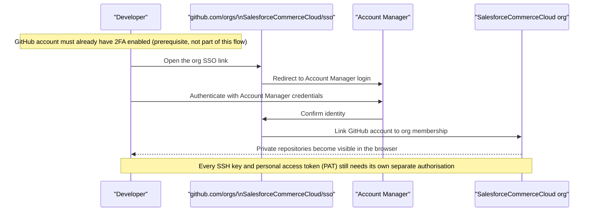

Someone in #b2c-general — one of the busiest channels in the [Unofficial SFCC Slack community](https://unofficialsfcc.com/) — asks it every few months, in one shape or another: two developers went through the identical SSO steps, and one of them still can't push at all. Twenty replies later, the thread dies without a clean answer. Slackbot's canned response is a link to the Trailhead module. It doesn't help, because the Trailhead module assumes the happy path, and this is not the happy path.

This post is the answer that thread never got. Not just the SSO walkthrough — the failure modes underneath it: the credential that needs its own authorisation, the 90-day clock nobody explains properly, the "where did the repo go" panic after AgentExchange absorbed a chunk of the GitHub org, and what you actually do if you need the code but aren't a customer at all.

## How the Account Manager to GitHub Link Actually Works

Access to Salesforce's private B2C Commerce repositories runs through your Account Manager identity, not a GitHub invite someone sends you. Account Manager is Salesforce's identity system for B2C Commerce — the same login behind Business Manager (Salesforce's admin interface for a storefront) and your sandboxes. Salesforce keeps its repositories in a GitHub organization called `SalesforceCommerceCloud` — "org" is GitHub's term for a shared account that owns a set of repositories. That org trusts your Account Manager identity through single sign-on (SSO): one authentication that proves who you are, so GitHub doesn't have to send you a separate invite for every repo.

Here's the sequence, per the [official Code Repositories guide](https://developer.salesforce.com/docs/commerce/b2c-commerce/guide/b2c-github-repo-access.html):

Three things trip people up before they even get to the interesting failure modes:

- **Turn on 2FA before you start.** Salesforce requires two-factor authentication on the GitHub account itself before it'll let that account touch a private repo. If you haven't turned it on yet, GitHub blocks you at the org link with an explicit two-factor-authentication prompt rather than letting the SSO flow complete — enable 2FA first, then try the link again.
- **The link is per-GitHub-account, not per-person.** If you have a personal GitHub account and a work one, and you link the wrong one, you'll swear you "did the SSO thing" while staring at a 404 on a repo you should be able to see.
- **A 404 on a private repo almost always means "not linked," not "doesn't exist."** GitHub doesn't tell an unauthorised user that a private repo exists at all — it just returns the same 404 you'd get for a URL with a typo in it. That ambiguity is most of the confusion in every one of these Slack threads.

A cartridge, in SFCC terms, is a self-contained package of code, templates, and configuration that plugs into a storefront — you clone it, customise it, and deploy it, rather than editing a single file. Once you're linked, you're looking at the base set the [Trailhead module](https://trailhead.salesforce.com/content/learn/modules/b2c-developer-resources-and-tools/b2c-developer-access-repositories) points new SFRA (Storefront Reference Architecture, Salesforce's reference storefront) developers to: `storefront-reference-architecture` for the base cartridge, `storefrontdata` for sample data, and `sgmf-scripts` for the CLI tooling, plus plugin cartridges like `plugin-applepay`, `plugin_datadownload`, `plugin_giftregistry`, `plugin_instorepickup`, `plugin_productcompare`, `plugin_sitemap`, `plugin_wishlists`, and `plugin_ordermanagement`. If you're new to SFRA, [my kickstart guide](/kickstart-guide-for-new-sfcc-developers/) covers what to do with these once you can actually clone them.

## The SSO Succeeds But Push Fails

This is the story from the top of the post, and it's the single most common shape of "I did everything right and it still doesn't work."

Worth clearing up first: "push" rarely means pushing to the canonical repo itself. Direct push access to `storefront-reference-architecture` and the plugin cartridges is reserved for B2C Commerce Engineering. Everyone else contributes the way the [official Contribute to SFRA guide](https://developer.salesforce.com/docs/commerce/b2c-commerce/guide/b2c-sfra-contributions.html) describes: fork the repository, clone your fork, branch, and push your changes to *your own fork* before opening a pull request against the main branch. So when someone hits "SSO succeeded but push failed," the push that's failing is almost always to their private fork, not to Salesforce's repo.

**The credential-authorisation gap.** GitHub treats the org-level SSO link and your individual credentials as two separate things — and that split follows you into your fork, because a private fork of a private org repo still inherits the org's SSO enforcement. Authenticating in the browser links your *account* to the org. It does not automatically authorise every SSH key and personal access token you've generated for that account — each one needs its own `Authorize` click under **Settings > SSH and GPG keys** (for keys) or **Settings > Developer settings > Personal access tokens** (for PATs), per [GitHub's own SSO authorisation docs](https://docs.github.com/en/enterprise-cloud@latest/authentication/authenticating-with-single-sign-on/authorizing-an-ssh-key-for-use-with-single-sign-on). One developer generated their key after linking and it picked up authorisation automatically through the flow; another had an older key sitting around from before they ever touched Account Manager, and that key had never been authorised. Same org, same SSO status, completely different push behaviour.

**The prerequisite nobody mentions.** Before GitHub will let you attach any credentials to your account, it needs to see that your account already has a linked "external identity" — GitHub's term for an account that's completed SSO with an outside system, in this case Account Manager. That means completing the Account Manager login through the SSO link at least once before you try to authorise anything else. Do the steps out of order and the `Authorize` option for your SSH key won't appear in the dropdown, which looks like a bug and isn't one.

So the fix, when a push to your fork fails despite a "successful" SSO link, is almost never re-doing the SSO flow. It's checking your SSH keys and PATs individually and authorising each one against the SalesforceCommerceCloud org by name.

## The 90-Day Silent Revocation

It's a 90-day inactivity timeout. Here's what actually counts as activity and what doesn't.

Per the official guide, GitHub accounts inactive for 90 days get automatically removed from the SalesforceCommerceCloud org, and removal takes your private forks of the org's private repositories with it. Nobody warns you mid-window — you find out when your next `git pull` starts failing or when the automated GitHub removal email lands, whichever you notice first.

**What actually counts as "activity" is exactly what the official doc leaves vague — and that vagueness is what burns people.** GitHub publishes its own list for a related policy — [its Enterprise Cloud dormancy rules](https://docs.github.com/en/enterprise-cloud@latest/admin/managing-accounts-and-repositories/managing-users-in-your-enterprise/managing-dormant-users), where the threshold is 30 days rather than Salesforce's 90 — and it's more specific than anything Salesforce documents. Authenticating via SAML SSO (the same browser-based login you used to link your account) counts as activity. So does most GitHub-side collaboration: opening a pull request, commenting on one, or closing and reopening an issue or PR. What doesn't count is the part that catches people out: plain `git push` or `git pull` over SSH or HTTPS on a private repo, using a personal access token or SSH key by itself, and — somewhat counterintuitively — creating or commenting on an issue on its own. A developer in #b2c-general figured out the practical version of this the hard way and posted the workaround that matches GitHub's list: logging into GitHub in a browser and navigating into the SFCC org resets the clock; pulling and pushing over SSH alone does not.

In my experience, this is the rule that catches senior developers as often as juniors, because SSH-only workflows are exactly what a comfortable, automated pipeline looks like. If your CI/CD or local git setup never touches the browser-based Account Manager login, the 90-day clock keeps ticking in the background regardless of how much code you're shipping through that same SSH key. (If MFA on your CI's Account Manager identity is also part of your setup, [this is where that story connects to the pipeline side](/account-manager-mfa-broke-sfcc-cicd/) — separate failure mode, same root identity.)

Getting back in after removal doesn't need a support ticket. Head back to the SSO link, re-authenticate with Account Manager, and membership is restored — but any SSH key or PAT you had authorised before removal needs re-authorising, because removal from the org invalidates that authorisation along with the membership.

## Where Did the Repositories Go

Salesforce has been steadily moving cartridges out of the SalesforceCommerceCloud GitHub org and onto its partner-solutions marketplace — the LINK cartridge family (Salesforce-certified, pre-built integrations with third-party services, like payment or tax providers) is the clearest example. That marketplace is also mid-rename: Salesforce folded AppExchange, the standalone AgentExchange listing site, and the Slack Marketplace into a single "AgentExchange" destination at TrailblazerDX 2026, so a cartridge you remember finding on AppExchange now lives under the AgentExchange name at the same URL. Multiple people in #b2c-general and #scapi have asked, a year or more apart, essentially the same question: is the marketplace version newer than the GitHub one, is the GitHub repo going away, and is there a list of what's moving versus what's staying? Neither thread landed on a definitive answer, and I haven't found a published, maintained list either — not in the official docs, not on Trailhead.

What I'd actually check, in order, when a repo you expect isn't where you remember it:

- **Search AgentExchange first, by cartridge name.** If the cartridge has moved, this is usually where it landed, packaged as a managed listing rather than a raw repo you clone.
- **Compare last-commit dates on both, if the GitHub repo still exists.** SFRA and its plugin cartridges follow [semantic versioning with matching Git tags](https://developer.salesforce.com/docs/commerce/sfra/guide/b2c-sfra-versions.html) across the family, so a stale GitHub repo next to an actively-versioned AgentExchange listing is a reasonably strong signal of which one is current.
- **Don't assume a missing repo means the cartridge is deprecated.** "Gone from GitHub" and "gone from the platform" aren't the same thing — it may just mean the distribution channel changed.
- **Public repositories are unaffected by any of this.** PWA Kit, the Commerce SDK, and SFCC-CI live in the same org but are public, need no Account Manager link at all, and aren't part of the migration story.

If you've gone looking for a specific cartridge repo by name and come up empty-handed, you're not missing a step — plenty of repos from the pre-migration era don't have a confirmed current home either.

## If You're Not an SFCC Customer

The Account Manager link assumes you have Account Manager credentials in the first place, which assumes you're a customer or an implementation partner on a client's instance. That leaves out a real chunk of the community: independent developers, people between contracts, and anyone building towards a certification without a sandbox (a personal, on-demand Commerce Cloud test instance) of their own.

There's no equivalent path into the private repositories without an Account Manager identity behind it. You can join the wider B2C Commerce community — by invitation or by completing Salesforce's community sign-up form — but that only grants forum and community access, not private GitHub repo access. Those are two separate systems that happen to share a "community" label, and conflating them is exactly what generates the unresolved "how do I get in without being a customer" threads.

What is genuinely open without any of this: the public side of the [SalesforceCommerceCloud org](https://github.com/SalesforceCommerceCloud) — PWA Kit, the Commerce SDK, and SFCC-CI — none of which require Account Manager linking. And [some third-party and community cartridges are collected outside the official org entirely](/helpful-salesforce-b2c-commerce-cloud-cartridges/), which is worth a look if what you actually need is a working cartridge rather than the specific official repo.

## The Troubleshooting Checklist

When access breaks and you need to work through it fast, in this order:

- **Confirm 2FA is on for the linked GitHub account** — a missing 2FA setting silently blocks the org link even when SSO otherwise "succeeds."
- **Confirm you linked the right GitHub account** — check for a stray personal account getting linked instead of your work one.
- **Re-check the SSO status directly at `github.com/orgs/SalesforceCommerceCloud/sso`** rather than trusting a cached browser session.
- **Authorise each SSH key and PAT individually** under GitHub settings, even if the account itself shows as linked — this is the fix for "SSO succeeded but the push to my fork still fails."
- **Treat a 404 on a private repo as "not authorised," not "doesn't exist,"** and work backwards from there instead of assuming the repo was deleted.
- **Log into GitHub through a browser and navigate the org at least once every 90 days** — SSH and PAT usage alone won't reset the inactivity clock.
- **If you've been removed, re-authenticate at the SSO link, then re-authorise your credentials** — membership comes back before your keys and tokens do.
- **If a repo is missing, check AgentExchange before assuming deprecation**, and compare commit/tag freshness if both versions still exist.
- **If you're not a customer, stop looking for a private-repo workaround** and check the public repositories and community cartridge collections instead — that gap is real, not a step you're missing.
