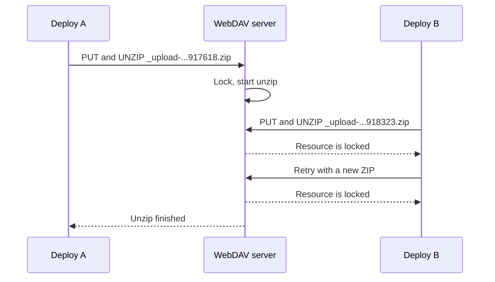
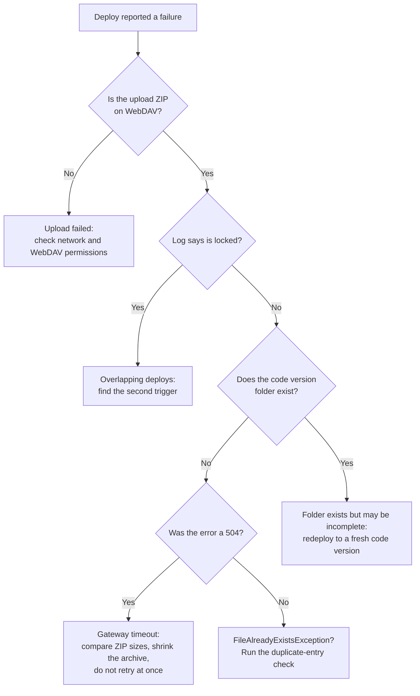

Your pipeline pushes a cartridge build, and the log says `Resource [_upload-1775813917618.zip] is locked`. Less than a second later there is a second upload, `_upload-1775813918323.zip`, and the answer is the same. Eighteen minutes later there is a third timestamp, a third ZIP, and the same sentence. Nothing in the archive looks wrong, and the cartridges build fine on your laptop.

If you have landed here by pasting an error string into a search engine, you are in the right place. This post sorts the recurring [WebDAV](/a-beginners-guide-to-webdav-in-sfcc/) deployment failures on B2C Commerce into the classes they belong to and ends with the pipeline guards that make them much less likely to come back.

Salesforce does not document the internals of the server-side unzip. Everything below about *why* is built from stack traces, log patterns, and the platform's published limits, and I mark it as inference where that is the case.

## How a Cartridge Deploy Works

Some vocabulary first. A *code version* is a folder on the instance that holds your cartridges, the packages of storefront code. Only one code version is *active* at a time. The others wait there for activation or a rollback.

To deploy, your tool zips the cartridges, uploads the ZIP over WebDAV under a temporary name, and then asks the server to unzip it into the code version folder with a second request (the WebDAV `UNZIP` method). The temporary name is the tool's choice. In my logs it was `_upload-<timestamp>.zip`, the pattern the B2C CLI's `b2c code watch` [used until September 2026](https://github.com/SalesforceCommerceCloud/b2c-developer-tooling/blob/main/packages/b2c-tooling-sdk/src/operations/code/upload-files.ts). Today `b2c code watch` uses `_upload-` plus a random ID, `b2c code deploy` uses `_sync-<timestamp>.zip`, and sfcc-ci keeps your ZIP's own filename. Whatever yours is called, that is the file to look for on the server. That is two steps, upload and extraction, and they fail in different ways. Keep that split in mind, because the rest of this post hangs on it.

## Three Failure Classes, Not One

"The ZIP is corrupt" is the explanation people reach for first. In the reports I have gone through, it was rarely the right one. What looks like one problem is at least three, and each needs a different fix:

| Symptom | Where you see it | Likely failure class | First check |
| --- | --- | --- | --- |
| `Resource [_upload-<timestamp>.zip] is locked` | Logs folder, CLI output | Lock contention during extraction | Is a second deploy running? |
| `FileAlreadyExistsException` | Logs folder, CLI output | Duplicate path during extraction | Does the ZIP contain duplicate entries? |
| `504 (Gateway Time-out)` | `sfcc-ci` output | Transport timeout | Does the archive exist, but not the code version folder? |
| `WebDAV authentication failed` | `sfcc-ci` output | Usually permissions, not deployment | Do the WebDAV Client Permissions cover the folder? |

The first three tend to get lumped together because they all end as a failed upload or a "Could not unzip file" message. The last one is a false lead that burns an afternoon more often than it should.

## Locked Upload ZIPs

Here is the pattern from the logs, boiled down:

```text
Resource [_upload-1775813917618.zip] is locked
  -> processing cancelled
Could not unzip file [_upload-1775813917618.zip]: File is locked.
  -> new upload: _upload-1775813918323.zip
Resource [_upload-1775813918323.zip] is locked
  ...
```

Those long numbers look like epoch milliseconds (the time in milliseconds since 1 January 1970 UTC), and if they are, the first two ZIPs were created at 09:38:37 and 09:38:38 UTC on 10 April 2026, about 700 milliseconds apart. A third, `_upload-1775814996365.zip`, followed roughly 18 minutes later. Nobody uploads a cartridge archive twice in under a second by hand. Something retried, or something else started a second upload while the first was still being processed.

The filenames are *different*, so this is not two files fighting over the same name. The names only tell you that a fresh upload started each time: the client picks the name, so a new name means a client tried again. My reading is that the thing being contended is the extraction, not the filename, but I cannot see inside the platform to prove it.

The stack trace backs this up. The failure runs through `FileServlet.doUnzip`, `WebdavServlet.doUnzip`, `LockMgrImpl.runWithLock`, `ZipUtils.unzip`, and finally `MultithreadingZipFileProcessor.processWithValidation`. In plain words, going by the class names: the server appears to take a lock, then start unzipping with multiple threads. If that reading is right, the lock is taken *on the server*, during extraction. Your local ZIP creation is then not involved, and rebuilding the archive on your side fixed nothing in these logs.

A lock error might sound odd for WebDAV, because, as I covered in the [beginner's guide](/a-beginners-guide-to-webdav-in-sfcc/#where-sfcc-parts-ways-with-the-standard), SFCC does not offer client-side `LOCK` and `UNLOCK`. The error text suggests the platform locks something internally during extraction anyway, though Salesforce's public documentation does not describe that mechanism. You cannot take those locks. You can only run into them.

The diagram below shows the overlap I suspect, not one I have confirmed. One wrinkle: in my logs even the first ZIP reported itself locked, so the lock may have been held by something that never appears in the excerpt. A third ZIP still hitting the same error 18 minutes later also hints at a lock that stayed put, not a brief collision.



> [!NOTE]
> Salesforce's [replication troubleshooting page](https://help.salesforce.com/s/articleView?language=en_US&id=cc.b2c_troubleshooting_replication.htm) describes `ErrorAcquiringEditingLocks` and `ErrorAcquiringLivelocks` as possible signs that resource locks from a previous replication were not released, and `ErrorLiveStagingProcessKilled` as a probable hang from a concurrent deployment or instance restart. That is replication, not WebDAV code upload, so the mechanics differ. The lesson may carry over, though: locks can outlive the operation that took them and trip the next one.

Two questions remain open, and Salesforce's documentation does not answer them either. First, whether concurrent uploads to the same code version are queued, rejected, or processed in parallel. Second, how a half-finished upload gets cleaned up. Treat any upload ZIP (`_upload-*.zip`, `_sync-*.zip`) that sits on the instance long after a failed deploy as your problem to remove.

## Could Not Unzip: Archive on the Server, No Code Version

The generic version of this error ends in `java.io.IOException: Failed to process zip file [_upload-<timestamp>.zip]`, thrown from `MultithreadingZipFileProcessor.processWithValidation`. By itself it says nothing. The exception *underneath* it tells you the class: a lock message, a `FileAlreadyExistsException`, or something else entirely.

The most instructive case in my notes is a different one. A roughly 90 MB ZIP with about 140 cartridges failed with `Error: Deploy code NODE18.zip failed (upload step): 504 (Gateway Time-out)`. A 504 means the web server in front of the application server stopped waiting for a reply. The archive was visible on WebDAV afterwards, but the expected code version folder never appeared. The wording gives the tool away: that message is sfcc-ci's, and sfcc-ci labels a failed `PUT` of the ZIP as the upload step. It only sends the separate unzip request once the `PUT` has succeeded, and reports a failure there as the unzip step. So the likeliest reading is that the server had the file, the gateway gave up waiting for the reply to the `PUT`, and the unzip was never asked for. A visible archive is not proof of a complete one, though, so compare its size with your local ZIP.

That gives you a two-question test after any reported failure:

1. **Does the archive exist on WebDAV?** If not, the upload itself failed, and you are looking at network or authentication trouble.
2. **Does the target code version directory exist?** Archive present, directory missing, means the upload probably finished (compare its size with your local ZIP) and extraction died or never started. That is a timeout or extraction failure, not a permissions problem.

The numbers fit. Salesforce lists a [500 MB limit for WebDAV uploads](https://help.salesforce.com/s/articleView?language=en_US&id=cc.b2c_import_export_transaction_handling_and_feed_size.htm) and a request timeout of five minutes, after which the web server closes the connection if the application server has not answered. Salesforce describes that timeout for imports and exports, so applying it to a code upload is my assumption. Ninety megabytes is nowhere near the size limit, so time is the likelier culprit, and a failure that arrives at almost exactly five minutes would fit.

The same documentation points at asynchronous job pipelines for long-running imports, but that advice does not translate to code deployment, where WebDAV is the mechanism you have. The practical lever is a smaller archive, and the [survival guide to SFCC platform limits](/a-survival-guide-to-sfcc-platform-limits/) has the wider picture on the platform's other ceilings. Do you really need to ship 140 cartridges on every build?

A 504 on the unzip request itself is a different animal. My inference: there, the gateway timing out does not stop the server from carrying on with the extraction. The [B2C CLI's source](https://github.com/SalesforceCommerceCloud/b2c-developer-tooling/blob/main/packages/b2c-tooling-sdk/src/operations/code/deploy.ts) assumes the same: it sends its unzip once and deliberately never retries it, because a second request could start a second extraction next to the first. If your pipeline sees that 504 and retries straight away, it starts a second upload while the first is still being unzipped. That is the overlap from the previous section, created by the retry itself. I cannot prove that sequence from the outside, but the symptoms line up, and it is a cheap theory to rule out.

## FileAlreadyExistsException

This is a standard Java exception: something tried to create a file at a path where one already exists. It looks like a packaging bug, and it might be. The full chain reads: `Could not unzip file`, then `Failed to process zip file`, then `ExecutionException`, then `java.nio.file.FileAlreadyExistsException`. The `ExecutionException` in the middle is the tell for worker threads: Java throws it when you ask for the result of a task that failed, with the real error attached as its cause. My reading is that one of the extraction threads failed and the wrapper surfaced it.

The conflicting paths in the reports were ordinary cartridge assets. One was an icon PNG under `cartridge/static/default/icons/standard/`, another a page script such as `cartridge/client/default/.../pages/Overview.js`. The same destination kept showing up, so the server probably believed a file was already there when it tried to write it.

Three explanations fit, and none of them is confirmed:

- **Duplicate entries inside the ZIP.** The archive itself lists the same path twice, so the second write hits the first.
- **Two extractions writing the same destination.** If `MultithreadingZipFileProcessor` is as parallel as its name suggests, two overlapping deploys could race to create the same file.
- **Leftovers from an earlier extraction.** The code version folder already holds files from a previous, half-finished deploy, and the new write refuses to replace them. Redeploying into an existing version normally works, so this one is a guess, but it is why I deploy into a fresh code version (see the fixes below). The B2C CLI also has `b2c code deploy --delete`, documented as deleting existing cartridges before upload, which is a cheap thing to try.

The first is quick to test locally, before you blame the platform:

```bash
# Any output here means the same path appears more than once in the archive
unzip -Z1 code.zip | sort | uniq -d

# Same check, ignoring case (my own hunch, not documented behaviour)
unzip -Z1 code.zip | tr 'A-Z' 'a-z' | sort | uniq -d
```

If both commands print nothing, the archive has no duplicate paths, and the overlap theory (or leftovers from an earlier extraction) moves to the top of the list. If they print paths, fix your packaging step. If the archive does contain duplicate entries, retrying the same ZIP should only reproduce the exception.

## Ruling Out the Authentication Red Herring

The fourth row of the table is the odd one out. `WebDAV authentication failed. Please (re-)authenticate first...` is what sfcc-ci prints for any 401 from a WebDAV request. The usual cause is an API client without the right WebDAV resource permissions, even though the token request itself succeeded. The message's closing line, about checking the WebDAV Client Permissions, is the part worth reading. The fix lives in Business Manager (the admin tool of an instance) under `Administration > Organization > WebDAV Client Permissions`, where the client needs access to the resources your deploy touches, including `/cartridges` with `read_write`, which is what the [B2C CLI authentication guide](https://salesforcecommercecloud.github.io/b2c-developer-tooling/guide/authentication.html#webdav-access) lists for code deployment. I walked through that screen in the [WebDAV beginner's guide](/a-beginners-guide-to-webdav-in-sfcc/).

Getting a token proves very little about what that token may do afterwards, so a successful auth step followed by a 401 on the next WebDAV request is usually the same problem. A 403 can point at the same permissions. And if you deploy to a staging instance, Salesforce requires a client certificate for code uploads there, so check that too. If you cannot get a token at all and your pipeline still logs in with a username and password, you are probably in [the MFA problem](/account-manager-mfa-broke-sfcc-cicd/), which has its own cure.

The rule of thumb: a missing WebDAV permission normally stops the deploy at the upload, *before* any ZIP lands. If you can see your upload ZIP on the server, that upload was authorised, so look at extraction next. The one case I would still rule out is a token that expires between the upload and the unzip.

## Diagnosing It in Five Minutes

I work in this order:



Both checks need only a `PROPFIND` request, the WebDAV method that lists the contents of a folder. Run it against the Cartridges folder, and against the code version folder too if your tool uploads the ZIP inside it:

```bash
# TOKEN is your OAuth access token, HOST your instance hostname.
# List the folder: look for leftover .zip files (_upload-*, _sync-*) and your code version.
# A 2xx status means the listing worked. 401 or 403 is a token or permissions problem, not an empty folder.
curl -sS -w '\nHTTP %{http_code}\n' -X PROPFIND -H "Depth: 1" \
  -H "Authorization: Bearer $TOKEN" \
  "https://$HOST/on/demandware.servlet/webdav/Sites/Cartridges/" | grep -oE '<([A-Za-z]+:)?href>[^<]*|^HTTP [0-9]+'
```

Then read the logs. Business Manager exposes them through the Folder Browser tab under `Administration > Site Development > Development Setup`, and over WebDAV at `/on/demandware.servlet/webdav/Sites/Logs/`. Salesforce keeps [production and staging logs for 30 days](https://developer.salesforce.com/docs/commerce/b2c-commerce/guide/b2c-log-files-overview.html), moving them to a compressed `log_archive` folder after three days. That retention is not promised for sandboxes, so do not count on old logs there.

I cannot tell you which file your realm writes the unzip lines to, so grep every log from the deploy window for `_upload-` (or for `.zip`, if your tool names its archive differently). Line up the timestamps against your pipeline runs. Two runs within seconds of each other is a strong lead.

## Fixes That Work

**Retry, but only the right error, and slowly.** Retry lock errors with exponential backoff plus jitter, which means waiting longer after each failure and adding a little randomness so retries do not line up. Fail immediately on everything else, a 504 included: that one is a signal to shrink the archive, not to try again. And wait longer than the five-minute request timeout before the last attempt, because whatever holds the lock may still be extracting. The `b2c` command is the B2C CLI, Salesforce's command-line tool for code deployment. A sketch:

```bash
#!/usr/bin/env bash
# Retries only lock errors. Add your own flags to the deploy command.
# Check that your tool really prints the lock message, or the match never fires.
# Waits: about 80s, 160s, then 320s, which is past the five-minute request timeout.
for attempt in 1 2 3 4; do
  if out=$(b2c code deploy --code-version "build-$BUILD_NUMBER" 2>&1); then echo "$out"; exit 0; fi
  echo "$out"
  grep -q "is locked" <<<"$out" || { echo "Not a lock error, stopping."; exit 1; }
  [ "$attempt" -lt 4 ] && sleep $(( (2 ** attempt) * 40 + RANDOM % 15 ))
done
exit 1
```

**Deploy into a fresh code version every time.** If a `FileAlreadyExistsException` comes from leftovers of an earlier, half-finished extraction, or from two extractions writing into the same folder, a new version name keeps the next extraction away from both. Use the build number: `build-1482`, not `v1`. You do not control the temporary ZIP name, since your tool picks it, but you do control the destination. On production you have no choice anyway: it rejects WebDAV uploads to the active code version, so uploads there must target an inactive one.

Fresh names pile up, so watch the retention setting: automatic deletion removes only the oldest versions (never the active or previously active one), and the configurable range is [3 to 20, default 10](https://developer.salesforce.com/docs/commerce/b2c-commerce/guide/b2c-code-deployment.html). On older instances the setting may still be 0, which means the feature is off.

**Shrink the archive.** If you ship 140 cartridges and only three changed, a timeout is the likely bill for that habit. The B2C CLI can limit a deploy with `--cartridge` and `--exclude-cartridge`, but only do that into a code version that already holds the other cartridges. A fresh version containing three of them is not a complete code version.

**Clean up by hand, carefully.** After a failed deploy, delete the stale upload ZIP with a WebDAV client or `b2c webdav rm --root=cartridges`, because the Folder Browser in Business Manager only lets you view and download. Then remove the half-extracted code version folder before reusing its name, either with `b2c code delete` or under `Administration > Site Development > Code Deployment` (inactive versions only). Do this only after confirming nothing is still running. Check the logs for activity; waiting a minute proves nothing.

## Preventing It in Automated Pipelines

Most of the failures in this post look worse when two deploys run at once, and the overlap theory above is the one I would rule out first. That makes a pipeline guard the first fix I would put in place. In GitHub Actions, a concurrency group per target instance does it:

```yaml
concurrency:
  group: sfcc-deploy-staging
  cancel-in-progress: false
```

With `cancel-in-progress: false`, a running deploy finishes before the next starts, and a newer pending run replaces an older pending one. For deploys, latest wins, and that is usually what you want. If every run must go through, `queue: max` lets pending runs line up instead.

Three more guards belong in the same pipeline:

- **Split deploy from activation.** Activation switches the instance over to the new code version. Build the ZIP, run `b2c code deploy`, confirm success, then run `b2c code activate` as a separate step. When something fails, you at least know whether it broke in the deploy (upload and extraction) or in the activation. Salesforce's [code deployment guide](https://developer.salesforce.com/docs/commerce/b2c-commerce/guide/b2c-code-deployment.html) calls the B2C CLI the recommended method for GitHub Actions or Jenkins pipelines, instead of manual uploads. Its own example pushes and activates in one step; keeping them apart is my preference, not a Salesforce rule.
- **Verify before activating.** Run the `PROPFIND` check above against the new code version folder. A missing folder should fail the job, not an activation a minute later. A folder that exists is no proof of a complete extraction, so also look for a file you know should be inside it.
- **Hunt for the second trigger.** A concurrency group only protects your pipeline. A colleague with a WebDAV client, a second repository deploying to the same instance, or someone running `b2c code watch` (the CLI's file watcher) against a shared sandbox bypasses it entirely. When locks keep appearing despite a guard, ask who else is writing to that instance.

The mechanics for storefronts on Managed Runtime are a different story. The [MRT architecture post](/managed-runtime-explained-architecture-deployment-ssr/) covers them. Everything here concerns cartridges going to B2C Commerce instances.

So the next time a `_upload-` ZIP reports itself locked, resist the urge to rebuild the archive. Look at the clock instead, and find out what else was uploading at 09:38 UTC.
