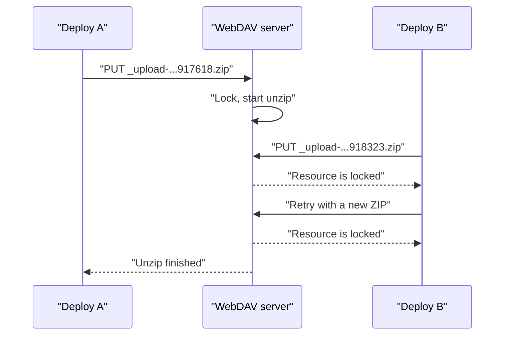
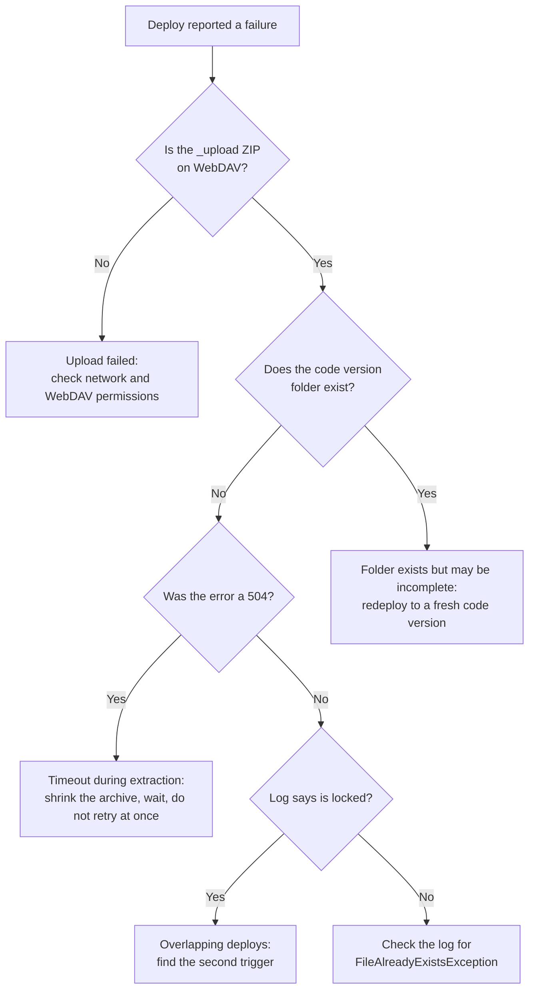

Your pipeline pushes a cartridge build, and the log says `Resource [_upload-1775813917618.zip] is locked`. You trigger it again. Now it is `_upload-1775813918323.zip`, and the answer is the same. Eighteen minutes later there is a third timestamp, a third ZIP, and the same sentence. Nothing in the archive looks wrong, and the cartridges build fine on your laptop.

If you have landed here by pasting an error string into a search engine, you are in the right place. This post sorts the recurring [WebDAV](/a-beginners-guide-to-webdav-in-sfcc/) deployment failures on B2C Commerce into the classes they belong to and ends with the pipeline guards that keep them from coming back.

Salesforce does not document the internals of the server-side unzip. Everything below about *why* is built from stack traces, log patterns, and the platform's published limits, and I mark it as inference where that is the case.

## How a Cartridge Deploy Works

Some vocabulary first. A *code version* is a folder on the instance that holds your cartridges, the packages of storefront code. Only one code version is *active* at a time. The others wait there for activation or a rollback.

To deploy, your tool zips the cartridges, uploads the ZIP over WebDAV under a temporary name (the `_upload-<timestamp>.zip` files in the logs), and the server then unzips it into the code version folder. That is two steps, upload and extraction, and they fail in different ways. Keep that split in mind, because the rest of this post hangs on it.

## Three Failure Classes, Not One

"The ZIP is corrupt" is the explanation people reach for first. In the reports I have gone through, it was rarely the right one. What looks like one problem is at least three, and each needs a different fix:

| Symptom | Where you see it | Failure class | First check |
| --- | --- | --- | --- |
| `Resource [_upload-<timestamp>.zip] is locked` | WebDAV log, CLI output | Lock contention during extraction | Is a second deploy running? |
| `FileAlreadyExistsException` | WebDAV log, CLI output | Duplicate path during extraction | Does the ZIP contain duplicate entries? |
| `504 (Gateway Time-out)` | CLI output | Transport timeout | Does the archive exist, but not the code version folder? |
| `WebDAV authentication failed` | CLI output | Permissions, not deployment | Do the WebDAV Client Permissions cover the folder? |

The first three tend to get lumped together because they all end as a failed upload or a "Could not unzip file" message. The last one is a false lead that burns an afternoon more often than it should.

## Locked Upload ZIPs

Here is the pattern from the logs, boiled down:

```text
Resource [_upload-1775813917618.zip] is locked
  -> processing cancelled
Could not unzip file [_upload-1775813917618.zip]: File is locked.
  -> new upload: _upload-1775813918323.zip
Resource [_upload-1775813918323.zip] is locked
  ...
```

Those long numbers look like epoch milliseconds (the time in milliseconds since 1 January 1970 UTC), and if they are, the first two ZIPs were created at 09:38:37 and 09:38:38 UTC on 10 April 2026, about 700 milliseconds apart. A third, `_upload-1775814996365.zip`, followed roughly 18 minutes later. Nobody uploads a cartridge archive twice in under a second by hand. Something retried, or something else started a second upload while the first was still being processed.

The filenames are *different*, so this is not two files fighting over the same name. The names tell you that uploads overlapped in time. The thing being contended is the extraction, not the filename.

The stack trace backs this up. The failure runs through `FileServlet.doUnzip`, `WebdavServlet.doUnzip`, `LockMgrImpl.runWithLock`, `ZipUtils.unzip`, and finally `MultithreadingZipFileProcessor.processWithValidation`. In plain words: the server takes a lock, then starts unzipping with multiple threads. The lock is taken *on the server*, during extraction. Your local ZIP creation is not involved, so rebuilding the archive on your side fixes nothing.

A lock error might sound odd for WebDAV, because, as I covered in the [beginner's guide](/a-beginners-guide-to-webdav-in-sfcc/#where-sfcc-parts-ways-with-the-standard), SFCC does not offer client-side `LOCK` and `UNLOCK`. The error text shows the platform locks something internally during extraction anyway. You cannot take those locks. You can only run into them. <!-- TODO verify: Salesforce's public docs do not describe a server-side locking mechanism for WebDAV unzip; the lock behaviour here is inferred from log output only. -->



> [!NOTE]
> Salesforce's [replication troubleshooting page](https://help.salesforce.com/s/articleView?language=en_US&id=cc.b2c_troubleshooting_replication.htm) describes `ErrorAcquiringEditingLocks` and `ErrorAcquiringLivelocks` as signs that resource locks from a previous replication were not released, and `ErrorLiveStagingProcessKilled` as a probable hang from a concurrent deployment or instance restart. That is replication, not WebDAV code upload, so the mechanics differ. The lesson carries over, though: overlapping operations can leave locks behind.

Two unanswered questions remain, and Salesforce has not answered them publicly either. First, whether concurrent uploads to the same code version are queued, rejected, or processed in parallel. Second, how a half-finished upload gets cleaned up. Treat any `_upload-*.zip` that sits on the instance long after a failed deploy as your problem to remove.

## Could Not Unzip: The Upload Worked, the Extraction Did Not

The generic version of this error ends in `java.io.IOException: Failed to process zip file [_upload-<timestamp>.zip]`, thrown from `MultithreadingZipFileProcessor.processWithValidation`. By itself it says nothing. The exception *underneath* it tells you the class: a lock message, a `FileAlreadyExistsException`, or something else entirely.

The most instructive case in my notes is a different one. A roughly 90 MB ZIP with about 140 cartridges failed with `Error: Deploy code NODE18.zip failed (upload step): 504 (Gateway Time-out)`. A 504 means the web server in front of the application server stopped waiting for a reply. The archive was visible on WebDAV afterwards, but the expected code version folder never appeared. The transfer had completed. The extraction had not.

That gives you a two-question test after any reported failure:

1. **Does the archive exist on WebDAV?** If not, the upload itself failed, and you are looking at network or authentication trouble.
2. **Does the target code version directory exist?** Archive present, directory missing, means the upload finished and extraction died or never started. That is a timeout or extraction failure, not a permissions problem.

The numbers fit. Salesforce lists a [500 MB limit for WebDAV uploads](https://help.salesforce.com/s/articleView?language=en_US&id=cc.b2c_import_export_transaction_handling_and_feed_size.htm) and a system-wide request timeout of five minutes. Ninety megabytes is nowhere near the size limit, so time is the likelier culprit. Unzipping 140 cartridges is a lot of small files, and the gateway gave up before the server did.

The same documentation points at asynchronous job pipelines for long-running imports, but that advice does not translate to code deployment, where WebDAV is the mechanism you have. The practical lever is a smaller archive, and the [survival guide to SFCC platform limits](/a-survival-guide-to-sfcc-platform-limits/) has the wider picture on the platform's other ceilings. Do you really need to ship 140 cartridges on every build?

My inference: a gateway timeout does not stop the server from carrying on with the extraction. If your pipeline sees a 504 and retries straight away, it starts a second upload while the first is still being unzipped. That is the overlap from the previous section, created by the retry itself. I cannot prove that sequence from the outside, but the symptoms line up, and it is a cheap theory to rule out.

## FileAlreadyExistsException

This is a standard Java exception: something tried to create a file at a path where one already exists. It looks like a packaging bug, and sometimes it is. The full chain reads: `Could not unzip file`, then `Failed to process zip file`, then `ExecutionException`, then `java.nio.file.FileAlreadyExistsException`. The `ExecutionException` in the middle is the tell for worker threads. One of the extraction threads failed, and the wrapper surfaced it.

The conflicting paths in the reports were ordinary cartridge assets. One was an icon PNG under `cartridge/static/default/icons/standard/`, another a page script such as `cartridge/client/default/.../pages/Overview.js`. The same destination kept showing up, so the server probably believed a file was already there when it tried to write it.

Two explanations fit, and Salesforce support has confirmed neither:

- **Duplicate entries inside the ZIP.** The archive itself lists the same path twice, so the second write hits the first.
- **Two extractions writing the same destination.** Because `MultithreadingZipFileProcessor` is parallel by design, two overlapping deploys can race to create the same file.

The first is quick to test locally, before you blame the platform:

```bash
# Any output here means the same path appears more than once in the archive
unzip -Z1 code.zip | sort | uniq -d

# Same check, ignoring case (my own hunch, not documented behaviour)
unzip -Z1 code.zip | tr 'A-Z' 'a-z' | sort | uniq -d
```

If both commands print nothing, the archive is clean, and the overlap theory moves to the top of the list. If they print paths, fix your packaging step. Retrying a ZIP with duplicate entries only reproduces the exception.

## Ruling Out the Authentication Red Herring

The fourth row of the table is the odd one out. `WebDAV authentication failed... Please (re-)authenticate first...` shows up when an API client lacks the right WebDAV resource permissions, even though the token request itself succeeded. The fix lives in Business Manager (the admin tool of an instance) under `Administration > Organization > WebDAV Client Permissions`, where the client needs access to the resources your deploy touches, including `/cartridges`. I walked through that screen in the [WebDAV beginner's guide](/a-beginners-guide-to-webdav-in-sfcc/).

Getting a token proves very little about what that token may do afterwards, so a successful auth step followed by a 401 on the next WebDAV request is the same problem. If you cannot get a token at all, you are probably in [the MFA problem](/account-manager-mfa-broke-sfcc-cicd/), which has its own cure.

The rule of thumb: an auth error stops the deploy *before* any ZIP lands. If you can see an `_upload-*.zip` on the server, authentication was fine.

## Diagnosing It in Five Minutes

I work in this order:



Both checks need only a `PROPFIND` request, the WebDAV method that lists the contents of a folder, against the Cartridges folder:

```bash
# TOKEN is your OAuth access token, HOST your instance hostname.
# List the folder: look for _upload-*.zip files and your code version
curl -s -X PROPFIND -H "Depth: 1" \
  -H "Authorization: Bearer $TOKEN" \
  "https://$HOST/on/demandware.servlet/webdav/Sites/Cartridges/" | grep -o '<D:href>[^<]*'
```

Then read the logs. Business Manager exposes them through the Folder Browser tab under `Administration > Site Development > Development Setup`, and over WebDAV at `/on/demandware.servlet/webdav/Sites/Logs/`. Salesforce keeps [production and staging logs for 30 days](https://developer.salesforce.com/docs/commerce/b2c-commerce/guide/b2c-log-files-overview.html), moving them to an archive folder after three.

I cannot tell you which file your realm writes the unzip lines to, so grep every log from the deploy window for `_upload-`. Line up the timestamps against your pipeline runs. Two runs within seconds of each other is your answer.

## Fixes That Work

**Retry, but only the right error, and slowly.** Retry lock errors with exponential backoff plus jitter, which means waiting longer after each failure and adding a little randomness so retries do not line up. Fail immediately on everything else. And wait longer than the five-minute request timeout before the last attempt, because the first extraction may still be running. The `b2c` command is the B2C CLI, Salesforce's command-line tool for code deployment. A sketch:

```bash
#!/usr/bin/env bash
# Retries only lock errors. Add your own flags to the deploy command.
# Waits: about 80s, 160s, then 320s, which is past the five-minute request timeout.
for attempt in 1 2 3 4; do
  if out=$(b2c code deploy 2>&1); then echo "$out"; exit 0; fi
  echo "$out"
  grep -q "File is locked" <<<"$out" || { echo "Not a lock error, stopping."; exit 1; }
  [ "$attempt" -lt 4 ] && sleep $(( (2 ** attempt) * 40 + RANDOM % 15 ))
done
exit 1
```

**Deploy into a fresh code version every time.** If a `FileAlreadyExistsException` comes from files left behind by an earlier, half-finished extraction, a new version name sidesteps the whole collision. Use the build number: `build-1482`, not `v1`. Unique ZIP names are not the lever here, but the destination is yours to choose. Production rejects WebDAV uploads to the active code version anyway, so uploads there must target an inactive one. As far as I can tell the temporary ZIP name is generated for you.

Fresh names pile up, so watch the retention setting: automatic deletion removes only the oldest versions (never the active or previously active one), and the configurable range is [3 to 20, default 10](https://developer.salesforce.com/docs/commerce/b2c-commerce/guide/b2c-code-deployment.html). On older instances the setting may still be 0, which means the feature is off.

**Shrink the archive.** If you ship 140 cartridges and only three changed, a timeout is the bill for that habit.

**Clean up by hand, carefully.** After a failed deploy, delete the stale `_upload-*.zip` through your WebDAV client or Business Manager's folder browser, and remove the half-extracted code version folder before reusing its name. Do this only after confirming nothing is still running. Check the logs for activity; waiting a minute proves nothing.

## Preventing It in Automated Pipelines

Every cause in this post gets worse when two deploys run at once, and the overlap theory above is the one I would rule out first. A pipeline guard is therefore the first fix I would put in place. <!-- TODO verify: an earlier draft attributed a warning against concurrent tasks/jobs to Salesforce's CI Trailhead module; the fetched page does not contain it. --> In GitHub Actions, a concurrency group per target instance does it:

```yaml
concurrency:
  group: sfcc-deploy-staging
  cancel-in-progress: false
```

With `cancel-in-progress: false`, a running deploy finishes before the next starts, and a newer pending run replaces an older pending one. For deploys, latest wins, and that is what you want.

Three more guards belong in the same pipeline:

- **Split deploy from activation.** Activation switches the instance over to the new code version. Build the ZIP, run `b2c code deploy`, confirm success, then run `b2c code activate` as a separate step. When something fails, you know whether it was transport, extraction, or activation. Salesforce's [code deployment guide](https://developer.salesforce.com/docs/commerce/b2c-commerce/guide/b2c-code-deployment.html) calls the B2C CLI the recommended method for GitHub Actions or Jenkins pipelines, instead of manual uploads.
- **Verify before activating.** Run the `PROPFIND` check above against the new code version folder. A missing folder should fail the job, not an activation a minute later.
- **Hunt for the second trigger.** A concurrency group only protects your pipeline. A colleague with a WebDAV client, a second repository deploying to the same instance, or someone running `b2c code watch` (the CLI's file watcher) against a shared sandbox bypasses it entirely. When locks keep appearing despite a guard, ask who else is writing to that instance.

The mechanics for storefronts on Managed Runtime are a different story, and the [MRT architecture post](/managed-runtime-explained-architecture-deployment-ssr/) covers them. Everything here concerns cartridges going to B2C Commerce instances.

So the next time a `_upload-` ZIP reports itself locked, resist the urge to rebuild the archive. Look at the clock instead, and find out what else was uploading at 09:38.
