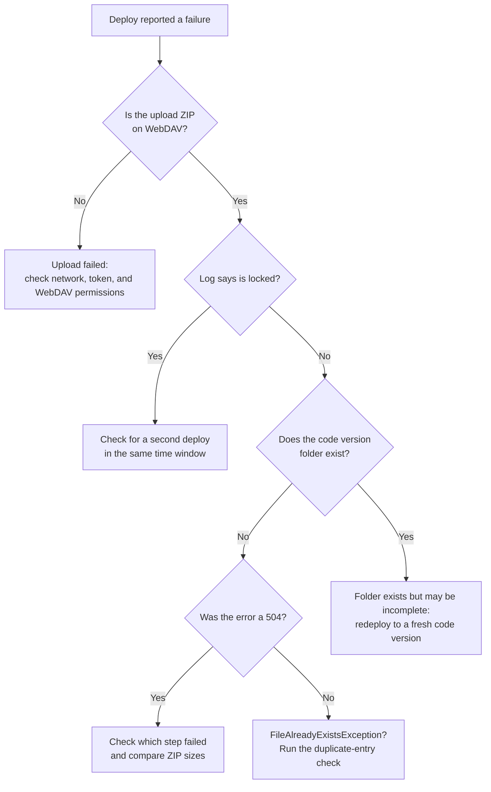

Your pipeline pushes a cartridge build, and the log says `Resource [_upload-<timestamp>.zip] is locked`, followed by `Could not unzip file [_upload-<timestamp>.zip]: File is locked.` A new timestamped ZIP appears, and the same failure repeats.

If you have landed here by pasting an error string into a search engine, you are in the right place. This post sorts the recurring [WebDAV](/a-beginners-guide-to-webdav-in-sfcc/) deployment failures on B2C Commerce into the classes they belong to, shows how to tell them apart, and ends with the pipeline guards worth putting in place.

Salesforce does not document the internals of the server-side unzip. This post sticks to what the logs, the official documentation, and the deploy tools' source code show, and says so where those run out.

## How a Cartridge Deploy Works

Some vocabulary first. A *code version* is a folder on the instance that holds your cartridges, the packages of storefront code. Only one code version is *active* at a time. The others wait there for activation or a rollback.

To deploy, your tool zips the cartridges, uploads the ZIP over WebDAV under a temporary name, and then asks the server to unzip it into the code version folder with a second request (the WebDAV `UNZIP` method). The temporary name is the tool's choice. In my logs it was `_upload-<timestamp>.zip`, the pattern the B2C CLI's `b2c code watch` [used until September 2026](https://github.com/SalesforceCommerceCloud/b2c-developer-tooling/blob/main/packages/b2c-tooling-sdk/src/operations/code/upload-files.ts). Today `b2c code watch` uses `_upload-` plus a random ID, `b2c code deploy` uses `_sync-<timestamp>.zip`, and sfcc-ci keeps your ZIP's own filename. Whatever yours is called, that is the file to look for on the server. That is two steps, upload and extraction, and they fail in different ways. Keep that split in mind, because the rest of this post hangs on it.

## Three Failure Classes, Not One

"The ZIP is corrupt" is the explanation people reach for first. What looks like one problem is at least three, and each needs a different check:

| Symptom | Where you see it | Step that failed | First check |
| --- | --- | --- | --- |
| `Resource [_upload-<timestamp>.zip] is locked` | Logs folder, CLI output | Unzip, on a server-side lock | Was a second deploy running? |
| `FileAlreadyExistsException` | Logs folder, CLI output | Unzip, writing a file | Does the ZIP contain duplicate entries? |
| `504 (Gateway Time-out)` | `sfcc-ci` output | Upload (`PUT`) | Does the archive exist, but not the code version folder? |
| `WebDAV authentication failed` | `sfcc-ci` output | Any WebDAV request (401) | Do the WebDAV Client Permissions cover the folder? |

The first three tend to get lumped together because they all end as a failed deploy or a "Could not unzip file" message. The last one is not a deployment failure at all, and it is worth ruling out early.

## Locked Upload ZIPs

Here is the pattern from the logs:

```text
Resource [_upload-<timestamp>.zip] is locked
  -> processing cancelled
Could not unzip file [_upload-<timestamp>.zip]: File is locked.
  -> new timestamped ZIP
  -> same failure
```

The names in these logs included `_upload-1775813917618.zip`, `_upload-1775813918323.zip`, and `_upload-1775814996365.zip`. Read as Unix epoch milliseconds, which is what `Date.now()` returns in the B2C CLI source linked above, the first two are 705 milliseconds apart, and the third is about 18 minutes later. Every name is different, so the failure is not two uploads writing to the same filename.

The stack trace shows where the lock sits. The failure runs through `FileServlet.doUnzip`, `WebdavServlet.doUnzip`, `LockMgrImpl.runWithLock`, `ZipUtils.unzip`, and finally `MultithreadingZipFileProcessor.processWithValidation`. All of that is server code, inside the unzip request. The lock is taken on the instance, after your ZIP has arrived, not while your machine builds the archive.

That lock is the platform's own. As I covered in the [beginner's guide](/a-beginners-guide-to-webdav-in-sfcc/#where-sfcc-parts-ways-with-the-standard), SFCC does not offer client-side `LOCK` and `UNLOCK`, and Salesforce's public documentation does not describe the lock manager in this stack trace. You cannot take or release it from a client.

The question to ask is the one the timestamps raise: were two ZIPs being unzipped on that instance at the same time? Salesforce's documentation does not say whether concurrent uploads to the same code version are queued, rejected, or processed in parallel, or how a half-finished upload is cleaned up. So check your pipeline runs for the same window (the steps are below), and treat any upload ZIP (`_upload-*.zip`, `_sync-*.zip`) that sits on the instance after a failed deploy as yours to remove.

## Could Not Unzip: Archive on the Server, No Code Version

The generic version of this error ends in `java.io.IOException: Failed to process zip file [_upload-<timestamp>.zip]`, thrown from `MultithreadingZipFileProcessor.processWithValidation`. By itself it says nothing. The exception *underneath* it tells you the class: a lock message, a `FileAlreadyExistsException`, or something else entirely.

One case in my notes shows how much the tool's wording tells you. A roughly 90 MB ZIP with about 140 cartridges failed with `Error: Deploy code NODE18.zip failed (upload step): 504 (Gateway Time-out)`. A 504 means a gateway did not get a timely answer from the server behind it. The archive was visible on WebDAV afterwards, but the expected code version folder never appeared. That message comes from sfcc-ci, and its [source](https://github.com/SalesforceCommerceCloud/sfcc-ci/blob/master/lib/code.js) settles the rest: "upload step" errors come from the `PUT` of the ZIP, and sfcc-ci only sends the unzip request after that `PUT` succeeds. So in this case the unzip was never requested, which is why no code version folder was created. A visible archive is not proof of a complete one, though, so compare its size with your local ZIP.

That gives you a two-question test after any reported failure:

1. **Does the archive exist on WebDAV?** If not, the upload itself failed: look at the network, the token, and the WebDAV permissions.
2. **Does the target code version directory exist?** Archive present, directory missing, means the ZIP reached the server but extraction did not finish, or never started. The upload was allowed to write, so this is not a permissions problem. Check the archive's size and your tool's output for which step failed.

Size alone does not explain this one. Salesforce lists a [500 MB limit for WebDAV uploads](https://help.salesforce.com/s/articleView?language=en_US&id=cc.b2c_import_export_transaction_handling_and_feed_size.htm), and 90 MB is well under it. What a smaller archive does give you is less to upload and less to unzip per request, and the [survival guide to SFCC platform limits](/a-survival-guide-to-sfcc-platform-limits/) has the wider picture on the platform's other ceilings. Do you really need to ship 140 cartridges on every build?

A failure on the unzip request itself is a different case. The [B2C CLI's source](https://github.com/SalesforceCommerceCloud/b2c-developer-tooling/blob/main/packages/b2c-tooling-sdk/src/operations/code/deploy.ts) sends its unzip once and deliberately never retries it. Its comment explains why: the unzip is a synchronous request with no job handle on the server, so a dropped connection does not tell you whether the extraction is still running, and a second unzip could start a second extraction into the same code version folder. If your own pipeline retries after an unzip failure, it takes on exactly that risk.

## FileAlreadyExistsException

This is a standard Java exception: something tried to create a file at a path where one already exists. The full chain reads: `Could not unzip file`, then `Failed to process zip file`, then `ExecutionException`, then `java.nio.file.FileAlreadyExistsException`. Java throws [`ExecutionException`](https://docs.oracle.com/en/java/javase/21/docs/api/java.base/java/util/concurrent/ExecutionException.html) when code asks for the result of a task that failed, with the real error attached as its cause. Here that cause is the `FileAlreadyExistsException`.

The conflicting paths in the reports were ordinary cartridge assets. One was an icon PNG under `cartridge/static/default/icons/standard/`, another a page script such as `cartridge/client/default/.../pages/Overview.js`. The same destination path came up repeatedly.

Two causes have been raised for this, and neither is confirmed:

- **Duplicate entries inside the ZIP.** The archive itself lists the same path twice, so the second write hits the first.
- **Two extractions writing the same destination.** Two deploys unzipping into the same code version folder at once would both try to create the same files.

The first is quick to test locally, before you look at the platform:

```bash
# Any output here means the same path appears more than once in the archive
unzip -Z1 code.zip | sort | uniq -d
```

If the command prints nothing, the archive has no duplicate paths, which leaves the second cause to check against your deploy history. If it prints paths, fix your packaging step.

## Ruling Out the Authentication Red Herring

The fourth row of the table is the odd one out. `WebDAV authentication failed. Please (re-)authenticate first...` is what sfcc-ci prints for any 401 from a WebDAV request, and a comment in its source notes that the server answers with a 401 when the WebDAV Client Permission is not set. So the token request can succeed while the WebDAV request after it fails. The message's closing line, about checking the WebDAV Client Permissions, is the part worth reading. The fix lives in Business Manager (the admin tool of an instance) under `Administration > Organization > WebDAV Client Permissions`, where the client needs access to the resources your deploy touches, including `/cartridges` with `read_write`, which is what the [B2C CLI authentication guide](https://salesforcecommercecloud.github.io/b2c-developer-tooling/guide/authentication.html#webdav-access) lists for code deployment. I walked through that screen in the [WebDAV beginner's guide](/a-beginners-guide-to-webdav-in-sfcc/).

If you deploy to a staging instance, Salesforce requires a client certificate for code uploads there, so check that too. If you cannot get a token at all and your pipeline still logs in with a username and password, read [the MFA post](/account-manager-mfa-broke-sfcc-cicd/) first.

One rule follows from the upload step: if your upload ZIP is on the server, the client was allowed to write it, so the failure came after the upload.

## Diagnosing It in Five Minutes

I work in this order:



Both checks need only a `PROPFIND` request, the WebDAV method that lists the contents of a folder. Run it against the Cartridges folder, and against the code version folder too if your tool uploads the ZIP inside it:

```bash
# TOKEN is your OAuth access token, HOST your instance hostname.
# List the folder: look for leftover .zip files (_upload-*, _sync-*) and your code version.
# A 2xx status means the listing worked. 401 or 403 is a token or permissions problem, not an empty folder.
curl -sS -w '\nHTTP %{http_code}\n' -X PROPFIND -H "Depth: 1" \
  -H "Authorization: Bearer $TOKEN" \
  "https://$HOST/on/demandware.servlet/webdav/Sites/Cartridges/" | grep -oE '<([A-Za-z]+:)?href>[^<]*|^HTTP [0-9]+'
```

Then read the logs. Business Manager exposes them through the Folder Browser tab under `Administration > Site Development > Development Setup`, and over WebDAV at `/on/demandware.servlet/webdav/Sites/Logs/`. Salesforce keeps [production and staging logs for 30 days](https://developer.salesforce.com/docs/commerce/b2c-commerce/guide/b2c-log-files-overview.html), moving them to a compressed `log_archive` folder after three days. That retention is not promised for sandboxes, so do not count on old logs there.

I cannot tell you which file your realm writes the unzip lines to, so grep every log from the deploy window for `_upload-` (or for `.zip`, if your tool names its archive differently). Line up the timestamps against your pipeline runs, and look for two runs within seconds of each other.

## Fixes That Work

**Retry only the right error, and slowly.** Retry lock errors with exponential backoff plus jitter, which means waiting longer after each failure and adding a little randomness so retries do not line up. Fail immediately on everything else, a 504 included, and look at which step failed before you run it again. The `b2c` command is the B2C CLI, Salesforce's command-line tool for code deployment. A sketch:

```bash
#!/usr/bin/env bash
# Retries only lock errors. Add your own flags to the deploy command.
# Check that your tool really prints the lock message, or the match never fires.
# Waits: about 80s, 160s, then 320s.
for attempt in 1 2 3 4; do
  if out=$(b2c code deploy --code-version "build-$BUILD_NUMBER" 2>&1); then echo "$out"; exit 0; fi
  echo "$out"
  grep -q "is locked" <<<"$out" || { echo "Not a lock error, stopping."; exit 1; }
  [ "$attempt" -lt 4 ] && sleep $(( (2 ** attempt) * 40 + RANDOM % 15 ))
done
exit 1
```

**Deploy into a fresh code version every time.** A new version name means extraction writes into a folder that does not exist yet, so no file from an earlier deploy can be sitting at the destination path. Use the build number: `build-1482`, not `v1`. You do not control the temporary ZIP name, since your tool picks it, but you do control the destination. On production you have no choice anyway: it rejects WebDAV uploads to the active code version, so uploads there must target an inactive one.

Fresh names pile up, so watch the retention setting: automatic deletion removes only the oldest versions (never the active or previously active one), and the configurable range is [3 to 20, default 10](https://developer.salesforce.com/docs/commerce/b2c-commerce/guide/b2c-code-deployment.html). On older instances the setting may still be 0, which means the feature is off.

**Shrink the archive.** If you ship 140 cartridges and only three changed, every deploy still uploads and unzips all 140. The B2C CLI can limit a deploy with `--cartridge` and `--exclude-cartridge`, but only do that into a code version that already holds the other cartridges. A fresh version containing three of them is not a complete code version.

**Clean up by hand, carefully.** After a failed deploy, delete the stale upload ZIP with a WebDAV client or `b2c webdav rm --root=cartridges`, because the Folder Browser in Business Manager only lets you view and download. Then remove the half-extracted code version folder before reusing its name, either with `b2c code delete` or under `Administration > Site Development > Code Deployment` (inactive versions only). Do this only after confirming nothing is still running. Check the logs for activity; waiting a minute proves nothing.

## Preventing It in Automated Pipelines

Two deploys running at once is the one possible cause that appears under both the lock errors and `FileAlreadyExistsException`, and it is the easiest to take off the table for your own pipeline. In GitHub Actions, a concurrency group per target instance does it:

```yaml
concurrency:
  group: sfcc-deploy-staging
  cancel-in-progress: false
```

With `cancel-in-progress: false`, a running deploy finishes before the next starts, and a newer pending run replaces an older pending one. For deploys, latest wins. If every run must go through, `queue: max` lets pending runs line up instead.

Three more guards belong in the same pipeline:

- **Split deploy from activation.** Activation switches the instance over to the new code version. Build the ZIP, run `b2c code deploy`, confirm success, then run `b2c code activate` as a separate step. When something fails, you at least know whether it broke in the deploy (upload and extraction) or in the activation. Salesforce's [code deployment guide](https://developer.salesforce.com/docs/commerce/b2c-commerce/guide/b2c-code-deployment.html) calls the B2C CLI the recommended method for GitHub Actions or Jenkins pipelines, instead of manual uploads. Its own example pushes and activates in one step; keeping them apart is my preference, not a Salesforce rule.
- **Verify before activating.** Run the `PROPFIND` check above against the new code version folder. A missing folder should fail the job, not an activation a minute later. A folder that exists is no proof of a complete extraction, so also look for a file you know should be inside it.
- **Hunt for the second trigger.** A concurrency group only protects your pipeline. A colleague with a WebDAV client, a second repository deploying to the same instance, or someone running `b2c code watch` (the CLI's file watcher) against a shared sandbox bypasses it entirely. When locks keep appearing despite a guard, ask who else is writing to that instance.

The mechanics for storefronts on Managed Runtime are a different story. The [MRT architecture post](/managed-runtime-explained-architecture-deployment-ssr/) covers them. Everything here concerns cartridges going to B2C Commerce instances.

So the next time a `_upload-` ZIP reports itself locked, check the clock before you rebuild the archive, and find out what else was uploading to that instance at the same time.
