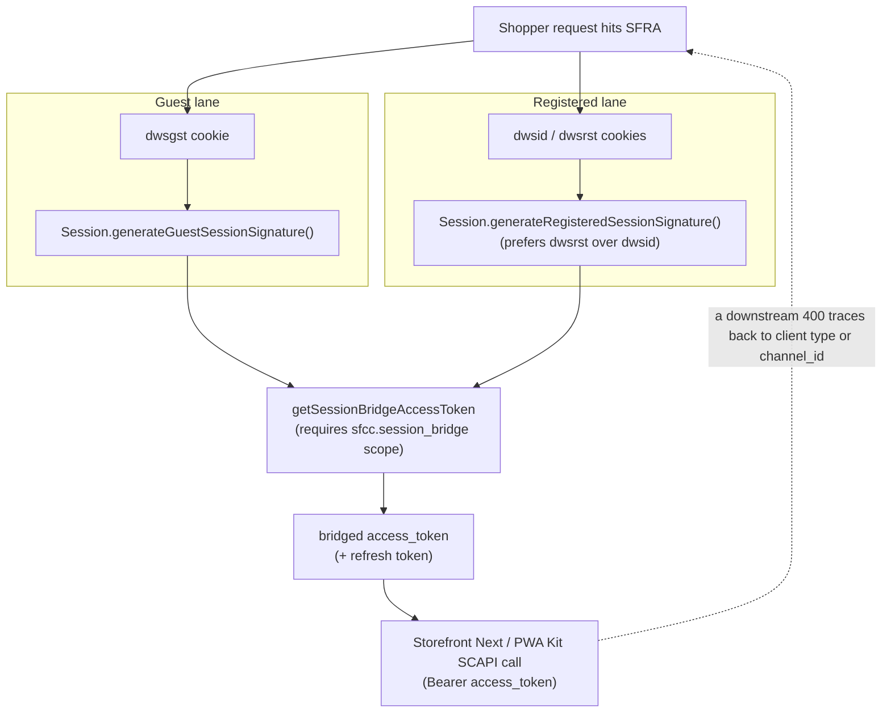

Someone on a client's Slack posted a one-line ask last week: "SLAS token comes back fine, but `loginCustomer()` still says the customer isn't logged in. Anyone seen this?" Three people replied within the hour, all with slightly different half-answers, none of them wrong, none of them complete. That thread is the reason this post exists.

SLAS (Shopper Login and API Access Service) is the authentication layer underneath every SCAPI (Salesforce Commerce API) call in B2C Commerce, and since version [25.3](https://help.salesforce.com/s/articleView?id=commerce.b2c_rn_25_3_release.htm&language=en_US&type=5) it comes with a platform-native replacement for `plugin_slas` called Hybrid Auth. Both pieces are well documented — Salesforce just spreads that documentation across more than a dozen separate pages, and none of them are written with "my refresh token just got rejected in production" in mind. This is the troubleshooting-shaped version of that documentation. If you want the strategic case for making the jump off `plugin_slas` in the first place, [SLAS Session Sync in SFRA and SiteGenesis](/slas-in-sfra-or-sitegenesis/) covers that ground; this post assumes you're already there and need to know why things break.

## The Two Clients You Keep Mixing Up

Every SLAS request runs through a SLAS client, and every SLAS client is either **public** or **private**. Get this wrong and every downstream symptom — refresh token 400s, unexpected re-logins, session bridge failures — starts looking like a different bug when it's the same root cause.

A **public client** has no client secret to protect, because it can't protect one. Browser-side code, a native mobile app, anything running where a user could open dev tools and read the source — that's a public client. It authenticates with the `authorization_code_pkce` grant, where PKCE (Proof Key for Code Exchange) is mandatory, and its refresh tokens are **single-use**: redeem one and SLAS hands back a new refresh token in the same response. The old one is dead the moment the new one exists.

A **private client** holds a secret on a server you control. It authenticates guests with `client_credentials` and registered shoppers with `authorization_code` or `authorization_code_pkce`, and its refresh tokens are **reusable** — you can redeem the same refresh token multiple times without SLAS rotating it out from under you.

The confusion shows up almost every time a team builds a Storefront Next or PWA storefront with a Node-based BFF (Backend for Frontend) in front of it. The BFF *can* hold a secret, so it feels natural to configure a private client and call it done. But the SLAS tokens still end up in the shopper's browser, through cookies or client-side state that JavaScript can read. That's the real problem: you now have public-client exposure — anyone who can read the browser can read the token — paired with private-client refresh semantics, where the same refresh token stays valid and reusable for up to 90 days instead of rotating out after one use. A leaked token under those rules doesn't get rejected by SLAS; it just keeps working for whoever holds it. Decide the client type by where the token can be read, not by where the request originates: if the browser can read it, register the client as public and let SLAS's single-use rotation limit the damage.

## The 400 Invalid Refresh Token, Decoded

Most people arrive at this post chasing one error string: `HybridAuthException: SLAS request failed 400 invalid refresh_token`, or the OCAPI (Open Commerce API, B2C Commerce's older REST API) equivalent — a plain `400 Bad Request` on a refresh call. Salesforce's own [knowledge article on the subject](https://help.salesforce.com/s/articleView?id=003876139&language=en_US&type=1) covers the token-lifecycle and client-type causes, and the [main SLAS guide](https://developer.salesforce.com/docs/commerce/commerce-api/guide/slas.html) documents a further cause on top of it — a missing `channel_id`. Between the two sources, six root causes emerge, and in practice they map cleanly onto the client confusion above:

- **The token expired.** Production refresh tokens are valid for 90 days for registered shoppers and 30 days for guests; non-production instances cap everything at 9 days regardless of shopper type. If your session storage held onto a token past that window, SLAS will not extend it — get a fresh one through login or guest token issuance.
- **A bot or monitoring tool kept retrying with a stale, expired, or deleted refresh token.** Synthetic monitoring scripts are the usual suspect: they cache one refresh token indefinitely and keep firing it long after it stopped being valid, which fails the same way for a private client as for a public one — this is a variant of the expiry case above, not the single-use violation below.
- **A public client reused a still-valid refresh token.** The single-use rule isn't a suggestion. If your frontend caches the refresh token in a variable and retries a failed request with the same value instead of the new one SLAS just issued, this is the error you get.
- **The client ID changed.** Refresh tokens are minted for a specific SLAS client ID. Rotate the client ID — during a Hybrid Auth migration, for instance — and every refresh token issued under the old client ID stops working immediately, by design.
- **`channel_id` is missing from the request.** SLAS requires the site's `channel_id` on guest token requests (`client_credentials` or `authorization_code_pkce`), and B2C Commerce started enforcing it in production on September 9, 2025. A request that worked in June can fail in October with nothing else in your code having changed.
- **Wrong credentials.** Client ID/secret mismatches, typically from an environment-specific config file pointing at the wrong SLAS client.

Note what's *not* on that list: password changes. Those are a separate mechanism — B2C Commerce revokes access tokens issued before a password change and rejects them on both the B2C Commerce API and OCAPI, and the platform documentation says this revocation takes several minutes to fully propagate. If a shopper changes their password and immediately hits an authenticated endpoint, a brief window of rejected-but-not-yet-expired tokens is expected behaviour, not a bug to chase.

## Why loginCustomer() Can Still Say "Not Logged In"

Here's the one that eats the most debugging time, and I'll be upfront: I couldn't find a Salesforce reference that spells out the internal mechanism, so treat this section as the operational pattern to check rather than an official explanation.

`CustomerMgr.loginCustomer()` logs an already-authenticated `dw.customer.Customer` into the session — the current, non-deprecated form takes the `AuthenticationStatus` returned by a prior `authenticateCustomer(login, password)` call, not a login and password directly. (An older `loginCustomer(login, password, rememberMe)` overload still exists, but Salesforce's own Script API reference marks it deprecated in favour of `authenticateCustomer()` plus `loginCustomer(authStatus, rememberMe)`, because only that pairing correctly checks for an expired password.) It's a server-side, `dw.system.Session`-scoped call against the site's Customer List profile, and it's the method SFRA (Storefront Reference Architecture, B2C Commerce's server-side controller framework) controllers use on the bridging side of a hybrid setup. SLAS, meanwhile, validates identity against that same Customer List through its own grant flow. A successful SLAS `authorization_code` exchange proves the shopper authenticated with SLAS; it does not, by itself, log that shopper into the SFRA session. If your controller code treats "SLAS returned a 200" as equivalent to "the customer is now logged in" and skips the explicit `authenticateCustomer()`/`loginCustomer()` pair, you get exactly this symptom: a valid access token sitting next to an unauthenticated `Customer` object. The same thing happens if `authenticateCustomer()` runs against a login/password pair that doesn't match what SLAS just validated — a stale form value, a different case-sensitivity rule, a federated-login profile with no local password at all.

The practical check, in order: confirm the login value passed to `loginCustomer()` is the same one that succeeded against SLAS, confirm the customer profile actually has a local password (an IDP-only profile won't authenticate this way), and confirm you're not calling `loginCustomer()` against a different site than the one SLAS validated against. If all three check out and the symptom persists, that's a support case, not a config fix.

## Session Bridging, Mechanically

Session bridging is what keeps a shopper from getting logged out just because they crossed from an SFRA page to a Storefront Next page mid-session. The endpoint doing the work is `getSessionBridgeAccessToken`, and it has one prerequisite that's easy to miss: the SLAS client making the call needs the `sfcc.session_bridge` scope. Without it, the exchange fails before any token logic even runs.

There are two flows, and they use different session material:

- **Guest shoppers** bridge using the `dwsgst` cookie — the signed guest-session identifier B2C Commerce sets automatically — together with `Session.generateGuestSessionSignature()`.
- **Registered shoppers** bridge using `Session.generateRegisteredSessionSignature()`, and Salesforce's own guidance prefers the rotating `dwsrst` token over the long-lived `dwsid` cookie (B2C Commerce's standard session-ID cookie) when both are available.

Here's a minimal SFRA controller that generates the signature side of that exchange:

```js
// controllers/SessionBridge.js
'use strict';

var server = require('server');

server.get('Signature', server.middleware.https, function (req, res, next) {
    var session = req.session.raw; // dw.system.Session
    var isAuthenticated = req.currentCustomer.raw.authenticated;

    // Registered shoppers: prefer the rotating DWSRST signature over
    // DWSID, per Salesforce's session bridge guidance.
    var signature = isAuthenticated
        ? session.generateRegisteredSessionSignature()
        : session.generateGuestSessionSignature();

    res.json({ sessionSignature: signature, authenticated: isAuthenticated });
    next();
});
```

The `isAuthenticated` check is the whole point of this snippet — it decides which signature method runs, and the headless side needs to know which flow it's in before it calls `getSessionBridgeAccessToken`.

Storefront Next or your PWA frontend takes whichever signature comes back and sends it to that endpoint, alongside the SLAS client credentials. In return, it gets a bridged `access_token` — a JWT (JSON Web Token, the signed, self-contained token format SLAS issues) — plus a refresh token, both scoped to the same shopper the SFRA session already recognised. From that point, every SCAPI call from the headless side carries that JWT as a Bearer credential. The platform keeps `dwsid` and the JWT pointed at the same shopper on its own; your code doesn't need to poll anything to keep them in sync.



That loop-back arrow is the point of the diagram: a `400` surfacing at the SCAPI call three steps downstream is still a client-type or `channel_id` problem back at step one, not a new bug.

The 30-minute session window catches most people first. A B2C Commerce session (the `dw` session) times out after 30 minutes of inactivity by default, and extends automatically on activity up to a configurable cap of six hours. The bridged access token doesn't follow that clock — it has its own, separate 30-minute lifetime, starting from the moment SLAS issued it. That means a shopper can be well inside their SFRA session window and still be holding an expired bridged token, if the frontend hasn't refreshed it.

The second edge is direction. This bridge is one-directional in spirit even though the mechanism is symmetric — plan for the "new shopper starts headless, moves to SFRA for checkout" flow and the "new shopper starts on SFRA, moves to a headless PLP (Product Listing Page)" flow as genuinely different code paths, because the signature generation happens on whichever side the shopper started.

## Handling Refresh Failures Without Losing the Basket

A refresh token failure should degrade, not crash. The pattern that holds up in production:

1. **Catch the 400 specifically**, don't let it bubble up as a generic auth error. A refresh failure and a "this shopper was never authenticated" failure need different handling — one should trigger a silent guest token re-issue, the other should redirect the shopper to log in.
2. **Never retry with the same refresh token.** For a public client this is a guaranteed second failure, since the token that just got rejected is, by definition, no longer valid. Always use whichever token the failed response body actually returned, or fall through to a fresh guest token exchange if none did.
3. **Preserve the basket before you drop the session.** A refresh failure is an auth problem, not a basket problem. Re-issuing a guest token and re-attaching the existing basket ID beats forcing an empty-basket relogin.
4. **Log the client ID alongside the failure.** Given how often a rotated client ID is the actual cause, capturing it at the point of failure turns a five-minute log search into a five-second one.
5. **Confirm `channel_id` is present on every guest token request**, not just the ones you remembered to update. This is the one that regresses quietly months after a migration, because nothing about the code path changed — only the platform's enforcement did.

## Migration Checklist: Retiring plugin_slas

If you're still running `plugin_slas`, B2C Commerce 25.3 gives you the platform-native replacement, and there's no good argument for staying on the cartridge once you're past that release. The checklist, in the order it actually bites:

- **Confirm your instance is on 25.3 or later.** Hybrid Auth doesn't exist before it.
- **Remove `plugin_slas` from the cartridge path** once Hybrid Auth is validated — don't run both.
- **Remove OCAPI permissions from the Hybrid Auth SLAS client ID.** Hybrid Auth is fully SCAPI-based and doesn't need OCAPI access at all — Salesforce's migration guidance has you strip OCAPI permissions from that client ID (and use a separate client ID for anything that still genuinely needs OCAPI) rather than pointing OCAPI at it. Sharing a client ID between Hybrid Auth and OCAPI is the configuration conflict this step exists to prevent.
- **Audit every request that issues guest or registered tokens for `channel_id`.** Enforcement went live in production on September 9, 2025; anything still missing it will start failing, not warning.
- **Decide on HttpOnly cookie support.** Recommended from B2C Commerce 26.7 onward — plan for it upfront rather than bolting it on after go-live.
- **Set refresh token TTL (Time To Live) overrides deliberately** within the platform's supported ranges (360–43,200 minutes for guests, 360–129,600 minutes for registered shoppers) instead of leaving whatever `plugin_slas` had configured.
- **Verify DNT (Do Not Track) preference sync** between the SFRA and headless sides — Hybrid Auth carries it automatically; custom cartridge code may have handled it differently.
- **Refactor anything that hard-codes `plugin_slas`-specific behaviour.** Customisations that aren't tied to the cartridge itself generally survive the move; anything that assumed the cartridge's specific API surface will not.
- **Test the failure paths, not just the happy path.** Guest checkout, registered login, logout, a password change mid-session, and an expired refresh token should all be part of go-live testing, because these are exactly the scenarios that behave differently under Hybrid Auth.
- **Watch the `/jwks` endpoint if you're validating JWTs yourself.** It's rate-limited to 25 requests per minute as of February 10, 2025 — cache the key set instead of fetching it per request.

None of this is exotic. It's mostly configuration discipline and testing the paths that don't show up in a quick smoke test. For deeper background on why `plugin_slas` accumulated this much technical debt in the first place, or for the initial SLAS client setup this post assumes you already have, see [How to Set Up SLAS for the Composable Storefront](/how-to-set-up-slas-for-the-composable-storefront/) and [How to Setup OAuth JWT for the OCAPI](/how-to-setup-oauth-jwt-for-the-ocapi/). And if you're still deciding which API layer a given call should even go through, [In the Ring: OCAPI versus SCAPI](/in-the-ring-ocapi-versus-scapi/) settles that argument.

Every one of these errors traces back to the same three questions: which client type is actually making this call, does the request carry `channel_id`, and is the refresh token you're about to use the one the last response actually gave you. Ask those three before you open a support case.
