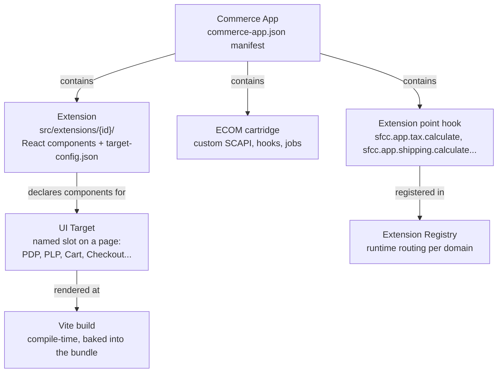
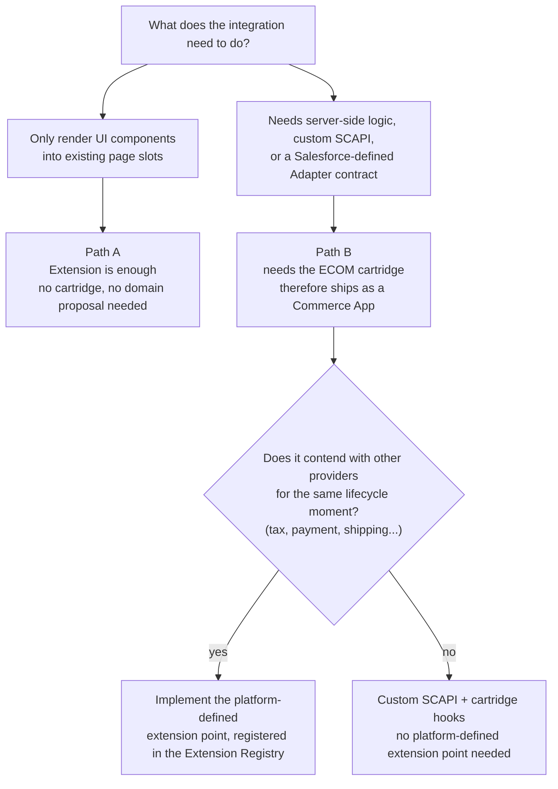
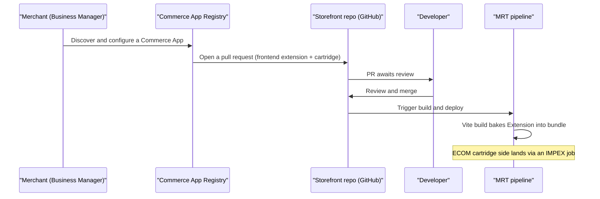

"Where did my `overrides/` folder go? Do I just edit files directly now?" I've heard some version of that question from every PWA Kit developer who's opened a Storefront Next repo for the first time. The answer they usually get is "use Extensions," which is true and also completely unhelpful on its own, because you spend the next five minutes discovering that "Extensions" is only one of three words the docs expect you to already understand. Then someone mentions Commerce Apps. Then UI Targets. Then an adapter interface, and an Extension Registry, and "Path A versus Path B" gets dropped into a Slack thread like everyone's supposed to know what that means.

Nobody draws the map in one place. So let's draw it.

## The Three Layers

Storefront Next's extensibility model has three pieces, and they stack. Each one exists to answer a different question.

- **Extensions** answer "where does my front-end code live and how does it get into the build?"
- **UI Targets** answer "which named slots on which pages can code render into?"
- **Commerce Apps** answer "how do I package and distribute an integration that needs more than front-end components?"



Extensions are the smallest unit and the direct replacement for `overrides/`. Commerce Apps are a strict superset — everything an Extension can do, plus a cartridge half and, when a domain needs one, an Adapter implementation. UI Targets sit in the middle as the contract both layers render into.

### Layer 1: Extensions

An Extension is a folder: `src/extensions/{your-extension-id}/`, living inside the storefront repo. It's React components, built with Vite, declared through TypeScript, styled with Tailwind — the same stack the rest of Storefront Next uses ([React 19, React Router 7 in framework mode, Tailwind, shadcn/ui](https://developer.salesforce.com/docs/commerce/pwa-kit-managed-runtime/guide/sfnext-architecture.html)). Storefront Next itself ships several as built-ins — Store Locator, BOPIS (which depends on Store Locator), Multiship, and a handful of demo extensions like Ratings & Reviews and Product Content — which double as reference implementations worth reading before you write your own.

The part that trips people coming from PWA Kit: an Extension doesn't override a file. It registers components into named slots via `target-config.json`. Something like this:

```json
{
  "extensionId": "loyalty-badge",
  "targets": {
    "product-detail.summary.badges": {
      "component": "./components/LoyaltyBadge"
    },
    "cart.line-item.actions": {
      "component": "./components/LoyaltyRedeemButton"
    }
  }
}
```

No file gets copied, no file gets owned forever. You declare intent — "render this component here" — and the build wires it up. That's the whole model, and it's also the whole reason template upgrades stop being a merge-conflict exercise: your Extension code lives in its own folder, separate from the template code it renders alongside, so a Storefront Next version bump doesn't touch your files the way an SFRA (Storefront Reference Architecture, B2C Commerce's older server-side storefront) cartridge override or a PWA Kit `overrides/` copy did.

One nuance the docs don't spell out: declaring a component in `target-config.json` gets you rendered into a slot, but it doesn't automatically give that slot everything it needs to function. If your component needs a context provider — a cart context, a locale context, something the surrounding page tree doesn't already supply at that exact point — you may still need to wire that up yourself around the surface. Extensions aren't fully plug-and-play just because the slot exists.

<!-- TODO verify: could not confirm in current official docs that OCAPI/SCAPI-style before/after/modify lifecycle hooks ship inside a Storefront Next Extension folder rather than the cartridge half of a Commerce App; re-check before publish or cut this paragraph. -->

### Layer 2: UI Targets

PDP (product detail page), PLP (product listing page), cart, checkout, My Account, content pages — that's the UI Target inventory today, and it only grows. Each one is a named anchor point the storefront template exposes: a fixed list of "here's a place on this page where something can render." Extensions and Commerce Apps both target the same inventory; there's no separate slot system for one versus the other.

The thing to unlearn if you're coming from a domain-driven mindset: **surface areas aren't domains**. A single "feature" can span a dozen UI Targets across five different pages, and one Commerce App can freely declare components against all of them. A loyalty programme touches the PDP badge, the cart line item, the checkout summary, and the order confirmation page — four UI Targets, one coherent feature, zero need to pretend it's four separate integrations.

Business Manager already lets merchants turn individual storefront extensions within an app on or off — the Shipping domain, for example, ships separate extensions for Delivery Estimation and Shipping Options & Calculations so a merchant can enable only what they need. <!-- TODO verify: current docs confirm feature/extension-level toggles, not confirmed per-individual-UI-Target-component granularity within a single extension; re-check before publish. --> Either way, flipping a toggle still means a rebuild. It's a compile-time system end to end; nothing about a BM toggle makes the render decision happen at runtime.

If the UI Target you need doesn't exist on the page you're targeting, that's a gap to file against the template, not a reason to invent a parallel extensibility mechanism. Complaining loudly (politely) in the right forum gets a new slot added faster than working around its absence ever will.

### Layer 3: Commerce Apps

Zoom out one more layer and you get the Commerce App: the packaged, installable distribution format, and a strict superset of an Extension — never a different thing. A Commerce App can contain, in any combination:

- The same `src/extensions/{app-id}/` front-end structure, same `target-config.json`, same UI Targets, no different from a hand-rolled Extension.
- An ECOM cartridge — the server-side code module that runs on the B2C Commerce instance itself, not in the browser: custom SCAPI endpoints, integration hooks, data models, custom objects, jobs. It's the half nothing purely front-end can reach.
- Capital-A Adapter implementations, for the handful of domains where Salesforce defines the contract.
- Business Manager configuration surfaces, task lists, and the manifest (`commerce-app.json`) that identifies the app, its version, and its publisher.

Everything an Extension does, a Commerce App can also do. The reverse isn't true. That asymmetry is the whole reason "Extension or Commerce App?" is the wrong first question to ask about an integration — more on that next.

## Path A vs Path B: The Question That Actually Matters

Forget "Extension vs Commerce App" as your starting question. The question that actually decides your architecture is: **does this integration need to participate in server-side logic, custom SCAPI, or an orchestrated flow like tax or shipping calculation — or is it purely front-end components in page slots?**



- **Path A** — a CMS connector dropping rich content into the PDP, a DAM widget rendering enrichment images, a reviews carousel, a promotional banner engine. All UI, all rendered through UI Targets, no reason to touch a cartridge. This is most third-party front-end integrations, and it doesn't need a domain proposal, because there's no Salesforce-owned contract involved.
- **Path B** — tax calculation, payment processing, shipping rate lookup: anything that has to plug into basket or order orchestration at a specific lifecycle moment, and anything where more than one ISV (independent software vendor — a third-party integration provider) might legitimately want to be "the" provider for that moment on a given site. That's where the cartridge half, and often a platform-defined extension point, becomes non-negotiable.

The domain list is a rollout sequence, not a closed enumeration. Salesforce's Commerce App domain registry currently lists ten domains — `tax`, `payment`, and `shipping` (grouped as "Providers," where competing apps show up as alternative choices under one Business Manager tile) plus `gift-cards`, `ratings-and-reviews`, `loyalty`, `search`, `address-verification`, `analytics`, and `approaching-discounts` (grouped as "Additional Setup") — with more (including Fraud and Marketing & TOS Consent) on Salesforce's published roadmap. <!-- TODO verify: confirm domain registry list and wave timing against the latest Supported Domains page before publish, since this is an active rollout and subject to Salesforce's safe-harbor caveat --> A new formal domain only gets a platform-defined extension point when it's genuinely required: basket/order orchestration, contention between providers at the same moment, a canonical interface multiple ISVs need to implement against. If your integration is Path A, you don't need to fit an existing domain and you don't need to lobby for a new one. You just target UI Targets.

## Capital-A Adapters vs lowercase-a adapters

This is the naming collision that causes the most confusion, and it's worth fixing once so it stays fixed.

**Capital-A Adapters** are Salesforce-defined, per-domain extension point contracts — Tax is the first domain with one, implemented as hook scripts like `sfcc.app.tax.calculate`, `sfcc.app.tax.commit`, and `sfcc.app.tax.cancel`. They're implemented in ecom script API, live in the cartridge half of a Commerce App, and get resolved through a runtime Extension Registry that routes each call to whichever installed app is the registered provider for that domain on that site — not by cartridge path scanning. Domain isolation here is deliberate — a Commerce App implements a domain-specific extension point (`sfcc.app.tax.calculate`) rather than the shared legacy hook (the old `dw.order.calculateTax`), which is exactly what stops two tax integrations from silently fighting over the same hook. Other domains, like Shipping and Fraud, get their own extension point contracts as Salesforce ships them.

**lowercase-a adapters** are just a code pattern — interface, provider, factory — used internally in the Storefront Next React layer. You'll see it in the template's product-content code: an interface for fetching product content, a couple of provider implementations behind it, a factory that picks one. It's a perfectly fine pattern to reuse inside your own Extension. It is not a platform contract, nothing registers it anywhere, and the Extension Registry has never heard of it.

If someone says "adapter" in a Storefront Next conversation, ask which one they mean before you plan around it. The two words look identical and solve completely different problems.

## What Actually Happens on Install

The wrong assumption almost everyone brings to this, in some flavour, is "Business Manager pushes the change live." It doesn't.



A Commerce App install, whether started by clicking Install on a tile in the Business Manager Cart & Checkout Hub or by running `b2c cap install` from the CLI, issues a pull request into the merchant's storefront repo — both the React/Storefront Next side and the ECOM cartridge side. A developer reviews and merges it, same as any other PR. The storefront then goes through the normal Managed Runtime (MRT) build-and-deploy pipeline — MRT is Salesforce's hosting service for the storefront application. The cartridge half goes in through an IMPEX job — an XML-based data import mechanism B2C Commerce has used for cartridge deployment for years. There is no live injection path where Business Manager pushes a component straight into a running MRT environment; the repo is always the source of truth, and the compile step always happens.

What the BM-driven flow buys you over hand-authoring an Extension is the guided UX around that same mechanism: discovery in the Commerce App Registry, a `tasksList.json`-driven configuration wizard, the automated pull request done for you instead of by hand. The back-end mechanics — PR, review, rebuild, redeploy — are identical either way. If the merchant's storefront repo isn't wired up for the automated PR flow (no GitHub integration configured), `b2c cap pull` downloads the installed app package so the frontend extension and cartridge can be integrated manually through normal source control instead.

## Is This Just PWA Kit 4.0?

Real question from the community, and Salesforce has answered it directly: no, and there's no codemod that flips the switch. It's a full architectural refactor — [React Router 7 in framework mode instead of PWA Kit's programmatic routing, Vite instead of Webpack, Tailwind instead of Chakra, route loaders and Suspense instead of fetch-on-render hooks with TanStack Query, httpOnly cookies instead of client-stored tokens](https://developer.salesforce.com/docs/commerce/pwa-kit-managed-runtime/guide/sfnext-pwa-overview.html). Migration tooling exists and is genuinely useful for guiding the rewrite, but it guides — it doesn't port your `overrides/` folder into `src/extensions/` for you.

There's also no deprecation clock forcing anyone's hand. PWA Kit's own support policy guarantees security patches for a minimum of [24 months after each major version's GA](https://developer.salesforce.com/docs/commerce/pwa-kit-managed-runtime/guide/pwa-kit-overview.html), with no stated end date beyond that, and SFRA — considerably older than PWA Kit — is still fully supported today. If you're on PWA Kit and stable, Storefront Next is a decision you get to make on your own timeline, not one that's being made for you. I covered the broader architecture and migration trade-offs in more depth in [Storefront Next: Architecture and the PWA Kit Migration](/storefront-next-architecture-and-migration-from-pwa-kit/)a companion piece on the broader architecture and migration trade-offs; this post is specifically the extensibility half of that picture.

The extensibility shift specifically is the headline change worth internalising: `overrides/` meant copying a file and owning every future merge conflict with the template forever. Extensions mean declaring components into slots the template defines, with your code living in its own folder the template never touches. That's not a smaller version of the same idea — it's a different relationship between your code and Salesforce's.

## Debugging Across Two Logging Planes

> [!NOTE]
> MRT/storefront logging and SCAPI/cartridge logging are two separate planes today, and there's no unified single-pane view across storefront action hooks, SCAPI, and cartridge hooks yet. Use correlation IDs to stitch a request together across the boundary: SCAPI accepts a `correlation-id` header and echoes it back, and also stamps an `sfdc_correlation_id` on the response. B2C Commerce 26.6 turns on automatic verbose logging, without you having to set a header at all, for two conditions: SCAPI requests where a remote service call to a third party errors, and SCAPI requests ending in a 4xx/5xx response caused by hook execution errors. On the cartridge side, debugging works exactly like any other SFCC cartridge — Prophet extension or the B2C DX VS Code debugger, your choice.

## The Decision Tree

Given an integration brief, here's the short version of what to reach for:

- **Only rendering UI into existing pages?** Write an Extension. Path A. No cartridge, no domain proposal, no Commerce App packaging required — though you can still ship it as a Commerce App purely for distribution if that's your go-to-market plan.
- **Need server-side logic, a custom SCAPI endpoint, or a job, but nothing that contends with another provider for the same lifecycle moment?** Commerce App with a cartridge, custom extension points, no Capital-A Adapter needed.
- **Competing to be the active provider for tax, payment, shipping, or a similar orchestrated moment?** Commerce App with a Capital-A Adapter implementation, resolved through the Extension Registry.
- **Not sure which slot or domain applies?** Check the current UI Target inventory and the published domain list before assuming you need a new one of either — most gaps are Path A gaps, not architecture gaps.

None of this requires memorising a glossary before you can reason about it. Extensions declare into slots. UI Targets are the slot inventory. Commerce Apps package everything an Extension can do plus the server-side half. Path A or Path B decides which of those three you actually need — and for most integrations, the honest answer is fewer of them than the docs make it sound like.
