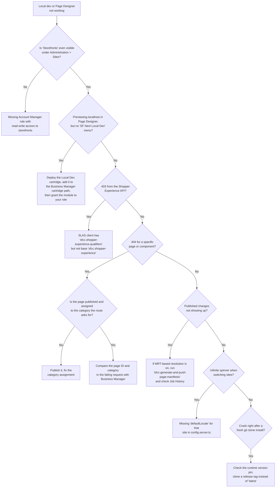
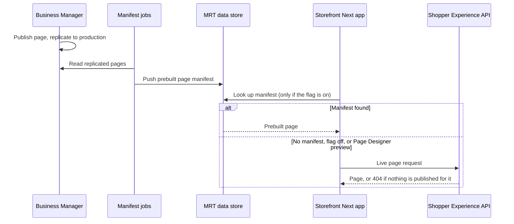

A 403 from the Shopper Experience API, right after you thought your fresh Storefront Next setup was done. Or worse: you fix that, and get a clean, unhelpful 404 instead. Or the storefront just spins forever the moment you switch sites in Page Designer. None of these show up in the official quick-start guides, because none of them are steps in the happy path — they're the gap between "I followed the docs" and "Page Designer content actually renders."

This guide is that gap, filled in. It's organised as symptom → cause → fix, so you can jump straight to the error you're staring at. If you haven't seen [Storefront Next's architecture yet](/storefront-next-architecture-and-migration-from-pwa-kit/), read that first — this post assumes you already know it keeps the same SCAPI (the B2C Commerce API), SLAS (Shopper Login and API Access Service), and Managed Runtime (MRT) backend as PWA Kit, and picks up from there.

## The Map

Start here, then jump to the section that matches what you're seeing.

## Stage 1: The Missing Entry Point

You open Business Manager looking for **App Launcher > Administration > Sites > Storefronts**, following Salesforce's own quick-start, and the menu item just isn't there — no error, nothing greyed out, nothing to click. That quick-start walks you straight from that menu into generating a project with the CLI, but it doesn't dwell on what makes the menu appear in the first place. The prerequisites section of Salesforce's [guide to creating a Storefront Next storefront in Business Manager](https://developer.salesforce.com/docs/commerce/pwa-kit-managed-runtime/guide/sfnext-quick-start-create-bm.html) lists it plainly: you need "a Business Administrator role in Account Manager or a role for the Business Manager Module and Organization context with read-write access to storefronts."

That permission lives in Account Manager — Salesforce's separate system for identity and role management across your B2C Commerce instances, distinct from Business Manager's site-level admin tools — and it's invisible from inside Business Manager itself. That's exactly why it's easy to miss: you go looking for a toggle in the wrong product entirely. If the Storefronts menu isn't there, that's the first thing to check, before you conclude your instance doesn't support Storefront Next at all: your Account Manager role assignment for storefront read-write access.

### The Missing SF Next Local Dev Menu

There's a second menu that goes missing, and it's a different problem. If you want Page Designer to preview the storefront running on your own machine, the [Page Designer integration guide](https://developer.salesforce.com/docs/commerce/b2c-commerce/guide/sfnext-page-designer.html) sends you to **Administration > SF Next Local Dev**. That menu isn't part of Business Manager out of the box. It comes from a separate Local Dev cartridge (a ZIP you download from that guide, not something in the template repository), and the guide's steps are short: deploy the cartridge, add it to your Business Manager cartridge path, open **Administration > SF Next Local Dev**, enter your local URL (for example `http://localhost:3000`), and click **Enable Headless URL Override**.

What the guide leaves out is the permission step. The Business Manager cartridge path lives on the special Business Manager site, under **Administration > Sites > Manage Sites > Business Manager > Settings**, and a module that a custom cartridge adds isn't granted to anyone automatically. Salesforce's own [Business Manager customisation guide](https://developer.salesforce.com/docs/commerce/b2c-commerce/guide/b2c-customize-business-manager.html) says it outright: "After successfully deploying your cartridge on the server, grant permissions on the menu action." Even the Administrator role only "Can be extended with access permissions for custom modules", per the [Administrator role reference](https://help.salesforce.com/s/articleView?id=cc.b2c_administrator_role.htm&type=5). So go to **Administration > Organization > Roles & Permissions**, pick your role, open the **Business Manager Modules** tab, select the **Organization** context, and give the SF Next Local Dev module access. Then reload Business Manager and the menu should be there.

> [!TIP]
> The guide also warns that the **Enable Headless URL Override** checkbox doesn't show its real state after you toggle it. Click it once, then check the preview, not the checkbox.

## Stage 2: The 403 — Scopes and the Shopper Experience API

Once the storefront is up and pointed at your sandbox, the next wall most people hit is a 403 the moment a route tries to fetch Page Designer content through the Shopper Experience API. In my experience, this is almost always a SLAS scope problem. SLAS is what issues the access token your storefront sends with that request, and the token only carries the specific permissions — "scopes" — that were assigned to the SLAS client that requested it. Salesforce's own [Authorization Scopes Catalog](https://developer.salesforce.com/docs/commerce/commerce-api/guide/auth-z-scope-catalog.html) explains exactly why the wrong scope list produces this 403: `sfcc.shopper-experience` grants "Read access for assets created in Page Designer", while the entry for `sfcc.shopper-experience.qualifiers` reads "Resolve qualifiers for customer groups, campaign promotions, and data binding contexts." They sound like variations on the same permission. They aren't. The qualifiers scope narrows *how* content gets targeted once you already have read access — it isn't a substitute for the base scope that grants that access.

If your SLAS client's scope list was hand-edited or copied from an older client and only carries the qualifiers sub-scope, the API answers with a 403. The same catalog page states it outright: "A `401` or `403` response indicates a missing or incorrect scope." Don't expect the storefront to tell you that, though. The template has no scope list of its own (scopes live entirely on the SLAS client), and its Page Designer middleware logs an unexpected content-resolution error and hands it to the generic error page. The status code in your network tab is the clue. `sfcc.shopper-experience` is in the catalog's list of default scopes, so a client created with the defaults has it. If yours was configured manually, [setting up SLAS for the Composable Storefront](/how-to-set-up-slas-for-the-composable-storefront/) walks through the SLAS Admin UI, which works the same way for Storefront Next.

> [!NOTE]
> **What to check:** open your SLAS client's scope configuration and confirm `sfcc.shopper-experience` is present on its own line, not just its `.qualifiers`, `.contents`, `.folders`, or `.pages` sub-scopes. Add the base scope and re-issue a token before you touch anything else.

## Stage 3: The 404 — Publishing, Category Assignments, and the Page Manifest Sync

Fix the scope, and it's common to trade a 403 for a 404. That's progress, not a new failure. It means the client can now reach the Shopper Experience API, and the API is telling you it has nothing to serve for the page you asked for.

Start with the obvious: the page has to actually be published in Page Designer. A Page Designer page is built from regions — named content areas on the page — and components, the individual content blocks (a banner, a product carousel, a PLP grid) an editor drops into a region. Salesforce's [Page Designer integration guide for Storefront Next](https://developer.salesforce.com/docs/commerce/b2c-commerce/guide/sfnext-page-designer.html) describes pages as "Top-level containers fetched via the ShopperExperience API". A category page (the `plp` page type) is assigned to categories in Business Manager, and the storefront asks for it by category ID. If the page was never published, or it's assigned to a different category than the one the route is asking for, the API has nothing to return. When both look right, open the failing request in your browser's network tab and compare the page ID and category ID it sends with what you see in Business Manager.

### What the Page Manifest Sync Does (and Doesn't) Explain

You'll also read about page manifests, and it's tempting to blame them for the 404. According to Salesforce's [MRT Data Store documentation](https://developer.salesforce.com/docs/commerce/b2c-commerce/guide/sfnext-mrt-data-store.html), a system job can prebuild each Page Designer page as a manifest and push it into the Managed Runtime (MRT) data store, so the storefront reads a prebuilt page instead of assembling it on every request. Two jobs do that work:

- **`sfcc-push-page-manifests`** runs automatically on production, every 5 minutes after replication (the staging-to-production copy of your content), and pushes what was replicated to the MRT data store.
- **`sfcc-generate-and-push-page-manifests`** is a job you run yourself, from **Administration > Operations > Jobs**, on production or development instances, when you need changes pushed immediately.

Here's the catch the docs don't spell out: in the template itself, reading from the data store is switched off by default. `config.server.ts` ships with `mrtBasedPageDesignerResolution: false`, and with that flag off, every Page Designer request goes straight to the Shopper Experience API. Even with the flag on, a missing manifest doesn't produce a 404. The template's own code comment in `src/lib/api/component.server.ts` puts it plainly: "On a manifest miss, unpack error, or if the flag is off, the request falls through to SCAPI unchanged." Page Designer's own preview requests (the ones carrying `mode` or `pdToken` parameters) always go to the live API too.

So the 404 almost always comes from the API, and the fix is in Page Designer, not in the job list. Where the manifest jobs do matter is a different symptom: you've turned `mrtBasedPageDesignerResolution` on, you publish a change, and the storefront keeps showing the old version. That's the data store serving the last manifest it received. Check **Administration > Operations > Job History** for both jobs. A successful run shows **OK** or **Finished**; a failure or a stale "last run" timestamp is your answer. Running `sfcc-generate-and-push-page-manifests` manually is the fastest way to confirm it.

> [!NOTE]
> **Version note:** this manifest mechanism is specific to Storefront Next. Salesforce's docs are explicit that it doesn't apply to PWA Kit, SFRA, or SiteGenesis, so don't go looking for the equivalent job on an older storefront.

## Known Version-Specific Bugs

Not every wall you hit here is a config problem — some are regressions that ship in a specific release and get fixed in the next one, and it's worth being able to tell the difference quickly rather than spending an afternoon re-checking scopes and catalog IDs that were never wrong to begin with.

The clearest example so far: a crash straight after a fresh `create-storefront` run or `git clone`, before you've touched any configuration, naming two functions, `getRegistrationError` and `consumeRegistrationError`. They're called from `src/components/region/component.tsx` on the Page Designer component registry, and the registry doesn't have them.

It isn't something you did. Between 4 and 11 September 2026, the template's default branch (`latest`) called those two methods while `package.json` still pinned `@salesforce/storefront-next-runtime` at `1.3.0`. That runtime release, published on 1 September, has no such methods on its `ComponentRegistry` class. Runtime `1.3.1` added them, and template `v2026.9.1` (14 September) ships with it. No release tag was ever affected: `v2026.9.0` predates the change and `v2026.9.1` includes the fix. So if you cloned `latest` that week, you got a broken storefront.

The Business Manager guided setup doesn't protect you from this, either. Its Salesforce CLI option runs the same `pnpm dlx @salesforce/storefront-next-dev create-storefront` command as the [local quick start](https://developer.salesforce.com/docs/commerce/b2c-commerce/guide/sfnext-quick-start-create-sf.html), and that command does a shallow clone of the template's default branch unless you pass `--template-branch`. Your pnpm version isn't the culprit here either. Do check that it meets the quick start's minimum (10.28 or later), but no pnpm version will fix a dependency that's pinned one release too early.

> [!NOTE]
> Neither the template's `CHANGELOG.md` nor its issue tracker names this crash, and the fix landed as a plain dependency bump. That's why it's so easy to lose an afternoon to it.

The general method, for this bug and the next one that will inevitably show up after this post is published:

- **Clone a release tag, not `latest`.** The default branch moves between releases; tags like `v2026.9.1` are the releases. Pass `--template-branch v2026.9.1` (or whatever the newest tag is) to `create-storefront`, or check the tag out in an existing clone.
- **Compare the dependency pins.** When a crash names a function that doesn't exist, compare the `@salesforce/storefront-next-*` versions in your `package.json` with the ones in the newest tag. A mismatch there is a much faster diagnosis than re-checking your config.
- **Re-run the setup once a fix ships.** Because `create-storefront` clones the current default branch, deleting the broken project and running it again picks up the fix. Check the pinned runtime version afterwards to be sure you got it.

## Multi-Site Page Designer and Shared Regions

Multi-site setups add a wrinkle that single-site troubleshooting won't prepare you for. If you're running several sites off one storefront with a shared, global content library, configuring a PLP region for one site's category can surface that same region on every other site sharing that category ID — there's no automatic per-site variation baked into a region bound directly to a category. Page Designer's own [component visibility rules](https://help.salesforce.com/s/articleView?id=cc.b2c_create_visibility_rules_components.htm&type=5) target customer groups, schedules, and locales, but not sites.

Salesforce does document a real, purpose-built mechanism for scoping content per site: [Content Blocks for site-wide regions](https://developer.salesforce.com/docs/commerce/b2c-commerce/guide/sfnext-page-designer-content-blocks.html), managed from **Merchant Tools > Your Site > Content > Content Blocks** — a path that is explicitly scoped to "Your Site," not global. Turning it on takes a feature switch and, according to that page, "Storefront Next template v1.1 or later", so if the option isn't there yet, that's the first thing to check. (Don't go looking for a `v1.1` tag, though. The public template repository tags its releases by date, such as `v2026.9.1`.) It's also still in beta: Salesforce's own [content slots migration guide](https://developer.salesforce.com/docs/commerce/b2c-commerce/guide/sfnext-page-designer-content-slots.html) says Site-Wide Regions for Content Blocks "is currently in beta", so budget for it still settling rather than treating it as a stable, long-term API. And it's designed for header, mega-menu, and announcement-banner content rather than PLP category regions specifically, so don't assume it's a drop-in fix for every shared-region case without checking that your region type is one it covers.

Where Content Blocks don't cover your case, the tool you have is the visibility rules themselves. Stack one component per locale in the same region, give each its own locale rule, and only the matching one renders. That's the documented targeting mechanism, not a hack, and Salesforce's guidance is to put a component with no rules at the bottom of the region as a fallback. It targets locales, not sites, so it only solves the multi-site problem when your sites don't share locales. If two sites both sell in `en-GB`, they'll both see the `en-GB` component.

> [!NOTE]
> **What to check:** if the same content unexpectedly shows up on several sites, first find out what the region or component is bound to. A category ID that those sites share is the likely cause. A content asset someone bound in on purpose is a different case. Salesforce's [content slots migration guide](https://developer.salesforce.com/docs/commerce/b2c-commerce/guide/sfnext-page-designer-content-slots.html) calls content-asset binding "best for content that must be shared", but it means sharing between storefront technologies (SFRA and Storefront Next reading the same asset), not between sites in a multi-site setup.

Whether private, per-site content libraries are cleaner than one shared global library is a genuine trade-off, not a solved problem. It's also an either-or choice: Salesforce's [content libraries documentation](https://help.salesforce.com/s/articleView?id=cc.b2c_content_libraries.htm&type=5) says "A site can use its own private library or it can use a shared library, but not both." A shared library means one place to update copy that's genuinely identical across brands, at the cost of exactly this kind of accidental bleed-through the moment two sites diverge on a category. Splitting into private libraries per site removes the bleed-through risk entirely, at the cost of duplicating anything that really is shared, and asking merchandisers to keep multiple copies in sync by hand. If your sites' catalogs and category structures overlap heavily and rarely diverge, a shared library with the Content Blocks/separate-component workaround above is probably still less work than full duplication. If you're running distinct brands whose catalogs already share almost nothing structurally, splitting the library outright may be the more honest architecture — [this blog's multi-site decision guide](/multi-site-multi-brand-storefronts-on-sfcc/) goes deeper into that rubric if you're weighing it for a whole storefront, not just Page Designer content.

## The defaultLocale Spinner

The last one is quieter than a 403 or a 404: you switch sites in Page Designer, and the preview just spins. No error in the console worth quoting, no failed network call that jumps out — just a storefront that never finishes resolving.

Storefront Next's [multisite configuration docs](https://developer.salesforce.com/docs/commerce/pwa-kit-managed-runtime/guide/sfnext-multi-site.html) are specific about what each site entry under `commerce.sites` in `config.server.ts` needs, and `defaultLocale` is one of the fields documented per site — "the locale used when no locale can be resolved from the URL, cookie, or header." The template only enforces that field for one site. In `src/middlewares/site-context.server.ts`, it checks `defaultLocale` for the site named in `defaultSiteId` and throws an error on every request if it's missing, so you'd see an error page there, not a spinner. Leave it off any other site and nothing catches it. When the storefront's site switcher moves you to that site, `src/routes/action.set-site-context.ts` writes the site's `defaultLocale` straight into the locale cookie, with no check and no fallback. That leaves the storefront with no locale to resolve to, which fits the symptom. Salesforce's [Page Designer guide](https://developer.salesforce.com/docs/commerce/b2c-commerce/guide/sfnext-page-designer.html) also puts the site default at the end of the content locale fallback chain. What no Salesforce doc describes is the spinner itself, and I can't tell from the template alone whether Page Designer's site switch runs through that same code, so treat this as the first thing to rule out, not a guaranteed diagnosis. It is, though, a one-line check.

> [!NOTE]
> **What to check:** open `config.server.ts`, find the site you're switching to, and confirm it has its own `defaultLocale` set alongside its `supportedLocales` array — not just inherited or assumed from another site's config. Cross-check that the same locale IDs also appear in `i18n.supportedLngs` — the docs call out a mismatch there as a separate cause of locale-switcher weirdness worth ruling out in the same pass.

None of these are exotic once you've hit them a first time. What makes them expensive is that Storefront Next just happens to be where the symptom shows up — the actual fix lives one layer out, in Account Manager, a cartridge permission, a SLAS client, a dependency pin, or a config file most people never open. Next time the storefront itself looks broken, check that layer before you touch the storefront at all.
