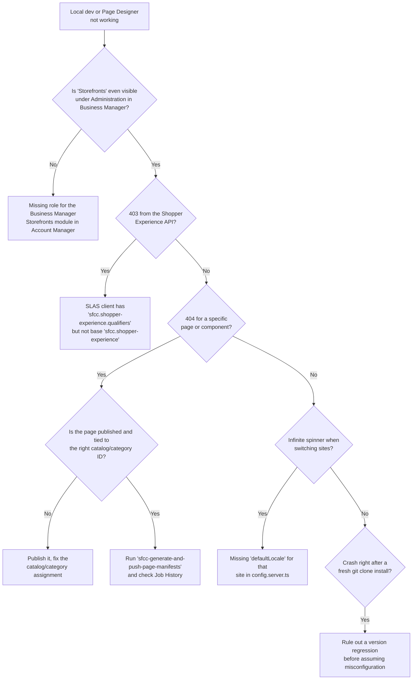
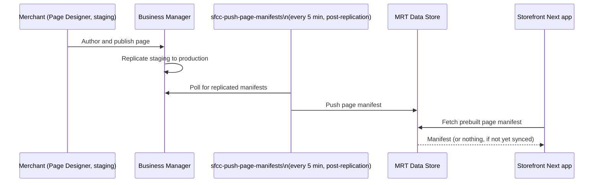

A 403 from the Shopper Experience API, right after you thought your fresh Storefront Next setup was done. Or worse: you fix that, and get a clean, unhelpful 404 instead. Or the storefront just spins forever the moment you switch sites in Page Designer. None of these show up in the official quick-start guides, because none of them are steps in the happy path — they're the gap between "I followed the docs" and "Page Designer content actually renders."

This guide is that gap, filled in. It's organised as symptom → cause → fix, so you can jump straight to the error you're staring at. If you haven't seen [Storefront Next's architecture yet](/storefront-next-architecture-and-migration-from-pwa-kit/), read that first — this post assumes you already know it keeps the same SCAPI (the B2C Commerce API), SLAS (Shopper Login and API Access Service), and Managed Runtime (MRT) backend as PWA Kit, and picks up from there.

## The Map

Start here, then jump to the section that matches what you're seeing.

## Stage 1: The Missing Entry Point

You open Business Manager looking for **App Launcher > Administration > Sites > Storefronts**, following Salesforce's own quick-start, and the menu item just isn't there — no error, nothing greyed out, nothing to click. That quick-start walks you straight from that menu into generating a project with the CLI, but it doesn't dwell on what makes the menu appear in the first place. The prerequisites section of Salesforce's [guide to creating a Storefront Next storefront in Business Manager](https://developer.salesforce.com/docs/commerce/pwa-kit-managed-runtime/guide/sfnext-quick-start-create-bm.html) lists it plainly: you need "a Business Administrator role in Account Manager or a role for the Business Manager Module and Organization context with read-write access to storefronts."

That permission lives in Account Manager — Salesforce's separate system for identity and role management across your B2C Commerce instances, distinct from Business Manager's site-level admin tools — and it's invisible from inside Business Manager itself. That's exactly why it's easy to miss: you go looking for a toggle in the wrong product entirely. If the Storefronts menu isn't there, that's the first thing to check, before you conclude your instance doesn't support Storefront Next at all: your Account Manager role assignment for storefront read-write access.

## Stage 2: The 403 — Scopes and the Shopper Experience API

Once the storefront is up and pointed at your sandbox, the next wall most people hit is a 403 the moment a route tries to fetch Page Designer content through the Shopper Experience API. Nine times out of ten, this is a SLAS scope problem. SLAS is what issues the access token your storefront sends with that request, and the token only carries the specific permissions — "scopes" — that were assigned to the SLAS client that requested it. Salesforce's own [Authorization Scopes Catalog](https://developer.salesforce.com/docs/commerce/commerce-api/guide/auth-z-scope-catalog.html) explains exactly why the wrong scope list produces this 403: `sfcc.shopper-experience` grants "read access for assets created in Page Designer," while `sfcc.shopper-experience.qualifiers` only "resolves qualifiers for customer groups, campaign promotions, and data binding contexts." They sound like variations on the same permission. They aren't. The qualifiers scope narrows *how* content gets targeted once you already have read access — it isn't a substitute for the base scope that grants that access.

If your SLAS client's scope list was hand-edited or copied from an older client and only carries the qualifiers sub-scope, you'll get exactly the 403 Storefront Next throws when a required scope is missing — the same catalog page states it outright: "a 401 or 403 response indicates a missing or incorrect scope." Note that `sfcc.shopper-experience` ships as one of the default SLAS scopes, so if you're troubleshooting a client that was configured manually rather than through the standard flow described in [setting up SLAS for the Composable Storefront](/how-to-set-up-slas-for-the-composable-storefront/), check there first for what a correctly scoped client should carry.

> [!NOTE]
> **What to check:** open your SLAS client's scope configuration and confirm `sfcc.shopper-experience` is present on its own line, not just its `.qualifiers`, `.contents`, `.folders`, or `.pages` sub-scopes. Add the base scope and re-issue a token before you touch anything else.

## Stage 3: The 404 — Publishing, Catalog IDs, and the Page Manifest Sync

Fix the scope, and it's common to trade a 403 for a 404. That's progress, not a new failure — it usually means the client can now reach the Shopper Experience API, but the specific page or component it's asking for isn't available there for that site and locale. Two separate things can cause that, and it's worth checking both before assuming either one on its own.

The first is straightforward: the page has to actually be published in Page Designer. A Page Designer page is built from regions — named content areas on the page — and components, the individual content blocks (a banner, a product carousel, a PLP grid) an editor drops into a region. Any Product Listing Page (PLP) region or component bound to a category needs the right catalog/category ID configured in Business Manager. Salesforce's [Page Designer integration guide for Storefront Next](https://developer.salesforce.com/docs/commerce/b2c-commerce/guide/sfnext-page-designer.html) describes pages as "Top-level containers fetched via the ShopperExperience API" — if that container was never published, or points at a category ID that doesn't exist in the site's assigned catalog, the API has nothing to serve.

The second cause is less obvious, and it's the one worth understanding properly rather than just working around: content doesn't move from Business Manager to your storefront the instant you hit Publish. According to Salesforce's [MRT Data Store documentation](https://developer.salesforce.com/docs/commerce/b2c-commerce/guide/sfnext-mrt-data-store.html), Storefront Next doesn't build Page Designer pages on every shopper request. Instead, a system job prebuilds each page as a manifest and pushes it into the Managed Runtime (MRT) data store, and the storefront reads that prebuilt manifest instead of assembling the page dynamically. That job only has something to push once your content has been replicated — copied from staging to production, usually by an administrator, in Business Manager. Two jobs do the manifest work:

- **`sfcc-push-page-manifests`** runs automatically on production, on a 5-minute cycle, after replication — it picks up whatever was already replicated from staging and pushes it to the MRT data store.
- **`sfcc-generate-and-push-page-manifests`** is a manual job you run yourself, from **Administration > Operations > Jobs**, when you need changes pushed immediately or when they were made directly on production without going through staging replication.

If the page is published and correctly assigned, but the manifest sync hasn't run yet or failed, the storefront is asking the MRT data store for content that hasn't arrived. Check **Administration > Operations > Job History** for both jobs — a successful run shows **OK** or **Finished**; a failure or a stale "last run" timestamp is your answer. Running `sfcc-generate-and-push-page-manifests` manually is the fastest way to confirm the sync, not the config, was the problem.

> [!NOTE]
> **Version note:** this manifest mechanism is specific to Storefront Next. Salesforce's docs are explicit that it doesn't apply to PWA Kit, SFRA, or SiteGenesis, so don't go looking for the equivalent job on an older storefront.

## Known Version-Specific Bugs

Not every wall you hit here is a config problem — some are regressions that ship in a specific release and get fixed in the next one, and it's worth being able to tell the difference quickly rather than spending an afternoon re-checking scopes and catalog IDs that were never wrong to begin with.

One shape this takes: a crash immediately after a fresh `git clone` and install, before you've touched any configuration. The stack trace points at functions that a component file calls, but that don't exist anywhere in the codebase you just cloned. That symptom — a function referenced but missing entirely, not misconfigured — is the tell that you're looking at a regression in the template itself, introduced between releases, rather than something you did. Ruling out your own tooling first still matters: confirm your pnpm version meets Salesforce's stated minimum (10.28 or later, per the [Storefront Next local quick start](https://developer.salesforce.com/docs/commerce/b2c-commerce/guide/sfnext-quick-start-create-sf.html)) before assuming it's a platform bug rather than an environment mismatch.

> [!WARNING]
> I've described this one by its symptom on purpose. Salesforce hasn't published a release note for it that I can point you to, so I can't give you an issue number or a fixed version. If your crash matches, check the current release notes and the open issues on the [Storefront Next template repository](https://github.com/SalesforceCommerceCloud/storefront-next-template) before you report it as new.

The general method, for this bug and the next one that will inevitably show up after this post is published:

- **Compare against a known-good tag.** If a fresh clone of the current default branch fails but an older tagged release doesn't, that's strong evidence of a regression — check out the last known-good tag as an immediate workaround while you wait for a fix.
- **Check release notes and open issues before assuming you're the only one.** A crash this early in setup, on an unmodified template, is exactly the kind of thing that gets reported and fixed fast.
- **Prefer the Business Manager fast-setup flow over a manual clone once a fix ships.** If you hit a bug on a manually cloned project, deleting the storefront and re-running the guided setup from Business Manager (Stage 1, above) picks up the current template rather than whatever commit you happened to clone.

## Multi-Site Page Designer and Shared Regions

Multi-site setups add a wrinkle that single-site troubleshooting won't prepare you for. If you're running several sites off one storefront with a shared, global content library, configuring a PLP region for one site's category can surface that same region on every other site sharing that category ID — there's no automatic per-site or per-locale variation baked into a region bound directly to a category.

Salesforce does document a real, purpose-built mechanism for scoping content per site: [Content Blocks for site-wide regions](https://developer.salesforce.com/docs/commerce/b2c-commerce/guide/sfnext-page-designer-content-blocks.html), managed from **Merchant Tools > Your Site > Content > Content Blocks** — a path that is explicitly scoped to "Your Site," not global. Turning it on takes a feature switch and, if your storefront predates it, an update to Storefront Next template v1.1 or later, so if the option isn't there yet, that's the first thing to check. It's also currently a beta feature — Salesforce's own [content slots migration guide](https://developer.salesforce.com/docs/commerce/b2c-commerce/guide/sfnext-page-designer-content-slots.html) refers to it by its full name, "Site-Wide Regions for Content Blocks (Beta)" — so budget for it still settling rather than treating it as a stable, long-term API. And it's designed for header, mega-menu, and announcement-banner content rather than PLP category regions specifically, so don't assume it's a drop-in fix for every shared-region case without checking that your region type is one it covers.

Where Content Blocks (or an equivalent per-site content strategy) don't cover your case, the practical workaround is to stop binding the region directly to the shared category and instead create separate content per site or locale, stacked in the same region, so each site's editors only manage what applies to them.

> [!NOTE]
> **What to check:** if the same content unexpectedly shows up on several sites, first find out what the region or component is bound to. A category ID that those sites share is the likely cause. A content asset someone bound in on purpose is a different case. Salesforce's [content slots migration guide](https://developer.salesforce.com/docs/commerce/b2c-commerce/guide/sfnext-page-designer-content-slots.html) calls content-asset binding "best for content that must be shared", but it means sharing between storefront technologies (SFRA and Storefront Next reading the same asset), not between sites in a multi-site setup.

Whether private, per-site content libraries are cleaner than one shared global library is a genuine trade-off, not a solved problem. A shared library means one place to update copy that's genuinely identical across brands, at the cost of exactly this kind of accidental bleed-through the moment two sites diverge on a category. Splitting into private libraries per site removes the bleed-through risk entirely, at the cost of duplicating anything that really is shared, and asking merchandisers to keep multiple copies in sync by hand. If your sites' catalogs and category structures overlap heavily and rarely diverge, a shared library with the Content Blocks/separate-component workaround above is probably still less work than full duplication. If you're running distinct brands whose catalogs already share almost nothing structurally, splitting the library outright may be the more honest architecture — [this blog's multi-site decision guide](/multi-site-multi-brand-storefronts-on-sfcc/) goes deeper into that rubric if you're weighing it for a whole storefront, not just Page Designer content.

## The defaultLocale Spinner

The last one is quieter than a 403 or a 404: you switch sites in Page Designer, and the preview just spins. No error in the console worth quoting, no failed network call that jumps out — just a storefront that never finishes resolving.

Storefront Next's [multisite configuration docs](https://developer.salesforce.com/docs/commerce/pwa-kit-managed-runtime/guide/sfnext-multi-site.html) are specific about what each site entry under `commerce.sites` in `config.server.ts` needs, and `defaultLocale` is one of the fields documented per site — "the locale used when no locale can be resolved from the URL, cookie, or header." If a given site's entry is missing that field, there's no fallback locale for the middleware to resolve to once you land on that site without one already carried in the URL, cookie, or header, and that's consistent with the state Page Designer's preview puts you in when you switch sites. The docs don't describe the spinner itself, so treat this as the first thing to rule out, not a guaranteed diagnosis. It is, though, a one-line check, and a missing `defaultLocale` is the gap I'd look for first.

> [!NOTE]
> **What to check:** open `config.server.ts`, find the site you're switching to, and confirm it has its own `defaultLocale` set alongside its `supportedLocales` array — not just inherited or assumed from another site's config. Cross-check that the same locale IDs also appear in `i18n.supportedLngs` — the docs call out a mismatch there as a separate cause of locale-switcher weirdness worth ruling out in the same pass.

None of these are exotic once you've hit them a first time. What makes them expensive is that Storefront Next just happens to be where the symptom shows up — the actual fix lives one layer out, in Account Manager, a SLAS client, a job history screen, or a config file most people never open. Next time the storefront itself looks broken, check that layer before you touch the storefront at all.
