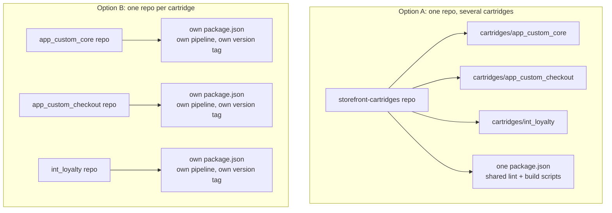
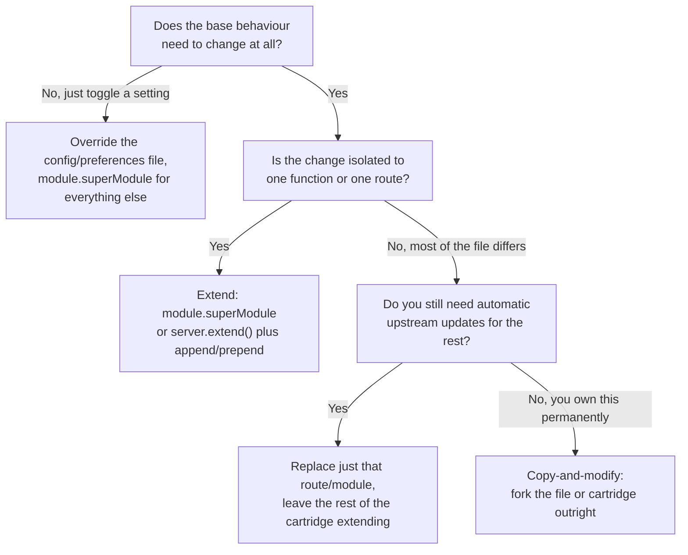

You override one client-side JavaScript file — a search results partial, say — and the build immediately wants you to copy the whole of `main.js` and rewire every `require()` path inside it. Or you inherit a connector cartridge that overrides an entire `Account`/`Address` controller for the sake of three functions that actually differ from the base, and now you're stuck deciding whether to strip it down or leave the other twelve alone. By the time you hit either of those, the cartridge *mechanics* usually aren't the problem. You already know a cartridge is a folder of controllers, templates, and scripts that Business Manager stacks together to build a storefront. What's missing is the layer above that: what goes in its own cartridge, what goes in its own repository, and when "extend the base" stops being the right answer.

I've already written up how the cartridge path resolves files once it's built — `module.superModule`, `HookMgr` priority, the ISML caching gotcha that costs people an afternoon — in [a companion piece on cartridge path overrides](/sfcc-cartridge-path-overrides-explained/). This post assumes you know that part and works one level up: how to structure cartridges and repos before you get to overriding anything, and how to decide between extending, replacing, and copying when the base doesn't fit.

## Rule Zero: Extend the Base, Never Edit It

Before any of the structural decisions below, one rule sits underneath all of them: don't edit or rename `app_storefront_base` or any other Salesforce-provided cartridge. Editing it in place voids the platform's backward-compatibility guarantee for that cartridge and leaves you hand-merging every future SFRA update yourself. The [Customise SFRA guide](https://developer.salesforce.com/docs/commerce/sfra/guide/b2c-customizing-sfra.html) is built entirely around the alternative: create your own cartridge, place it ahead of the base on the path, and override only what actually needs to change.

Take a concrete example. Someone wants to change how an order-confirmation email gets sent. The instinct is to open the base cartridge's send function and tweak it. Don't. Override the method in your own cartridge with `module.superModule`, adjust the email template there too, and leave `app_storefront_base` exactly as Salesforce shipped it. That's the whole pattern this post keeps coming back to, at every scope from a single preference to a whole controller.

> [!WARNING]
> **Non-negotiable**
>
> Editing `app_storefront_base` directly isn't a shortcut — it's a decision to hand-apply every future SFRA update yourself, forever, on every file you touched. Nobody budgets for that until it's already too late.

## The Canonical Stacking Order

The pattern SFCC expects is a stack, not a single override file: your own cartridge (or cartridges) go first, any third-party or partner cartridges next, SFRA's own plugin cartridges after that, and `app_storefront_base` last. The [Cartridges guide](https://developer.salesforce.com/docs/commerce/b2c-commerce/guide/b2c-cartridges.html) documents that cartridges assigned to a site take precedence in order from left to right, so the stacking order *is* the whole mechanism — not a convention layered on top of it. Where you put a given cartridge in that string is the real design decision; the platform just enforces whatever you typed into **Administration > Sites > Manage Sites > [Site] > Settings**.

That principle isn't SFRA-specific, either. Whatever storefront runtime you're building on — [classic SFRA](/sitegenesis-vs-sfra-vs-pwa/) or a move towards Storefront Next — your own code goes ahead of whatever Salesforce ships, never inside it. I'm not covering Storefront Next's toolchain specifics here; that's its own post. For how the path actually resolves a request once it's assigned — locale folders, legacy pipeline quirks, the two-pass controller search — that's the companion piece linked above, not this one.

## Structuring a Repo for More Than One Custom Cartridge

None of the official cartridge documentation tells you how to lay out your *repository* once you have more than one custom cartridge. That part is unavoidably a team decision, not a platform rule. In practice I've seen two patterns work, and they trade off in predictable ways.

**Single repo, multiple cartridges.** One repository holds `app_custom_core`, `app_custom_checkout`, and maybe an integration cartridge like `int_loyalty`, sharing one `package.json`, one lint config, and one pair of `compile:scss` / `compile:js` scripts. This is the lower-friction default for a single team shipping one storefront: one pull request touches both cartridges together when a change spans both, one CI pipeline, one version tag that means something for the whole stack.

**One repo per cartridge.** Each cartridge gets its own repository, its own `package.json`, and its own pipeline. This earns its overhead when cartridges genuinely have separate deployment cadences — a payment connector a different team owns and versions independently, or a cartridge you intend to LINK-certify or ship as its own package separately from the rest of your codebase, where bundling it into a shared repo makes packaging it as a standalone deliverable harder than it needs to be.

The deciding question isn't team size. It's whether the cartridges are versioned, reviewed, and released together in practice, or whether keeping them in one repo is just historical accident. If a change to one cartridge routinely needs a coordinated pull request in another, that's your single-repo case being made for you. If two cartridges haven't shared a meaningful change in months, the coordination overhead of a shared repo is pure cost.



Whichever you pick, keep the build configuration itself consolidated rather than duplicated. A `package.json` `paths` entry pointing at `app_storefront_base` — covered in full in the companion post's SCSS section — needs to be correct in exactly one place per cartridge that consumes it, not copy-pasted across three and left to drift.

## Overriding Controllers Without Forking the Whole Route

SFRA gives you a controller-level equivalent of `module.superModule`: `server.extend()`. Where [hooking into an SFRA controller](/where-to-hook-into-an-sfra-controller/) covers `prepend`/`append`/`replace` as middleware on routes you already own, `server.extend()` is what you reach for when you want to override an *existing named controller* — `Address.js`, say — without recreating every route inside it.

Here's the shape of it, extending a controller that already exists further down the cartridge path:

```js
'use strict';

var server = require('server');
server.extend(module.superModule);

server.append('Show', function (req, res, next) {
    var accountHelpers = require('*/cartridge/scripts/helpers/accountHelpers');
    res.setViewData(accountHelpers.decorateAddressList(res.getViewData()));
    next();
});

module.exports = server.exports();
```

`server.extend(module.superModule)` pulls in every route the base `Address.js` defines — `Show`, `List`, `SaveAddress`, all of them — before your file adds anything. The `server.append('Show', ...)` call then only touches the one route you actually care about; every other route keeps running exactly as the base cartridge wrote it, because you never replaced its middleware, only extended the controller it lives in. The [SFRA Modules guide](https://developer.salesforce.com/docs/commerce/sfra/guide/b2c-sfra-modules.html) documents exactly this pattern: extend with `server.extend(baseController)`, then hook individual routes with `append`/`prepend`, and reach for a full `replace()` only on the specific route that genuinely needs different logic end to end.

The mistake worth naming: forgetting `server.extend(module.superModule)` and just writing `server.append('Show', ...)` against a bare `require('server')`. That doesn't extend `Address.js` at all — it creates a separate controller that happens to share a filename, and every route you didn't declare in that file silently stops existing for anything resolving to your cartridge's copy. If a route vanishes after an "extension," that's almost always the cause.

## The Client-Side Trap: One File Override, One Copied main.js

Client-side JS and SCSS are where "extend, don't replace" gets hardest to follow, and it's the failure mode I hear about most. You want to override a single component — a search results partial — so you copy that one file into your cartridge's `client/default/js` folder. The build breaks, because that file's `require()` calls are relative paths resolving against its original position in the source tree, not against where you just put your copy. To fix the paths, you end up copying `main.js` too, and rewiring every entry point it pulls in, for the sake of overriding one partial.

The fix isn't a build trick. It's picking a different file to override. If overriding a leaf module forces you to also own its parent's entry point, you're overriding at the wrong level. Push the override one step further down: find the smallest module that actually contains the behaviour you want to change, and override *that*, letting everything above it — `main.js` included — keep resolving to the base cartridge's copy through ordinary cartridge-path resolution. [How SFRA loads client-side JS and CSS](/how-to-load-client-side-javascript-and-css-in-sfra/) covers how `assets.js` and the ISML templates queue those files at runtime, which is the other half of this picture — worth reading if the override compiles but never actually renders.

SCSS has the same trap with a different symptom: an `@import` that fails at `npm run compile:scss`, not at runtime. That one comes down to a `package.json` `paths` entry, and [the cartridge path overrides post](/sfcc-cartridge-path-overrides-explained/) walks through the exact alias mechanism, down to the `~` prefix people forget. I won't repeat it here. This section is about the principle underneath it: override the smallest thing that carries the behaviour you need, not the file that happens to be easiest to find.

## Extend, Replace, or Copy-and-Modify: A Decision Framework

Every override eventually reduces to one of three moves, and each carries a different cost:

- **Extend.** `module.superModule` for scripts, `server.extend()` for controllers. You inherit every future change to the base file automatically, except the one piece you deliberately touched. This should stay the default until something concrete rules it out.
- **Replace.** `server.replace()` on one route, or a hook implementation that fully overrides a single extension point. You lose automatic inheritance for that one file or route, but everything else in the cartridge stack still updates itself when Salesforce ships an SFRA update.
- **Copy-and-modify.** You fork the file, or the whole cartridge, with no live link back to the source. Maximum control, zero automatic inheritance — every future base change has to be manually diffed in and reapplied by hand.

The framework is really just one question: how much of the file's behaviour do you actually need to change, and can you tolerate owning the rest of it manually?



Take the connector-cartridge case from the opening: a partner-built cartridge overrides all of `Account.js` and `Address.js`, but only three functions across both files actually differ from what `app_storefront_base` already does. Stripping that connector cartridge down to a minimal cartridge that extends the base for just those three functions is the right call *if* you're the one maintaining it going forward — you get every other future SFRA fix to those controllers for free. Leaving the full override in place, or patching the connector cartridge's file directly, only makes sense if you don't control that cartridge's source at all — a genuine third-party cartridge you can't fork — and even then, wrapping your changes in your *own* cartridge that extends theirs beats editing their file directly. Copy-and-modify is a last resort, not a shortcut, and every function you fork is a function you've volunteered to keep in sync by hand.

Turning off one unwanted default is the cleanest illustration of "extend" done right. If all you want is to disable one behaviour, don't copy the whole configuration file. Override just that one file with `module.superModule`, forward every other value through untouched, and change only the one you actually care about — the same `module.exports = base` pattern the companion post's `pricingHelper.js` example uses, just applied to configuration instead of logic.

## Page Designer's render.js and response.js: Extend the Assembly, Don't Rebuild It

Page Designer components add their own override surface on top of everything above. Each component type needs a JSON meta definition file — stored under `{cartridge}/cartridge/experience/components/`, filename restricted to alphanumeric characters and underscores — and a matching `render.js` script whose render function takes a context and a model and has to return a string, per the [Page Designer guide](https://developer.salesforce.com/docs/commerce/b2c-commerce/guide/b2c-dev-for-page-designer.html).

If you need to change how one component type renders, override that component's `render.js` in your own cartridge and reach for `module.superModule` to fall through to the base logic for everything you didn't deliberately change, rather than rebuilding the whole render path from scratch. The same goes for `response.js` where your storefront uses it to assemble the data `render.js` consumes: extend it, don't rebuild it, for the same reason as every other file in this post — you inherit the parts you didn't touch.

Two limits are worth knowing before you design a component. A rendered Page Designer page tops out at 3MB, tighter than the general 10MB ISML template ceiling, and the platform's default script timeout is 30 seconds — both per the [Development Best Practices guide](https://developer.salesforce.com/docs/commerce/b2c-commerce/guide/b2c-dev-best-practices.html). A component that's cheap alone can still push a page over that 3MB ceiling once a merchant stacks a dozen of them on one landing page, so budget for that limit while you're designing the meta definition, not after the page stops rendering.

## Building a Cartridge That Has to Be LINK-Certified

Everything above applies with less room to improvise once the cartridge you're building isn't just for your own storefront. LINK cartridges are partner-built integrations — payment processors, tax engines, and similar — and Salesforce requires them to conform to its own quality standards and pass certification before they're listed. Salesforce doesn't publish the full certification rubric outside partner channels, so treat the specifics as something to confirm with your partner contact rather than something I can hand you here. But the architectural discipline this post has been building towards is exactly what a reviewer checks for: does the cartridge sit cleanly in front of the base without touching it, does every override extend rather than fork where extension was possible, and can the cartridge be dropped into a path it's never seen before without assuming anything about what else is on it.

That last part is the real difference between building for yourself and building to be LINK-certified. Your own cartridge can assume it knows every other cartridge in your path. A cartridge meant to run inside someone else's storefront can't assume that at all — which is exactly why "extend, don't replace" stops being a nice-to-have and becomes the thing standing between your cartridge and every other partner cartridge it might one day share a path with.

## Choose the Layer Deliberately

Structure and override strategy are decisions you get to make once, deliberately, or decisions that get made for you by accident — by whichever pattern the first developer on the project happened to reach for. None of the three moves above is wrong in isolation. Extending too eagerly on a file that genuinely needs a full rewrite just delays the inevitable fork. Copying too early turns a one-line preference change into maintenance debt nobody remembers signing up for.

So the next time you're staring at a connector cartridge that overrides twelve functions for the sake of three, or deciding whether a new integration earns its own repository, you've got the actual question now: how much of this do you need to own, and how much can you let `app_storefront_base` keep doing for you?
