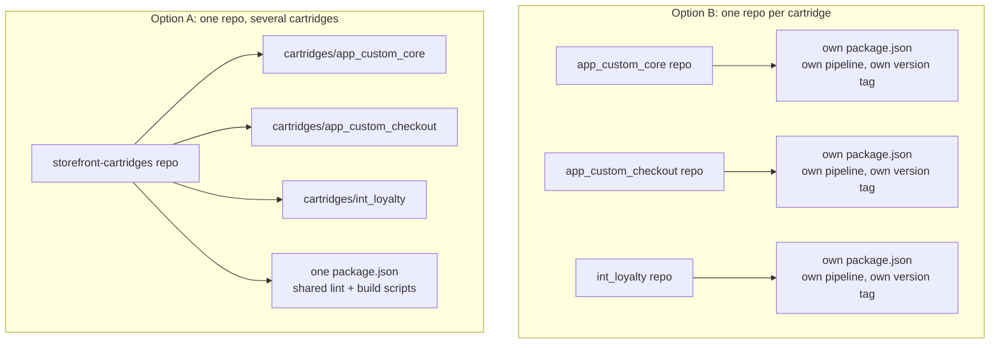
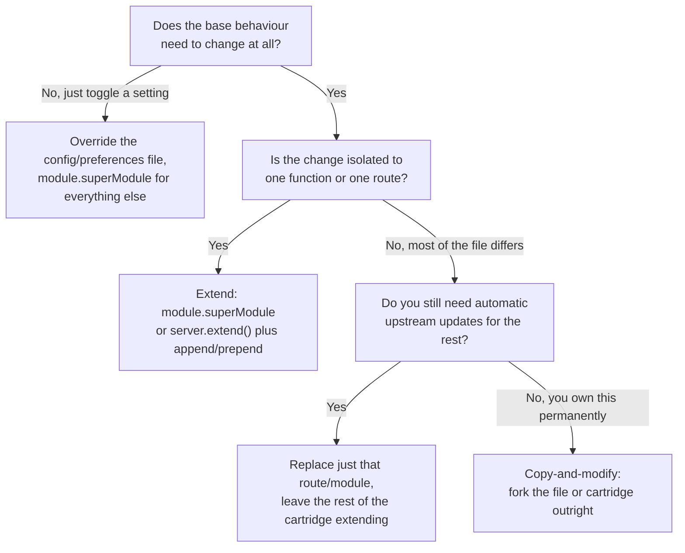

You override one client-side JavaScript component and end up copying the whole of `main.js` and rewiring every `require()` path inside it. Or you inherit a connector cartridge that overrides the entire `Account` and `Address` controllers for the sake of three functions that actually differ from the base, and now you're stuck deciding whether to strip it down or leave the rest alone. By the time you hit either of those, the cartridge *mechanics* usually aren't the problem. You already know a cartridge is a folder of controllers, templates, and scripts, and that a site's cartridge path (the ordered list of cartridges you set in Business Manager) stacks them into one storefront. What's missing is the layer above that: what goes in its own cartridge, what goes in its own repository, and when "extend the base" stops being the right answer.

I've already written up how that path resolves files once it's built — `module.superModule`, `HookMgr` priority, the caching gotcha in ISML (SFCC's server-side template language) that costs people an afternoon — in [a companion piece on cartridge path overrides](/sfcc-cartridge-path-overrides-explained/). This post assumes you know that part and works one level up: how to structure cartridges and repos before you get to overriding anything, and how to decide between extending, replacing, and copying when the base doesn't fit.

## Rule Zero: Extend the Base, Never Edit It

Before any of the structural decisions below, one rule sits underneath all of them: don't edit or rename `app_storefront_base`, the base cartridge that ships with SFRA (Storefront Reference Architecture), or any other Salesforce-provided cartridge. Editing it in place voids the platform's backward-compatibility guarantee for that cartridge. The [Customise SFRA guide](https://developer.salesforce.com/docs/commerce/sfra/guide/b2c-customizing-sfra.html) is built entirely around the alternative: create your own cartridge, place it ahead of the base on the path, and override only what needs to change.

Take a concrete example. Someone wants to change how an order-confirmation email gets sent. The instinct is to open the base cartridge's send function and tweak it. Don't. Override the method in your own cartridge with `module.superModule`. That property hands your script the same-named file from the next cartridge down the path, so you can call into it instead of duplicating it. Adjust the email template in your cartridge too, and leave `app_storefront_base` as Salesforce shipped it. The same pattern holds at every scope, from a single preference to a whole controller.

> [!WARNING]
> **Non-negotiable**
>
> Edit `app_storefront_base` directly and every future SFRA update becomes a manual merge, on every file you touched, for as long as the site runs.

## The Canonical Stacking Order

The pattern SFCC expects is a stack: your own cartridge (or cartridges) go first, any third-party or partner cartridges next, SFRA's own plugin cartridges (optional features such as product compare and gift registry) after that, and `app_storefront_base` last. The [SFRA Features and Components guide](https://developer.salesforce.com/docs/commerce/sfra/guide/b2c-sfra-features-and-comps.html) shows a path in that order:

```text
app_custom_mybrand:app_custom_mysite:LINK_bazaarvoice:LINK_wordpress:plugin_applepay:plugin_comparison:app_storefront_base
```

The [Cartridges guide](https://developer.salesforce.com/docs/commerce/b2c-commerce/guide/b2c-cartridges.html) documents that cartridges assigned to a site take precedence in order from left to right, so the order you type is the mechanism itself. Where you put a given cartridge in that string is the real design decision; the platform just enforces whatever you typed into **Administration > Sites > Manage Sites > [Site] > Settings**.

Everything in this post is cartridge mechanics for [classic SFRA](/sitegenesis-vs-sfra-vs-pwa/). Storefront Next has its own toolchain, and I'm leaving it out here.

## Structuring a Repo for More Than One Custom Cartridge

None of the official cartridge documentation tells you how to lay out your *repository* once you have more than one custom cartridge. That part is unavoidably a team decision, not a platform rule. In practice I've seen two patterns work, and they trade off in predictable ways.

**Single repo, multiple cartridges.** One repository holds `app_custom_core`, `app_custom_checkout`, and maybe an integration cartridge like `int_loyalty`, sharing one `package.json`, one lint config, and one pair of `compile:scss` / `compile:js` scripts. This is the lower-friction default for a single team shipping one storefront: one pull request touches both cartridges together when a change spans both, one CI pipeline, one version tag that means something for the whole stack.

**One repo per cartridge.** Each cartridge gets its own repository, its own `package.json`, and its own pipeline. This earns its overhead when cartridges have separate release cadences: a payment connector a different team owns and versions on its own schedule, or a partner cartridge you intend to list on AppExchange (covered further down). A cartridge you ship to other people needs its own version history and its own release package, and carving that out of a shared repo later is more work than starting it separately.

In my experience, team size isn't what decides it. What matters is whether the cartridges are versioned, reviewed, and released together in practice, or whether keeping them in one repo is just historical accident. If a change to one cartridge routinely needs a coordinated pull request in another, that's your single-repo case being made for you. If two cartridges haven't shared a meaningful change in months, the coordination overhead of a shared repo is pure cost.



Whichever you pick, keep the build configuration itself consolidated rather than duplicated. A `package.json` `paths` entry pointing at `app_storefront_base` (the setting that tells the build where another cartridge's client-side source lives, covered in full in the companion post's SCSS section) needs to be correct in exactly one place per cartridge that consumes it, not copy-pasted across three and left to drift.

## Overriding Controllers Without Forking the Whole Route

At controller level, `module.superModule` pairs with `server.extend()`. SFRA's `server` module registers a controller's routes, the named endpoints such as `Address-List` that a storefront URL maps to. Pass `server.extend()` the base controller and it copies every route that controller registered onto your own `server` object. Where [hooking into an SFRA controller](/where-to-hook-into-an-sfra-controller/) covers `prepend`/`append`/`replace` as middleware on routes you already own, `server.extend()` is what you reach for when you want to override an *existing named controller* — `Address.js`, say — without recreating every route inside it.

Here's the shape of it, in `cartridge/controllers/Address.js` inside your own cartridge, the same path the base controller uses:

```js
'use strict';

var server = require('server');
server.extend(module.superModule);

server.append('List', function (req, res, next) {
    // loyaltyHelpers is your own module, not part of app_storefront_base
    var loyaltyHelpers = require('*/cartridge/scripts/helpers/loyaltyHelpers');
    res.setViewData(loyaltyHelpers.addTierBadges(res.getViewData()));
    next();
});

module.exports = server.exports();
```

`server.extend(module.superModule)` pulls in every route the base `Address.js` defines — `List`, `AddAddress`, `SaveAddress`, all of them — before your file adds anything. The `server.append('List', ...)` call then only touches the one route you care about. Your function runs after the base route's own middleware, so `res.getViewData()` returns the data the base route already prepared for its template, and `res.setViewData()` merges your additions into it before the page renders. Every other route keeps running exactly as the base cartridge wrote it, because you never replaced its middleware, only extended the controller it lives in.

The [SFRA Modules guide](https://developer.salesforce.com/docs/commerce/sfra/guide/b2c-sfra-modules.html) uses the same extend-then-append pattern in its own controller-override example. The same move scales to every route in the file: extend with `server.extend(baseController)`, hook individual routes with `append`/`prepend`, and reach for a full `replace()` only on the specific route that needs different logic end to end.

The common mistake is dropping the `server.extend(module.superModule)` line, and what happens next depends on how you add the route. Call `server.append('List', ...)` on a bare `require('server')` and SFRA throws `Route with this name does not exist` as soon as the file loads, because `append` and `prepend` only modify routes the server object already has. That failure is loud, at least. Declare the route afresh with `server.get('List', ...)` instead and the file loads fine, but it now exports only `List`. Your `Address.js` sits ahead of the base one on the path, so `AddAddress`, `SaveAddress`, and the rest are gone for every request that resolves to your copy. If routes vanish after an "extension," check for a missing `server.extend()` first.

## The Client-Side Trap: One File Override, One Copied main.js

Client-side JS and SCSS are where "extend, don't replace" gets hardest to follow, and it's the failure mode I hear about most. You want to override a single component that `main.js` pulls in, so you copy that one file into a subfolder of your cartridge's `client/default/js`. Nothing changes. SFRA builds client-side code with `sgmf-scripts`, the command-line tools behind `npm run compile:js` and `npm run compile:scss`. The webpack config it generates compiles only the top-level files in `client/<locale>/js` as entry points, so a file in a subfolder never becomes a bundle of its own. Meanwhile the storefront still loads the base cartridge's compiled `main.js`, which has its own copy of the component baked in. So you copy `main.js` as well, and now the build breaks: its `require()` calls are relative paths to sibling modules that only exist in the base cartridge. Fixing that means copying or rewiring every module it pulls in, for the sake of overriding one component.

You do need your own `main.js`. The cartridge path applies to the compiled files in `static/`, and it picks whole files: the first cartridge with a `static/default/js/main.js` wins.

What you don't need is a copy of everything `main.js` pulls in. The `paths` property in your `package.json` gives webpack an alias for each cartridge you list, so with `"base"` pointing at `app_storefront_base`, your `main.js` can require every unchanged module as `base/...` and keep only the changed component local. Inside that component, apply the same rule again: require the base module through the alias and override only the functions that differ. The [Customise SFRA guide](https://developer.salesforce.com/docs/commerce/sfra/guide/b2c-customizing-sfra.html) describes `paths` the same way: as a way to import client-side JavaScript from other cartridges and selectively override it.

[How SFRA loads client-side JS and CSS](/how-to-load-client-side-javascript-and-css-in-sfra/) covers how `assets.js` and the ISML templates queue those files at runtime. That's the other half of the picture: read it if the override compiles but never renders.

SCSS has the same trap with a different symptom: an `@import` that fails at `npm run compile:scss`, not at runtime. That one comes down to the same `package.json` `paths` entry, and [the cartridge path overrides post](/sfcc-cartridge-path-overrides-explained/) walks through the exact alias mechanism, down to the `~` prefix people forget. The principle underneath is the same as for JavaScript: override the smallest thing that carries the behaviour you need, even when a bigger file is easier to find.

## Extend, Replace, or Copy-and-Modify: A Decision Framework

Every override eventually reduces to one of three moves, and each carries a different cost:

- **Extend.** `module.superModule` for scripts, `server.extend()` for controllers. You inherit every future change to the base file automatically, except the one piece you deliberately touched. This should stay the default until something concrete rules it out.
- **Replace.** `server.replace()` on one route, or a hook implementation that fully overrides a single extension point. You lose automatic inheritance for that one file or route, but everything else in the stack still picks up base changes when you upgrade SFRA.
- **Copy-and-modify.** You fork the file, or the whole cartridge, with no live link back to the source. Maximum control, zero automatic inheritance — you diff and reapply every future base change by hand.

The framework comes down to one question: how much of the file's behaviour do you need to change, and can you live with owning the rest by hand?



The smallest version of "extend" is turning off one unwanted default. If all you want is to disable one behaviour, don't copy the whole configuration file. Override just that one file with `module.superModule`: assign the base file's exports to `module.exports` so every other value passes through untouched, then change only the one value you care about. It's the same `module.exports = base` pattern the companion post's `pricingHelper.js` example uses, applied to configuration instead of logic.

Take the connector-cartridge case from the opening: a partner-built cartridge overrides all of `Account.js` and `Address.js`, but only three functions across both files differ from what `app_storefront_base` already does. Stripping that connector cartridge down to a minimal cartridge that extends the base for just those three functions is the right call *if* you're the one maintaining it going forward — you get every other future SFRA fix to those controllers for free. Leaving the full override in place only makes sense if you don't control that cartridge's source at all, such as a third-party cartridge you can't fork. Even then, don't patch their file: put your changes in your *own* cartridge that extends theirs. Copy-and-modify is a last resort, and every function you fork is a function you've volunteered to keep in sync by hand.

## Page Designer Components: Extend the Render Script, Don't Rebuild It

Page Designer components add their own override surface on top of everything above. Each component type needs two files, both stored under `{cartridge}/cartridge/experience/components/`. The first is a JSON meta definition file that tells Business Manager's visual editor what the component is called and which attributes a merchant can configure. The second is a script file with the same name that does the rendering: a `banner.json` meta file pairs with a `banner.js` script, and both filenames are restricted to alphanumeric characters and underscores. That script exports a `render` function, which receives the rendering context, builds a model from it, and has to return a string, usually by handing that model to an ISML template. All of this comes from the [Page Designer guide](https://developer.salesforce.com/docs/commerce/b2c-commerce/guide/b2c-dev-for-page-designer.html).

To change how one component type renders, override that component's script in your own cartridge. Use `module.superModule` to fall through to the base logic for everything you didn't change, instead of rebuilding the whole render function from scratch. Treat the helper scripts that the render function calls the same way: extend them too, so you inherit the parts you didn't touch and fork only the piece that has to differ.

Check two limits before you design a component. A rendered Page Designer page tops out at 3MB, tighter than the general 10MB limit for ISML output, and the platform's default script timeout is 30 seconds — both per the [Development Best Practices guide](https://developer.salesforce.com/docs/commerce/b2c-commerce/guide/b2c-dev-best-practices.html). A component that's cheap alone can still push a page over that 3MB ceiling once a merchant stacks a dozen of them on one landing page, so budget for that limit while you're designing the meta definition, not after the page stops rendering.

## Building a Partner Cartridge for AppExchange

Everything above applies with less room to improvise once the cartridge you're building isn't just for your own storefront. You'll still hear partner integrations (payment processors, tax engines, and similar) called LINK cartridges, but the certification programme behind that name is gone. Salesforce [retired the LINK Marketplace](https://help.salesforce.com/s/articleView?id=sf.b2c_rn_link_retirement.htm&language=en_US&type=5), moved its listings to AppExchange (which Salesforce now also calls AgentExchange), and says the LINK Program "has officially concluded." A partner cartridge now gets listed by passing the AppExchange Security Review.

Salesforce publishes the [security requirements for B2C Commerce solutions](https://developer.salesforce.com/docs/atlas.en-us.packagingGuide.meta/packagingGuide/secure_code_b2c_commerce.htm) every listed cartridge must meet: cross-site request forgery (CSRF) protection in state-changing controllers, escaped output, no dynamically loaded third-party scripts, least-privilege permissions for the Open Commerce API (OCAPI) and Salesforce Commerce API (SCAPI), and more. Nothing on that list covers lint rules or test coverage. One item does back up this whole post, though: to make patches and upgrades easier to install, partners should tell customers to keep their customisations in separate cartridges wherever possible.

The rest of the architectural discipline is on you, because no published rubric checks it. Does the cartridge sit cleanly in front of the base without touching it? Does every override extend rather than fork where extension was possible? Can the cartridge be dropped into a path it's never seen before without assuming anything about what else is on it?

That last question is the real difference between building for yourself and building for a listing. Your own cartridge can assume it knows every other cartridge in your path. A cartridge meant to run inside someone else's storefront can't. Say two partner cartridges both override `Address.js`. If both replace it outright, only the one further left on the path runs, and the other's changes disappear without an error. If both extend it with `module.superModule`, each one hands off to the next and both sets of changes apply. On a path you don't control, "extend, don't replace" is what lets your cartridge coexist with ones you've never seen.

## Choose the Layer Deliberately

Structure and override strategy are decisions you get to make once, deliberately, or decisions that get made for you by accident — by whichever pattern the first developer on the project happened to reach for. None of the three moves above is wrong in isolation. Extending too eagerly on a file that needs a full rewrite just delays the inevitable fork. Copying too early turns a one-line preference change into maintenance debt nobody remembers signing up for.

So the next time you're staring at a connector cartridge that overrides two whole controllers for the sake of three functions, or deciding whether a new integration earns its own repository, you've got the question to ask: how much of this do you need to own, and how much can you let `app_storefront_base` keep doing for you?
