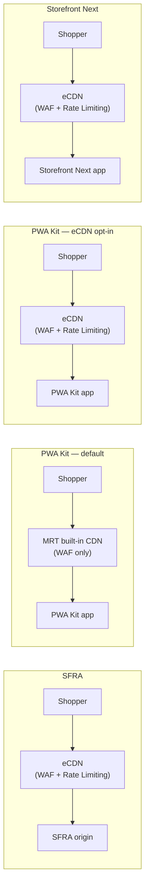
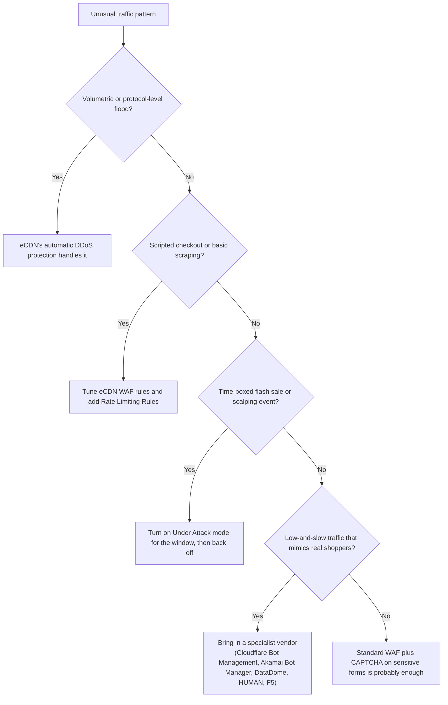

A client asked me last month whether their storefront was "protected against bots." Simple question. The honest answer depends on which CDN actually sits in front of the storefront, and that's where he got a surprise: it probably isn't the one he thought.

Ask a room full of SFCC people what powers the eCDN and most will say Akamai. It's an easy guess. Akamai has shipped an [official connector for B2C Commerce](https://techdocs.akamai.com/property-mgr/docs/akamai-conn-salesforce-commerce-cloud) for years, and it shows up on enough go-live checklists that it feels like the default. But the eCDN wrapped around every B2C Commerce instance out of the box runs on Cloudflare. Salesforce's own Trailhead module on eCDN configuration points admins straight at ["Understanding the Cloudflare Cookies"](https://trailhead.salesforce.com/content/learn/modules/ecdn-b2c-commerce/ecdn-b2c-commerce-explore) as the reference for how the network behaves, and its stacked-CDN example CNAMEs point at `*.cdn.cloudflare.net`. Akamai is real, and genuinely useful — it's the alternative you stack in front of eCDN, not the thing eCDN is built on.

That mix-up isn't just trivia. It changes what you should expect eCDN to stop on its own, what you're on the hook to configure, and when it's actually worth paying someone else to run the door.

## What eCDN Actually Is

eCDN is Salesforce's managed Cloudflare deployment, wired into Business Manager so you configure zones, hostnames, and firewall rules without ever seeing a Cloudflare login screen. Every production and development instance sits behind it by default. Staging gets a separate flavour ("eCDN for Staging") that works through the [CDN Zones API](https://developer.salesforce.com/docs/commerce/commerce-api/references/cdn-api-process-apis?meta=Summary) instead of Business Manager UI, which is why staging setup always feels one step more manual than production.

You can stack a third-party CDN in front of eCDN, Akamai or anything else you already run, when eCDN's own tools don't cover what you need. Salesforce documents this explicitly for merchants who want [additional bot management](/lets-go-live-ecdn/) beyond what's built in. But that's a choice you make, not the architecture you start with.

## The Doorman's Default Shift

Out of the box, without touching a single setting, eCDN gives you two things: DDoS protection at the network layer, and a web application firewall. Both are described by Salesforce as ["a value-added feature included in the Commerce Cloud eCDN at no additional charge"](https://help.salesforce.com/s/articleView?id=000391234&language=en_US&type=1) — not an add-on SKU, not a line item you negotiate. The WAF inspects every request for SQL injection, cross-site scripting, and the usual OWASP suspects, and it does this whether or not anyone in your organisation has ever opened the eCDN settings in Business Manager.

Here's the catch: "included" doesn't mean "aggressive." Salesforce ships the [WAFv2 ruleset](https://developer.salesforce.com/docs/commerce/commerce-api/guide/cdn-zones-wafv2.html) as three components: the eCDN Managed Ruleset, the OWASP Core Rule Set, and an Exposed Credentials Check. A chunk of the individual rules inside ship disabled or set to `log` rather than `block`. That's a deliberate trade-off to avoid false positives on day one, not an oversight. It means the WAF is watching from the moment your instance goes live, but it isn't necessarily *stopping* much until someone reviews the logs and decides which rules earn a promotion to `block`.

And the WAF was never meant to catch everything. Salesforce says this plainly: a bot that places an order the "right" way, filling in real fields and following the normal request flow, isn't something the WAF is built to flag. That's a legitimate request as far as the firewall is concerned, even if the account behind it is a script. For that class of problem, the doorman needs a different job to do.

## Configuring the Rest

Everything past the default WAF posture is opt-in, and this is where most of the bot-protection work happens:

- **Rate Limiting Rules** — you define the expression (path, header, country, whatever you need to match on), the time window (10 seconds up through an hour), and the action: `block`, `log`, `legacy_captcha`, `js_challenge`, or `managed_challenge`. None of this exists until someone writes it.
- **WAF sensitivity tuning** — moving individual rules from `log` to `challenge` or `block`, and adjusting OWASP paranoia levels once you've watched the logs long enough to trust a rule.
- **Selective Origin Shielding** — restricts direct origin access to an allow-listed set of IPs, so a bot that somehow figures out your real origin address still can't skip the CDN.
- **"Under Attack" mode** — forces a CAPTCHA on every visitor before they see the storefront. This is a light switch, not a thermostat: Salesforce's own [flash-sale mitigation guide](https://developer.salesforce.com/docs/commerce/commerce-solutions/guide/bot-mitigation-sk.html) recommends flipping it on for the sale window and back off immediately after, because leaving it on standing posture means every real shopper pays the CAPTCHA tax too.

SFCC has leaned on this same [origin-shielding logic](/the-importance-of-origin-shielding/) since the platform started taking flash sales seriously. It just has more configurable teeth than it had a few years ago.

## Salesforce's Stance: You Own the Policy

Salesforce's documentation is consistent on one point: the platform gives you the levers, and deciding how hard to pull them is your job. Its own guidance describes a layered escalation: interaction friction first (CAPTCHA before add-to-cart), then account controls, then rate limiting, then risk-based rules, and only then a specialist third party for traffic sophisticated enough to survive everything else. Salesforce recommends [named vendors](/secure-coding-in-salesforce-b2c-commerce-cloud/) for that last tier: PerimeterX (now HUMAN Bot Defender), DataDome, Shape (now part of F5), Akamai Bot Manager, Cloudflare Bot Management. But the language throughout is "consider" and "recommend," never "require." There's no single Salesforce product that makes this decision for you.

Credential stuffing gets the same treatment. The fix Salesforce documents for repeated failed logins isn't a dedicated anti-fraud feature — it's turning up WAF sensitivity so a CAPTCHA challenge kicks in and forces the attacker to slow down. If you're separately worried about account-takeover fraud rather than login-form bots specifically, [that's a related but distinct problem](/a-dev-guide-to-combating-fraud-on-sfcc/) with its own set of controls.

## Stack by Stack

The "who's behind eCDN" question doesn't have the same answer across SFRA, PWA Kit, and Storefront Next — and the differences matter more than most teams realise until they're mid-incident.

### SFRA

SFRA runs directly on B2C Commerce infrastructure, so it sits behind eCDN with no separate CDN tier of its own. Every WAF rule, rate-limiting policy, and shielding setting described above applies the moment SFRA traffic hits the edge. I went looking for a documented CAPTCHA hook, something first-class you could register against a login or registration flow, and came up empty. The official [SFRA Hooks guide](https://developer.salesforce.com/docs/commerce/sfra/guide/b2c-sfra-hooks.html) only documents OCAPI hooks and generic custom extension points registered through `HookMgr`; there's no named `bot` or `captcha` hook in it. If you've wired CAPTCHA into `Account-Login` or `Account-SubmitRegistration`, it was almost certainly a controller override or a marketplace cartridge, not a documented SFRA extension point.

### PWA Kit / Managed Runtime

This is where the assumptions get expensive. PWA Kit gives you three separate CDN choices, and Salesforce's own [decision guide](https://developer.salesforce.com/docs/commerce/pwa-kit-managed-runtime/guide/decide-on-cdn.html) is explicit that Managed Runtime's built-in CDN — not eCDN — is the default for new projects. eCDN is the option Salesforce calls out for "additional control over security features," but it's something you opt into, not something wrapped around PWA Kit automatically. Pick the MRT default and you get MRT's own web application firewall. It's real, but it comes without the Rate Limiting Rules, Selective Origin Shielding, or challenge actions that are specifically eCDN features.

Put plainly: choosing MRT's default CDN over eCDN is a bot-protection decision, not just a cost or convenience one. If your PWA Kit storefront has never had eCDN switched on, you should already know that before your next flash sale, not during it.

### Storefront Next

Storefront Next is the React 19 / React Router 7 storefront framework that shipped as generally available in the June '26 release, on the successor track from PWA Kit, and it closes that gap by default. Its own [Managed Runtime overview](https://developer.salesforce.com/docs/commerce/pwa-kit-managed-runtime/guide/sfnext-mrt-overview.html) states it directly: environments created through Business Manager "are behind an embedded content delivery network (eCDN)," and "the eCDN that serves the storefront includes a web application firewall (WAF)." No opt-in step, no CDN-choice fork — eCDN is the path by default. Beyond inheriting eCDN's protections, I couldn't find a Storefront-Next-specific bot feature; the product is roughly six weeks old at the time of writing, and the documentation reflects that.

## When to Call in Reinforcements

Everything above is eCDN doing its job. There's a real tier of traffic where eCDN — tuned or not — isn't the right tool, and that's when a dedicated bot-management vendor starts paying for itself: sophisticated scraping that mimics normal browsing patterns closely enough to dodge rate limits, credential-stuffing campaigns that spread requests thin across IPs and time to stay under any threshold you'd set, and scalper bots during a hype drop that are worth building custom tooling to beat because the resale margin justifies the engineering cost on the other side.



## What It Costs

This is the part vendors don't publish, so treat every figure below as a reported estimate, not a quote you can hold anyone to.

| Tier | What you get | Typical cost | Confidence |
| --- | --- | --- | --- |
| Bundled with eCDN | WAF, Rate Limiting Rules, Selective Origin Shielding | Included in existing licensing — no separate SKU found anywhere in Salesforce's docs | High |
| Akamai Bot Manager | Bot scoring, custom response policies | Reported roughly $20K–$80K+/year, and per Akamai's own services description it requires an existing Ion, DSA, or KSD contract to attach to | Medium on the prerequisite, low on the dollar figures |
| Cloudflare Bot Management | ML-based bot scoring, managed challenges | Confirmed Enterprise-plan-only with no public rate card; reported roughly $60K/year entry, scaling well past $100K for high-traffic deployments | Medium on Enterprise-only gating, low on the numbers |
| Specialist vendors (DataDome, HUMAN, F5, Kasada, Imperva, Radware) | Dedicated detection across web, mobile, and API traffic | Quote-based across the board; DataDome's tiers, where reported, run roughly $3.8K–$10K+/month | Low — mostly aggregator-reported, not vendor-confirmed |

The honest read: eCDN gives you real, licensed-in bot-mitigation primitives at no incremental cost, and most storefronts never outgrow them. Stepping up to a named vendor is a five-to-low-six-figure-a-year decision, and every vendor in that tier wants a sales call before they'll say a number out loud.

## One Thing to Check Before Your Next Flash Sale

If you run PWA Kit, go find out which CDN your project is actually using. Not which one the architecture diagram says, not which one was chosen two years ago — which one is live right now. If it's Managed Runtime's default and eCDN was never switched on, you're one flash sale away from finding out the hard way what's missing.
