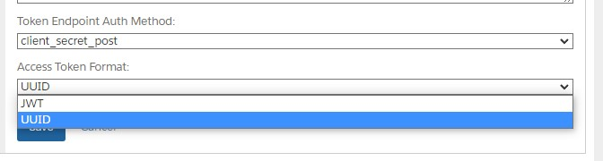

Last week (end of August 2022), many received an email warning us of a change to integrations in 2023: "Deprecation Announcement for UUID Token for API Clients in Account Manager."

But what does this mean? And what can be done to make sure integrations keep working?

Update ( 03/03/2023 ) A date has been published: [June 15th 2023.](https://help.salesforce.com/s/articleView?id=000394343&type=1)

## UUID Token

When doing an OAuth integration with Salesforce B2C Commerce Cloud, you must set up an "[API Client](https://help.salesforce.com/s/articleView?language=en_US&id=cc.b2c_account_manager_add_api_client_id.htm)" in Account Manager. During this process, you have the option of choosing which type of "bearer (access) token" format you want to use:

- JWT
- UUID

**Note:** Currently the default is JWT, but I am not sure if the default was UUID before.

[](account-manager-api-client-token-format-808bcccc72.jpg)

## How do I change it

Changing your API Client from UUID to JWT is a straightforward process. You go to [Account Manager](https://account.demandware.com/), open your API Client and go to the "Access Token Format" shown on the screenshot in the previous section.

Change that option from UUID to JWT and click "Save"!

That's it! Easy isn't it?

## What is the effect of this change

Not a lot actually. To put it as "simple" as possible: "**Your bearer token becomes a much larger string."**

Your bearer token changes from a simple and short UUID to a [JWT](https://jwt.io/).

```text
// An example of a UUID token response to:
// URL: https://account.demandware.com/dw/oauth2/access_token
{
    "access_token": "aEVhfDrzSoQ23Xd1m9m-nb8PKL4",
    "scope": "mail",
    "token_type": "Bearer",
    "expires_in": 1799
}
```

The above token is 27 characters long, which does not leave much room for "usable information." A JWT is much more suited for that. So let me change this API Client to the JWT format!

```text
// An example of a JWT response to:
// URL: https://account.demandware.com/dw/oauth2/access_token
{
 "access_token": "<sample-jwt>",
    "scope": "mail",
    "token_type": "Bearer",
    "expires_in": 1799
}
```

Pfoo... that is quite a bit longer, isn't it? About 1269 characters, which is a lot more than 27! But that is because this access token contains much more information than the UUID we previously saw.

### Call other APIs using this token

Like before, you can use the (longer) token to call other APIs.

## What information can be found in the JWT

To figure that out, we need to [undo the encoding](https://jwt.io/) of our "access\_token". If we do that, we get the following information:

```json
{
  "sub": "a2b32fe3-9373-4ca1-b643-60355a6cefe2",
  "cts": "OAUTH2_STATELESS_GRANT",
  "auditTrackingId": "ac7b2645-e71b-49a9-8539-2846ea449d1a-272809643",
  "subname": "a2b32fe3-9373-4ca1-b643-60355a6cefe2",
  "iss": "https://account.demandware.com:443/dwsso/oauth2",
  "tokenName": "access_token",
  "token_type": "Bearer",
  "authGrantId": "WAHrDv5q2Vpuf4BlBQbxIUqVR2E",
  "aud": "a2b32fe3-9373-4ca1-b643-60355a6cefe2",
  "nbf": 1661757640,
  "grant_type": "client_credentials",
  "scope": [
    "mail"
  ],
  "auth_time": 1661757640,
  "realm": "/",
  "exp": 1661759440,
  "iat": 1661757640,
  "expires_in": 1800,
  "jti": "baXcufo3e0YqvJMadXlES5c8AjA",
  "client_id": "a2b32fe3-9373-4ca1-b643-60355a6cefe2"
}
```

That is a lot more information to work with, which is why this change is happening!

## Why do this change

Before we get started, I do not work for Salesforce! So I will be making some assumptions here based on the small amount of information that has been shared.

The change itself makes sense. Because the UUID does not contain much information, the Account Manager needs to "fill in the blanks" when doing an authentication call. This causes extra "strain" on the servers (probably additional database calls and processing) to fetch certain information and do validation.

This change will cause the Account Manager load to drop, leaving more room for other, more important things. And in the end, make the solution more scalable for the future!

## When should we migrate

Just be sure to contact your third-party integration teams about this change. Why? Because it needs to be verified if they can handle this longer token. We are going from 27 characters to more than a thousand, which could mean database changes need to be made to facilitate this change.

Update ( 09/15/2022 ) Currently, not all Use Cases support JWT - and Salesforce is required to make changes on their end. This is (probably) why they have not yet communicated a timeline/deadline.

Tobias Lohr has provided a help article to explain which cases only work using UUID (for now): [https://github.com/SalesforceCommerceCloud/sfcc-ci/wiki/Token-format-change-from-UUID-to-JWT](https://github.com/SalesforceCommerceCloud/sfcc-ci/wiki/Token-format-change-from-UUID-to-JWT)

There is no time like the present. Even though you will probably have a year (possibly more - possibly less - depending on when this is planned in 2023), I see no reason to postpone this change.

It is a relatively small change that can easily be tested.
