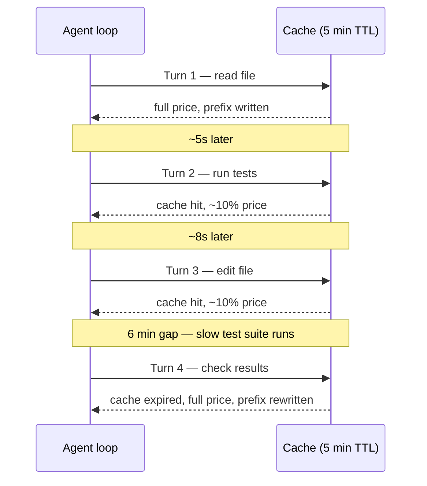

You ask an agent to add a custom SCAPI endpoint and a matching PWA Kit hook to pull loyalty balance onto the account page. It writes something plausible in thirty seconds: a hook name that sounds right, a `useLoyaltyBalance` signature that sounds right, a response shape that sounds right. None of it exists. You spend the next twenty minutes feeding it error messages, and it apologises and tries again, and again, each round trip re-reading the same files and re-explaining the same context. By the time it lands on something that actually compiles, you have burned ten times the tokens the task should have cost — and the invoice does not care that the first nine attempts were wrong.

That is the part nobody puts in the pricing table. Model choice is one lever on your bill. Whether the agent is grounded in what is actually true about your platform is the other, and it usually matters more.

## The bill is two numbers, not one

Every request has an input cost and an output cost, and they are not the same price. Here's the current Claude line-up, per million tokens:

| Model | Input | Output |
| --- | --- | --- |
| Haiku 4.5 | $1 | $5 |
| Sonnet 5 | $3 ($2 through August 2026) | $15 ($10 through August 2026) |
| Opus 4.8 | $5 | $25 |

One thing that table doesn't show: Sonnet 5 and Opus 4.8 count the same text as roughly 30% more tokens than Haiku 4.5 does, because both run on a newer tokenizer that Haiku 4.5 doesn't share. The per-token rate hasn't changed. The same prompt just gets counted as more tokens on the newer models, so a budget estimate built by eyeballing word counts on Haiku 4.5 will undercount the moment you move that prompt to Sonnet 5 or Opus 4.8.

Output is always the expensive half, and that's the part people forget: an agent that narrates its reasoning at length, or that emits a full file rewrite instead of a diff, pays the 5x-or-worse rate on every one of those tokens.

Context window compounds this cost, and quietly. Sonnet 5 and Opus 4.8 both carry a 1M-token window; Haiku 4.5 caps at 200K. A long-running SFCC job debugging session that keeps the full log tail in context on every turn does not just risk hitting that ceiling. It re-sends and re-bills the same log content on every single turn until something gets trimmed. Prompt caching is the fix for that repeated cost: cache the cartridge structure and the job log baseline once, and pay full price only for what actually changed this turn.

> [!NOTE]
> **Prompt caching, in short:** every request resends the full conversation and system prompt from scratch. Caching lets the provider hold onto a prefix of that input (a system prompt, a cartridge's `dw.*` reference set, yesterday's job log baseline) so a later request that reuses the same prefix reads it back at a fraction of the price instead of paying full rate again. It's a strict prefix match, though: change one byte anywhere in the cached span, a timestamp or a reordered key, and everything after that point falls out of the cache.

The discount and the write premium both scale off the model's base input price. Per million tokens, it breaks down like this:

| Model | Cache write (5 min) | Cache write (1 hour) | Cache read |
| --- | --- | --- | --- |
| Haiku 4.5 | $1.25 | $2.00 | $0.10 |
| Sonnet 5 | $3.75 ($2.50 through August 2026) | $6.00 ($4.00 through August 2026) | $0.30 ($0.20 through August 2026) |
| Opus 4.8 | $6.25 | $10.00 | $0.50 |

You don't sit there deciding when to cache, though. An agent chasing a bug doesn't send one deliberate request and wait. It loops: read a file, make an edit, run the tests, read the output, adjust, repeat. Every one of those is a separate API call that resends the whole conversation built up so far. Whether any given call lands inside the cache comes down to two things: does the prefix (system prompt, tool definitions, everything before the newest turn) stay byte-for-byte identical, and does the call land before the cache's TTL (time-to-live) runs out. Watch what that looks like across an actual loop:

Turns 2 and 3 land a few seconds after the one before them: the model replies, the harness runs the tool call, and the result goes straight back in. That's nowhere near the five-minute TTL, so both read the cache at roughly a tenth of the price. Turn 4 misses for a reason that has nothing to do with the agent's judgment: the test suite between turns 3 and 4 happened to take six minutes. The cache doesn't track why the gap happened, only that it happened. Cross the TTL and the next call pays full price again, rewriting the prefix from scratch.

None of this is something you configure by hand, and the mechanics for managing it differ more than you'd expect across the major agentic CLIs:

- **[Claude Code](https://code.claude.com/docs/en/prompt-caching)** layers the prompt stable-to-volatile: system prompt and tool definitions first, then project context like `CLAUDE.md`, then the growing conversation. A new turn only ever appends after the last cache breakpoint instead of disturbing what came before it. On a Claude subscription it requests the 1-hour TTL by default, since that cost is already covered by the plan; against a raw API key it defaults to the 5-minute TTL unless you opt into the longer one.
- **[OpenAI's Codex CLI](https://developers.openai.com/codex/cli)** rides on [caching that's automatic on the API side](https://developers.openai.com/api/docs/guides/prompt-caching) for any prompt over 1,024 tokens. Codex's own job is keeping system instructions, tool definitions, and environment context identically ordered across calls, and appending to history rather than rewriting it when something in the session changes.
- **[Gemini](https://ai.google.dev/gemini-api/docs/caching)** takes the same automatic approach for its 2.5-generation models (2,048-token minimum), separate from the older manual caching API you'd reach for to pin something like a shared reference document on purpose.

All three land on the same rule: the provider or the CLI decides where the cache breakpoints go, and your job is just not to break the prefix out from under it: don't swap models mid-session, don't reorder tools, don't let a timestamp slip into the system prompt.

## Not every task deserves your priciest model

The instinct to point every prompt at the strongest model available is expensive and, more often than people expect, worse. A model that reasons harder than a task needs tends to add scope: an abstraction nobody asked for in a scaffold, a refactor stapled onto a one-line fix that didn't need one. Match the tier to the judgement the task actually requires.

- **Haiku 4.5** for the mechanical stuff: scaffolding a new cartridge, renaming a variable across a controller, editing a job-step XML value you already know the shape of. Nothing here needs reasoning depth, and at $1/$5 per million tokens it is cheap enough to run constantly.
- **Sonnet 5** as the default workhorse: writing the actual body of a custom SCAPI endpoint, building the PWA Kit hook and component that consume it, wiring up a new job step's logic. This is where most day-to-day SFCC and storefront work should sit.
- **Opus 4.8** for the calls that are wrong in expensive ways if you get them wrong: should this live behind SFRA or a standalone SCAPI custom API, is a custom object the right shape for this data or should it be a system object extension, why is this job suddenly taking four times as long as last month. Architecture and diagnosis, not typing.

This is not a one-way ratchet, either. A task that turns out to need more judgement than you expected (Haiku producing a scaffold that doesn't match the rest of the cartridge, Sonnet guessing at an architecture question instead of asking) is a signal to move up a tier, not to keep re-prompting the cheaper one and hoping.



## Where the real waste hides

Model tier is the visible cost. The one that actually torches a token budget is an agent that doesn't know what it doesn't know, and SFCC gives it plenty of chances: a `dw.*` class method that sounds plausible but isn't there, a `dw.ocapi.shop.*` hook name invented on the spot (the same extension points power SCAPI and the [now-deprecated](/in-the-ring-ocapi-versus-scapi/) OCAPI), a PWA Kit SDK hook signature guessed from the shape of ten other hooks instead of read from the actual source. None of these fail loudly. They fail as a build error an hour later, or worse, as something that runs and does the wrong thing.

Two more patterns burn tokens without any hallucination at all. An agent that re-discovers the same Business Manager documentation page every session because nothing on disk remembers it was already read. And an agent debugging a backend job that pastes the full, raw log tail into context on every turn: thousands of tokens of timestamp noise, most of it irrelevant to the one `ERROR` line that actually matters.



The fix for all three is the same: ground the agent in the real platform before it writes anything, and stop feeding it more raw context than the task needs.

## Grounding tools, in the order you'd actually reach for them

**[Bonsai](https://bonsai.rhino-inquisitor.com/)** solves the first problem: an agent that answers from training data because the real docs are hard to reach. Salesforce Help and Developer docs are client-rendered, so a generic fetch often returns an empty shell instead of the article you meant to cite. Bonsai ships host-specific site modules for exactly that case, plus a cache: fetch once, get clean Markdown, and every later session reads the same cached page instead of re-scraping it.

Bonsai's own benchmark against a Salesforce B2C Commerce job-step prompt is the sharp version of this: one agent running native web search spent roughly 80,000 tokens and produced no usable answer, while the Bonsai-grounded run cost roughly 74,000 tokens and reached full, cited grounding. Same order of spend, opposite outcome. Mainstream framework docs often don't need this: native search matches Bonsai's depth there for less. But SPA-heavy vendor documentation, which is most of what SFCC and PWA Kit developers live in, is the case where it earns its keep.

**[sfcc-mcp-dev](https://sfcc-mcp-dev.rhino-inquisitor.com/)** was the first answer to the same problem, specifically for SFCC: an MCP (Model Context Protocol) server that puts SFCC and SFRA documentation, cartridge scaffolding, and log analysis straight into the agent's context, zero setup in its documentation-only mode. The manual alternative it replaced is well documented in the project's own numbers: developers losing two to four hours a day to tab-hunting method signatures, copy-pasting from forums, and manually correlating logs. It's mostly been superseded now: the b2c CLI below covers the same ground and more, in one tool instead of a separate read-only layer plus your deployment tooling.

**The [b2c CLI](https://salesforcecommercecloud.github.io/b2c-developer-tooling/cli/)** is that replacement, and it changes the shape of the problem rather than just adding another doc source. `b2c docs` searches and reads Script API references, Developer Center guides, job-step documentation, and XSD schemas directly. That's what lets the agent writing your custom SCAPI endpoint look the real hook signature up instead of guessing it. `b2c scaffold` generates cartridges, controllers, and hooks from templates instead of an agent free-handing boilerplate from memory. `b2c jobs` lets it trigger and monitor the very job it's building, and `b2c custom-apis` lets it check the live status of the endpoint alongside it. And because the same tool both grounds and acts, it ships **Safety Mode** for exactly the situation where you'd want that: `SFCC_SAFETY_LEVEL=NO_DELETE` or `READ_ONLY` env vars that block destructive operations at the HTTP layer, and no command-line flag the agent passes can override that. That's the difference between a docs-only MCP server and a CLI built with agents in mind from the start. You can hand it real authority without handing it an unguarded `DELETE`.



**[Headroom](https://headroomlabs-ai.github.io/headroom/cli/)** sits underneath all of this, and it isn't SFCC-specific at all. It's a general, provider-agnostic context-compression layer that runs as a proxy in front of Claude Code, Codex, Cursor, and others. `headroom proxy` sits between the agent and the model via `ANTHROPIC_BASE_URL`; `headroom wrap claude` launches Claude Code through it directly. What it does with the traffic in between is the point: it compresses tool output, log tails, and file dumps before they reach the model's context, rather than shipping the full raw text on every turn. Point it at that backend job debugging session from earlier and the multi-thousand-token log tail becomes the handful of lines that actually matter: same signal, a fraction of the tokens, every turn instead of just the first one.

> [!WARNING]
> Headroom is a third-party project, not an Anthropic product, and it works by sitting in the request path. Treat it the way you'd treat any proxy: know what it's rewriting and verify it against a real session before trusting it on anything sensitive.

## Grounded doesn't mean it remembers your codebase

Grounding stops an agent from inventing a hook that doesn't exist. It does nothing about a function that already exists and the agent doesn't know it, because grounding points it at your platform's real docs, not your codebase's memory. Every new chat starts the same way a new hire's first day does: the agent has never seen this cartridge before, doesn't know that `getLoyaltyDiscount()` already lives in `loyalty-helpers.js`, and writes a second version that looks perfectly reasonable in isolation. Memory systems help across sessions, but they don't make an agent read every file before it writes one, so the failure mode here isn't hallucination. It's duplication, drift, and a codebase that gets a little harder to read with every PR that looked fine on its own.

A smarter prompt won't fix this. What actually helps is the same layered defense you'd already put around a junior developer: mechanical gates that don't care how confident the code sounds, self-checks the agent runs on its own output, and a second reviewer with no stake in the first draft.

- **Deterministic gates, before anything reaches a PR.** `npx husky init` wires a `.husky/pre-commit` hook into every commit; pair it with `lint-staged` so it only touches staged files, and it can run ESLint, or whatever your stack's linter is, on every commit without waiting on an agent's judgment call. What Husky and ESLint won't catch is the thing the loyalty example above hinges on: that `getLoyaltyDiscount()` already exists somewhere else in the cartridge. That's a different job, closer to static analysis than linting. **[Fallow](https://fallow.tools/)** is built specifically for it: a Rust-native, zero-config analyzer for TypeScript and JavaScript codebases that finds unused code, duplication, circular dependencies, and architecture drift deterministically, with no AI inside the analyzer itself, and it ships an MCP server so an agent can query it directly before writing new code instead of after.
- **Self-critique skills that make the agent doubt its own draft.** **[Ponytail](https://github.com/DietrichGebert/ponytail)** pushes an agent through a "laziness ladder" before it commits to custom code: does this need to exist, can it reuse something that already does, does the standard library already cover it. Its own benchmark claims roughly 54% less code and 20% lower cost from that habit alone. Cursor's **[thermo-nuclear-code-quality-review](https://github.com/cursor/plugins/blob/3347cbab5b54136f6fba0994c3a01a56f7fb7fca/cursor-team-kit/skills/thermo-nuclear-code-quality-review/SKILL.md)** skill runs the same idea the other way, at review time: it hunts specifically for "code judo," restructurings that make an already-working diff dramatically simpler, and it's built to block the merge if a simpler path was visible and skipped.
- **A subagent with no stake in the first draft.** The check I trust most is a subagent, not a tool: one that starts with none of the main conversation's context, only a prompt describing what to audit. It hasn't spent the last hour negotiating trade-offs in the room, so it reviews the diff the way a teammate would on Monday morning, not the way the author who wrote it at 11pm does. I run at most three, depending on the project: a `senior-technical-code-reviewer`, a `senior-qa` that tests the feature critically in a real browser instead of trusting the agent's own account of it, and a `senior-technical-writer` that checks inline comments and documentation against a specific style guide rather than whatever felt natural mid-implementation. That code-reviewer subagent runs the same static-analysis and self-critique layers from above itself: it queries Fallow directly for duplication and architecture drift, then runs the thermo-nuclear-code-quality-review or Ponytail skill against the diff before it reports anything back, so the fresh set of eyes doesn't skip checks a machine already ran.

This layer doesn't replace grounding. It catches the failure mode grounding was never built for: code that's technically correct, reads fine on its own, and quietly duplicates something three files away.

## The verdict

Route by task, not by habit. Haiku for the mechanical work, Sonnet for the endpoint and hook code that makes up most of a sprint, Opus for the decisions that are expensive to get wrong. Then spend the engineering effort you'd otherwise put into chasing a cheaper model on the things that actually move the bill: grounding the agent in the real platform with Bonsai and the b2c CLI, compressing what still reaches the model with something like Headroom, and catching what grounding can't with precommit gates, self-critique skills, and a fresh-context subagent auditing the result. A hallucinated hook signature and a quietly duplicated helper function cost you the same rework loop no matter which tier wrote them. The gates that stop that from happening are worth more than the tier you picked.

It's the same arrangement I described running [the migration that rebuilt this blog](/goodbye-wordpress-rebuilding-this-blog-with-ai/): the model does the typing, but the guardrails around it are what decide whether that typing was worth paying for.
