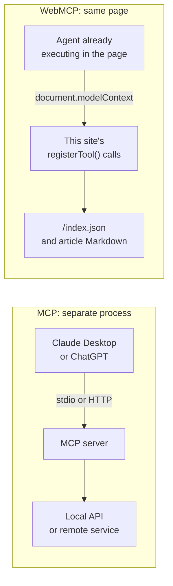
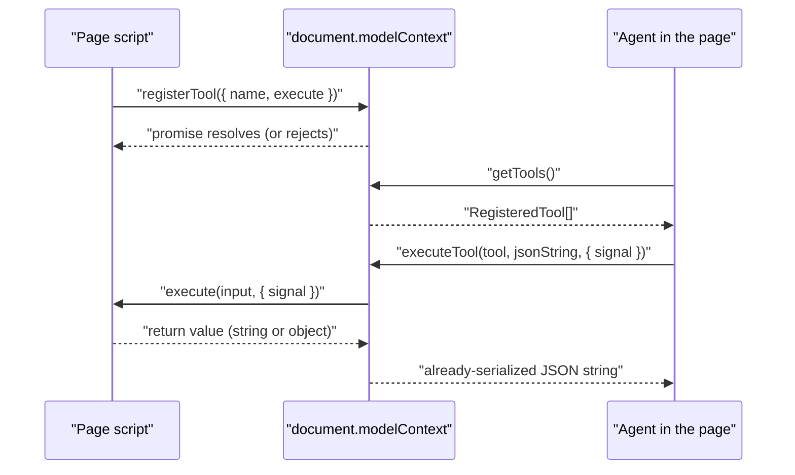

Three days into building agent tools for this blog, I stopped and wrote down the problem I couldn't solve: I didn't know what shape of data my own code was supposed to hand back to an agent. Chrome's documentation showed one answer, the spec's explainer showed another, and the browser's own source turned out to do something neither of them described. I had already written four tools on top of that ambiguity. That's the honest starting point for this post. Not "here is what WebMCP is", but "here are the days I spent finding out, badly, and what fell out of it."

## Two acronyms, one prefix apart

The confusion starts before you write a line of code. WebMCP and MCP share three letters and roughly nothing else, and every explanation I read online at some point slid from one to the other without saying so.

> [!NOTE]
> **Agent and tool, in short:** an *agent* is any program that runs a language model and can take actions for you: Claude Desktop, ChatGPT, a coding assistant, a chat widget embedded in a page. A *tool* is a named function that agent is allowed to call, described in enough plain English that the model can judge for itself when calling it is the right move. Both protocols in this post answer the same two questions: how does an agent discover which tools exist, and how does it call one? They answer them in completely different places.

[MCP](https://modelcontextprotocol.io/introduction) — the Model Context Protocol — keeps the tools in a separate program. A host application like Claude Desktop or ChatGPT connects to an *MCP server*, and the server is what exposes the tools. When that server runs on your own machine, the two talk over stdio: standard input and output, the same pair of pipes any command-line program reads and writes. When it runs somewhere else, they talk over HTTP. Either way, the server's tools call out to whatever it fronts: a filesystem, a database, an internal API. Agent and tool sit in different processes, often on different machines, and standardising that conversation is the protocol's whole job.

[WebMCP](https://developer.chrome.com/docs/ai/webmcp) is not that. There's no server, no separate process, no stdio pipe. A page calls `document.modelContext.registerTool()` from a plain `<script>` tag, and any agent already running JavaScript inside that page — a browser's built-in assistant, an extension, an embedded agent — can discover and call those tools in-process. The site isn't exposing an API to the world; it's handing tools to whatever is already looking at the page.



Once you see it that way, the confusing headlines make more sense. "MCP for the web" gets thrown around as though WebMCP replaced the server. What it describes is the client-side counterpart: tools an agent reaches for once it has already landed on your page, where MCP was built for processes talking to processes. I'd already written about [MCP as a grounding layer for coding agents](/tokens-arent-free-picking-models-and-keeping-agents-grounded/), and none of that transfers here. Different transport, different lifecycle, different question being answered.

## Not a standard. Not yet, not close

Before touching any of this, I wanted one honest answer to "is this a thing I can rely on", and the answer is no. WebMCP is a Draft Community Group Report under the [Web Machine Learning Community Group](https://github.com/webmachinelearning/webmcp) — a W3C (World Wide Web Consortium) community group, not the standards track, which is the formal process a browser feature has to complete before other vendors commit to treating it as settled. Chrome's own [feature-tracking entry](https://chromestatus.com/feature/5117755740913664) lists its status as **Proposed**, running as an origin trial, with Firefox and Safari both showing "No signal" — the label vendors use when they haven't taken a public position on a feature at all. The explainer says so itself: WebMCP is "under active discussion and subject to change in the future."

That's not throat-clearing caution on my part. It already changed once. The entry point used to be `navigator.modelContext`. It's now `document.modelContext` ([webmachinelearning/webmcp#173](https://github.com/webmachinelearning/webmcp/issues/173)). Anyone shipping against this today is shipping against a moving target, on purpose, in a browser vendor's words.

Chrome runs the trial from M149 through M156, its shorthand for its own major-version milestones. [Origin trials](https://developer.chrome.com/docs/web-platform/origin-trials) work exactly the way that phrase implies: limited-duration, public by registration, gated per origin by a token that ships in your HTML. Chrome's token for this site covers the whole trial. Edge's, a separate trial with a separate signing key, expires 2026-11-01, weeks before the shared end date of 2026-11-17, so it needs one renewal to survive to the finish line. When both lapse, nothing breaks: the code that checks for the API before using it stops finding it, and the page carries on without tools.

## The spec that argued with itself

This build started in a written plan rather than an editor: four read-only tools — `searchArticles`, `listRecentArticles`, `getSiteOverview`, `getArticle` — to let an in-page agent query this site's articles the way a crawler can already query `/index.json`, the single JSON file this site publishes with one entry per article. The most useful line in that plan was a warning I wrote before any code existed. Whole sections of the spec were still marked TODO, so I wrote down the rule I would need later: assume Chrome's documentation describes a build ahead of stable, and verify every example against the version actually installed.

I didn't fully believe my own warning until the return shape forced the point. The explainer's worked example returns an MCP-style envelope, `{content: [{type: "text", text}]}`, while every imperative-API example on Chrome's own docs returns a plain string instead.

Web IDL, the interface-definition language a spec uses to pin down an API's exact shape, splits the difference and declares the callback as `Promise<any>`. Both are legal. Even Google's own polyfill (a JavaScript shim that adds `document.modelContext` to browsers that don't ship it natively) hedges its bets: a comment reads `// TODO: Remove when executeTool doesn't accept JSON stringified inputArgs in Chrome Stable`. Three sources with some claim to being official, three different answers, and my four tools sat downstream of whichever one turned out to be true.

The resolution, once I went and read Chromium's own source rather than guessing, was stranger than "pick one": both return shapes work, because Chrome checks the type of whatever you hand back and treats each case differently (`ToolFunctionFinishedCallback::React`, if you want to read it yourself). An object gets JSON-stringified before the agent sees it; a plain string arrives raw and unquoted; anything that can't be converted becomes the literal string `"Operation succeeded"`. None of the three errors.

The contradiction I had written down wasn't a contradiction at all on the return side. It was a real one, sitting one parameter over, on what `executeTool()`'s caller has to pass in. On Chrome stable that has to be a JSON string, while the docs' own example — dated after mine, ahead of stable — passes an object straight through. I only found that by diffing Chromium's `main` branch against the M153 branch-head, which is not something I expected "add a tool to a Hugo blog" to require.

## Proving the thing existed before designing around it

Before writing any of the four tools, I answered one question that had nothing to do with design: does `document.modelContext` fire on this machine at all? If the rig couldn't be stood up, that was the finding, and the plan would have changed. It did fire, on Chrome 153.0.8010.47, launched with `--enable-features=WebMCP,WebMCPTesting,DevToolsWebMCPSupport` against a plain `localhost` page. A secure context, meaning a page served over HTTPS or `localhost` during local development, needs no origin-trial token at all, which is the only reason any of this was verifiable before the tokens existed.



Two things off that diagram cost me real time. First: `registerTool()` never throws on a bad definition. It rejects the promise, silently, unless you `.catch()` it, which means a bare `try`/`catch` around a fire-and-forget call catches nothing.

Second: `execute` is handed `{ signal }`, an options object, not a bare `AbortSignal`, despite Chrome's own docs describing it as receiving "an AbortSignal parameter named signal." Hand that object straight to `fetch()` and it fails with "Failed to convert value to 'AbortSignal'" — gracefully enough that every tool answered with its own could-not-load guidance. That is why a unit test with a hand-rolled signal never caught it.

Here is one whole tool, in the smallest shape Chrome 153 accepts, with both traps already avoided:

```js
document.modelContext.registerTool({
  name: 'getSiteOverview',
  description: 'Describes this site: what it publishes, how many articles it has, the topics it covers.',
  inputSchema: { type: 'object', properties: {} },
  annotations: { readOnlyHint: true },
  execute: function (args, options) {
    // `options` is the wrapper. The signal fetch() wants is one level in.
    return fetch('/index.json', { signal: options && options.signal })
      .then(function (response) { return response.json(); })
      .then(function (index) { return JSON.stringify(summarise(index)); });
  }
}).catch(function (error) {
  // Without this, a definition Chrome dislikes fails in silence.
  console.warn('registerTool rejected', error);
});
```

Three lines carry the teaching. `.catch()` is the only way a rejected registration ever reaches you. `options && options.signal`, not `options`, is what `fetch()` accepts. And `readOnlyHint` tells an agent this tool only reads and changes nothing, so it can call it without stopping to ask the user first. `summarise()` is my own code and left out here; all that matters is that it returns a string. Making that string short enough is the next problem.

## Measuring the same number wrong, twice

Chrome's [tool security guidance](https://developer.chrome.com/docs/ai/webmcp/secure-tools?hl=en) recommends, in its own words, at most 500 characters per tool description, 150 per parameter description, 30 per name, and "1.5K character limit per individual tool output." Recommendations, not enforced ceilings. Breaching them fails invisibly: the agent doesn't get an error, it gets a payload silently dropped or truncated, and every downstream decision it makes now rests on incomplete data.

I got the output number wrong twice on the way to shipping this. The first time, a verification script reported `getArticle` at 1,540 characters against a 1,500 limit I'd set as the stricter reading of Chrome's "1.5K" — forty-one search queries flagged as over budget. All of it was a measurement bug: `executeTool()` hands the agent a payload that's *already* a JSON string, and my rig was calling `JSON.stringify()` on it a second time, escaping every inner quote twice and inflating the true length by roughly 5%. The real worst case, measured correctly across all 175 live entries, is exactly 1,500. Two entries land on it precisely. The budget fitter, the function that trims a tool's answer until it fits the limit, is working right at that limit rather than coasting with headroom to spare.

The second miss was subtler. `listRecentArticles`'s output doesn't simply grow as you ask for more rows, the way I assumed. It peaks at `limit: 4` (1,480 characters) and then *falls*, because past that point the budget fitter has to trim the list back to three rows and spend the characters it saves on a sentence explaining the cut. A first sweep sampled limits 1, 2, 3, 4, 6, 8, 12, 16, 20 and placed the fall at limit 6. The true fall is at limit 5. One value late, because sampling instead of measuring every case hides the rises-then-falls behaviour that matters most.

## Blaming the wrong thing for an hour

This site's build has to pass a full gate run before a change ships: an automated check, built on Lighthouse (Google's site-auditing tool), that fails the build if any score drops below a threshold. This time it came back with SEO at 92 against a required 95. The failing line was this site's own `robots.txt` directive, `Content-Signal: ai-train=yes, search=yes, ai-input=yes`, which the audit flagged as an "Unknown directive." For a good hour that looked like Lighthouse penalising a deliberate policy choice — the kind of "the platform is fighting me" moment that's easy to write an angry paragraph about. It's also the most humbling moment of the build, and it never touched the WebMCP code at all.

The real cause was a version skew. `@lhci/cli` bundles its own Lighthouse 12.6.1, which has no `content-signal` entry in its robots.txt safelist (the list of directives its SEO audit recognises as valid). The version this site pins, 13.0.3, lists it explicitly, commented "not officially supported, but used in the wild." A stale `node_modules` had kept the old nested copy alive locally. CI was green the entire time. The diagnosis was wrong for an hour, and the fix was `npm ci`.

## Where it actually stands today

Both origin-trial token parameters in this site's `hugo.toml`, Hugo's site configuration file, ship empty right now. No token, no `<meta http-equiv="origin-trial">` tag, no `document.modelContext` for an ordinary visitor. I checked this against the live site directly — no flags, `document.modelContext` is `undefined`, zero tools. Turn on `chrome://flags/#enable-webmcp-testing` and all four appear; the DevTools Application → WebMCP pane additionally wants `chrome://flags/#devtools-webmcp-support`. The flag and the token are two separate doors to the same API: a flag opens it on one machine for whoever set it, a token opens it for every visitor to one origin. I have the first and not the second. So today the tools are real, tested, gated by 103 unit tests and a sweep over every article on the site — and dormant for every reader who isn't me with a flag enabled.

What none of that proves is whether an agent would ever *pick* these tools from their names and descriptions alone, rather than just being able to run them when told to. That needs the [Model Context Tool Inspector extension](https://chromewebstore.google.com/detail/model-context-tool-inspec/gbpdfapgefenggkahomfgkhfehlcenpd) and a real natural-language prompt, and I haven't run that test yet. A tool that works when invoked and a tool that gets chosen are two different claims, and I've only proven the first one.

## What Shopify already shipped, and why SFCC isn't Shopify

Shopify shipped this months ago. [WebMCP tools are live on every Liquid storefront](https://shopify.dev/docs/api/web-mcp) (Liquid is Shopify's theme templating language) and on Hydrogen, its React framework, still in developer preview. Ten tools: catalog search, store browsing, cart read and write, checkout navigation, order history, shop policies. A merchant does nothing to get them. In the docs' own words, "You don't need to install or configure anything." Nothing runs inside checkout itself; `proceed_to_checkout` takes the shopper there and stops. Doing that much while the spec still calls itself subject to change took real work, and it is further than I have gone.

They could do it because of something SFCC deliberately doesn't have. Shopify's [standard storefront events and actions](https://shopify.dev/docs/api/storefront-events-and-actions) are "a fixed set of event names and calls that don't change from one storefront to the next". The same page describes what life was like before them. "Apps used to do this by parsing a storefront's DOM or intercepting `window.fetch`, which meant a separate integration for every storefront. Now one integration covers them all." Shopify's WebMCP cart tools call those same `Shopify.actions` functions. One integration, written once by the platform and delivered from its CDN, covers every shop. When the spec moves, Shopify absorbs the migration centrally instead of mailing it to every merchant.

That movement is not hypothetical. [Hydrogen's 30 July preview notes](https://hydrogen.shopify.dev/update/developer-preview-release-notes-july-30-2026) drop the options type that used to carry the WebMCP switch from the public exports; `webMcp` is a prop on `ShopifyScripts` now. I found no published versioning, deprecation, or migration policy for the tool surface itself. Absorbing that churn centrally is the trick, and it only works if there is a centre.

Salesforce B2C Commerce, or SFCC, sells the opposite property on purpose. "Every aspect of the storefront is designed to be enhanced and extended with your own code," says [PWA Kit's own overview](https://developer.salesforce.com/docs/commerce/pwa-kit-managed-runtime/guide/pwa-kit-overview.html). [SFRA won't even let you edit the base cartridge](https://developer.salesforce.com/docs/commerce/sfra/guide/b2c-customizing-sfra.html), the unit a customer's own code ships in; you overlay your own on top. That freedom is why plenty of teams are on the platform at all, and it means no two SFCC storefronts share a DOM, a cart API, or a theme layer that Salesforce could wire a tool surface into once for everybody. There is no single place to put it. So every spec change arrives as your migration, and the [shared responsibility model](https://help.salesforce.com/s/articleView?id=cc.b2c_shared_responsibility_model.htm&type=5) already assigns customers the "secure sourcing, deployment, and maintenance of third-party integrations and extensions".

An SFCC team writes the tools, owns them, and re-tests them every time an origin-trial API moves underneath, all of it spent against agent traffic whose conversion nobody has published. I have no numbers on it either. Salesforce's own bet sits on the other half of the split this post opened with: a [B2C Commerce MCP Shopper Service](https://developer.salesforce.com/docs/commerce/commerce-api/guide/agentic-mcp-shopper-tools-quick-start.html) in pilot, a hosted MCP server exposing SCAPI-backed tools so an external agent can search, add to a basket, and hand off to checkout. Server-side, not in-page. Waiting is not timidity here; the bill for being early lands in a different place on this platform than it does on Shopify's.

## So, is it worth your time yet

If you run an SFCC storefront or any other site and you're wondering whether to add WebMCP tools this week: probably not yet, and that's fine. It's a Draft Community Group Report, single-vendor in practice, running on a clock that ends 2026-11-17 with no published plan for what comes after. If you're curious how an in-page agent surface differs from the MCP servers I've [written about before](/tokens-arent-free-picking-models-and-keeping-agents-grounded/) as a grounding layer for coding agents, or from a platform-native agent that runs entirely on the vendor's own platform, the shape is worth understanding now. The names collide; the patterns underneath don't. Just don't confuse "I understand the shape" with "I should ship this to production traffic." I did the second one on a blog with no checkout and no login, specifically because that's a safe place to find out what a spec still gets wrong. That's also roughly the spirit behind [tearing this whole site down and rebuilding it without a database in the first place](/goodbye-wordpress-rebuilding-this-blog-with-ai/) — quieter infrastructure gives you more room to gamble on the interesting stuff sitting on top of it.
